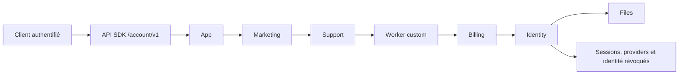

# Cycle de vie d’un compte applicatif

Ce document définit le contrat commun OpenGrow pour la déconnexion et la
suppression d’un compte dans toutes les applications. Il s’applique à la
référence MBZA, à VocoStar et aux futures cibles. Une application peut ajouter
une purge métier dans son Worker custom, mais ne peut pas créer une seconde
autorité de suppression.

## Deux opérations différentes

| Opération             | Route commune                                                              | Effet                                                                                                                                   |
| --------------------- | -------------------------------------------------------------------------- | --------------------------------------------------------------------------------------------------------------------------------------- |
| Déconnexion           | `opengrowApplicationLogoutJson`                                            | Révoque la session Identity, vide le stockage sécurisé et déconnecte le fournisseur d’achats. Les données du compte restent intactes.   |
| Suppression du compte | `DELETE /api/v1/sdk/account/v1` via `opengrowApplicationDeleteAccountJson` | Lance l’effacement durable de toutes les données applicatives rattachées à l’identité authentifiée, puis révoque l’identité en dernier. |

Le client ne fournit jamais l’identifiant à supprimer. Le middleware SDK
vérifie le JWT applicatif, résout le projet et dérive le sujet côté serveur. La
route historique `DELETE /auth/me`, qui ne supprimait que l’identité, retourne
désormais `410 account_erasure_route_required`. Cette fermeture empêche de
laisser des données orphelines dans les autres modules.

## Orchestration durable

La migration D1 `0057_application_account_erasure.sql` crée une opération unique
par couple projet/sujet haché. L’API acquiert un lease, persiste chaque étape
terminée, relâche le lease en cas d’échec et reprend les opérations `processing`
ou `failed` par le scheduled handler. Les clés d’idempotence sont dérivées de
l’opération et de l’étape; un retry ne doit donc pas répéter un effet externe.

L’ordre est intentionnel : Identity reste disponible jusqu’à ce que toutes les
autorités qui ont besoin du sujet aient terminé. Files est appelé par Identity
avant la suppression finale de l’utilisateur.

## Responsabilités des autorités

| Étape               | Données supprimées ou transformées                                                                                                                                              | Données conservées                                                                                                                   |
| ------------------- | ------------------------------------------------------------------------------------------------------------------------------------------------------------------------------- | ------------------------------------------------------------------------------------------------------------------------------------ |
| App                 | Profil analytique applicatif, événements rattachables, relations de parrainage et données de clientèle communes.                                                                | Uniquement les agrégats qui ne permettent plus de rattacher une personne.                                                            |
| Marketing           | Profil et préférences pseudonymisés, abonnements/listes détachés, événements personnels supprimés. Une suppression de confidentialité interdit toute réinscription automatique. | La suppression/suppression-list minimale nécessaire pour ne plus contacter la personne.                                              |
| Support             | Contacts, conversations, messages, pièces jointes R2, état Durable Object et index de recherche rattachés au sujet.                                                             | Les lignes d’audit obligatoires sont pseudonymisées et ne contiennent plus le sujet brut.                                            |
| Worker custom       | Données propres à l’application, jobs, résultats, fichiers métiers et reçus rattachables selon le contrat custom v2.                                                            | Les preuves techniques ou financières uniquement après pseudonymisation et selon la politique de rétention de la cible.              |
| Billing             | Références client, abonnements locaux et données de profil pseudonymisés; aucun nouveau traitement utilisateur possible.                                                        | La vérité financière, les reçus Store/Stripe et les écritures nécessaires aux obligations comptables, sous une référence pseudonyme. |
| Identity puis Files | Objets et métadonnées Files du propriétaire, sessions, identités Google/Apple/email, jetons et utilisateur.                                                                     | Rien qui permette une authentification future avec cette identité; seules les preuves techniques pseudonymisées autorisées restent.  |

Les durées exactes de conservation sont des paramètres de gouvernance propres à
chaque cible et doivent être validées juridiquement. La base ne transforme pas
une obligation comptable ou antifraude en suppression aveugle; elle exige une
pseudonymisation et interdit la réutilisation à des fins produit ou marketing.

## Confidentialité et observabilité

L’identifiant applicatif brut est stocké dans l’opération uniquement pendant le
traitement, afin de permettre une reprise après panne. Il est mis à `NULL` dès
que toutes les étapes sont terminées. Le hash complet est conservé pour
l’idempotence et l’audit technique. Il n’est jamais retourné au Dashboard.

`GET /api/v1/platform/account-erasures` est réservé aux owners/admins et limité à
l’instance authentifiée. Il expose seulement une référence de sujet tronquée,
le projet, l’état, les étapes terminées, les tentatives, la dernière erreur et
les dates. Les réponses utilisent `private, no-store`. Les logs structurés
n’incluent ni identifiant brut, ni email, ni token; la réussite utilise la même
référence tronquée. L’interface `/infrastructure` permet ainsi de suivre une
opération sans créer une nouvelle fuite de données personnelles.

## Procédure de validation et de promotion

1. Appliquer toutes les migrations sur les bases de recette MBZA et confirmer
   que l’API attend `0057_application_account_erasure.sql`.
2. Publier les SDK sous des tags Git immuables. Le client FlutterFlow exige
   `sdk-flutterflow-v2.2.4`; aucun projet distant ne doit être modifié avant que
   ce tag et le tag Support requis existent.
3. Exécuter `flutterflow ai test`, puis la validation dry-run du projet VocoStar.
4. Tester en recette un compte sans données, puis un compte possédant fichiers,
   consentements, conversations, achats sandbox et jobs custom. Interrompre un
   module pour prouver le retry et la reprise du lease.
5. Vérifier dans le Dashboard que l’opération progresse, qu’aucun identifiant
   brut n’est visible et que la reconnexion avec la session révoquée échoue.
6. Restaurer une sauvegarde de recette et répéter le test avant toute promotion
   vers `main`/VocoStar.

Le déploiement Cloudflare, l’application des migrations distantes, les tags Git,
la mutation FlutterFlow et la suppression de données de production restent des
actions protégées. Elles ne sont pas considérées comme réalisées par les tests
locaux.
