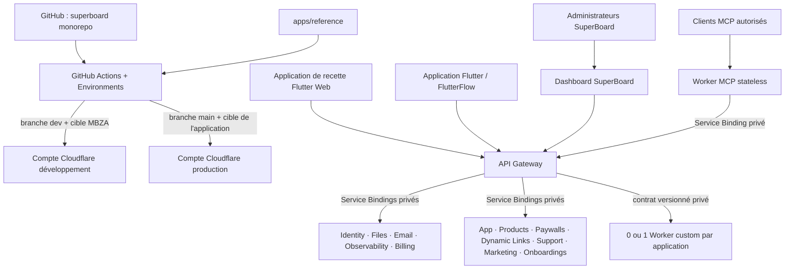

# Architecture cible SuperBoard, MBZA et VocoStar

État de la base de référence mis à jour le 9 août 2026. Ce document décrit la cible à
déployer; l'ancien inventaire de VocoStar reste disponible uniquement comme
[photographie historique](./VOCOSTAR_CLOUDFLARE_ARCHITECTURE.md).

## Décision d'architecture

SuperBoard devient le back-office et le plan de contrôle commun à toutes les
applications. Il n'est plus un SaaS autonome. Tout le code commun vit dans le
monorepo `mabzadev/superboard`; l'application d'acceptation FlutterFlow vit dans
`apps/reference`. `mbza.dev` est seulement l'environnement de
développement et de recette de cette plateforme.

Une application n'obtient jamais une copie modifiée des Workers communs. Elle
fournit un manifeste de cible non secret, active ses fonctionnalités et peut
ajouter au maximum un Worker custom pour ses traitements véritablement uniques.

## Adresses de la recette MBZA

| Surface                  | Adresse                                      | Rôle                                                                                          |
| ------------------------ | -------------------------------------------- | --------------------------------------------------------------------------------------------- |
| Application de référence | `https://reference.mbza.dev`                 | recette exécutable Flutter Web des quinze parcours communs et du protocole d'extension custom |
| Back-office              | `https://board.mbza.dev`                     | administration, données, états et diagnostics                                                 |
| API                      | `https://api.mbza.dev`                       | façade authentifiée de tous les services                                                      |
| SDK                      | `https://sdk.mbza.dev`                       | endpoints consommés par les bibliothèques mobiles                                             |
| Liens courts             | `https://in.mbza.dev`                        | redirection, attribution et app/universal links                                               |
| Fichiers                 | `https://files.mbza.dev`                     | diffusion contrôlée des fichiers                                                              |
| MCP                      | `https://mcp.mbza.dev/mcp`                   | outils opérateur OAuth en Streamable HTTP stateless                                           |
| Prévisualisation email   | `https://mail.mbza.dev`                      | boîte de capture protégée en développement                                                    |
| Support mobile           | `https://api.mbza.dev/api/v1/support-client` | conversations, pièces jointes, temps réel et CSAT                                             |

Les services de plateforme sont déclarés dans
`deploy/targets/mbza-development.json`. L'adresse de l'application de référence
et son Worker Static Assets sont déclarés dans
`apps/reference/reference.project.json`. Ces manifestes ne contiennent ni ID de
compte Cloudflare ni secret et leurs valeurs ne deviennent jamais des valeurs
par défaut du code réutilisable.

État public revérifié le 12 août 2026 : `board.mbza.dev` et
`api.mbza.dev/health` répondent en HTTP 200; `in.mbza.dev`, `sdk.mbza.dev` et
`files.mbza.dev` sont servis par la façade API, tandis que `mcp.mbza.dev` est
servi par le Worker MCP. `grow.mbza.dev` est retiré. `reference.mbza.dev` et
`mail.mbza.dev` ne sont pas encore publiés.
Le pipeline lit les zones, records DNS et domaines Workers avant de publier,
avec un token de déploiement explicitement fourni par GitHub Environment. Il
bloque ces conflits et ne remplacera ni l'ancien record de liens courts ni le
résidu API sans cutover explicite.

## Séparation entre déploiement privé et bascule publique

Le schéma de cible v8 impose un mode `publicRouting` à chaque environnement.
`staged` autorise le déploiement et les tests des Workers privés et de leurs
Service Bindings, mais ne génère aucune route ni aucun domaine personnalisé.
`active` autorise les surfaces publiques; en production, ce mode est refusé
tant que la cible ne référence pas un reçu de version client FlutterFlow
schema-validé. Le reçu lie le projet, le commit FlutterFlow, le snapshot revu,
la politique de convergence et l'empreinte de tous les fichiers sources
déclarés.

VocoStar est actuellement déclaré `publicRouting: staged`. Le pipeline peut
donc préparer sa pile production sans prendre `api.vocostar.com`, son Dashboard,
ses fichiers, son MCP, ses liens courts, son aperçu email ou son ancien domaine
Messaging. La bascule vers `active` restera impossible tant que les vingt-sept
contrôles du client VocoStar ne seront pas verts et que le reçu correspondant
n'aura pas été revu puis commité. Le back-office expose le mode de routage dans
la page Infrastructure afin qu'un Worker sain mais encore privé ne soit jamais
confondu avec une API publiquement active. La procédure détaillée et le rollback
sont décrits dans
[PUBLIC_ROUTING_CUTOVER.md](./PUBLIC_ROUTING_CUTOVER.md).

## Catalogue complet des Workers

La cible complète comporte seize déploiements Workers, dont sept obligatoires,
huit activables et un custom. L'ancien Worker Messaging n'appartient pas à cette
base; il n'est conservé que comme source temporaire de migration sur VocoStar.

| Worker          | Nature                 | Responsabilité                                                                                                   | État principal                                |
| --------------- | ---------------------- | ---------------------------------------------------------------------------------------------------------------- | --------------------------------------------- |
| `observability` | commun obligatoire     | reçoit les Tails nettoyés, agrège erreurs, latences, CPU et temps muraux                                         | Analytics Engine                              |
| `email`         | commun obligatoire     | emails transactionnels, capture dev, SMTP prod, tentatives, retry et DLQ                                         | D1 Email + Queue/DLQ                          |
| `files`         | commun obligatoire     | upload authentifié, métadonnées, téléchargement en flux, suppression et purge de compte                          | D1 Files + R2 commun                          |
| `identity`      | commun obligatoire     | compte applicatif, email/mot de passe, Google, Apple, sessions et échange JWT                                    | D1 Identity                                   |
| `api`           | commun obligatoire     | façade publique, OAuth administrateur, utilisateurs/projets, notifications, orchestration SDK et état plateforme | D1 central + KV + R2 + Queues                 |
| `mcp`           | commun obligatoire     | outils opérateur OAuth via Streamable HTTP stateless; validation et appels API par Service Binding privé         | aucun stockage ni secret propre               |
| `dashboard`     | commun obligatoire     | interface back-office SuperBoard et page Infrastructure                                                          | Worker OpenNext + cache R2                    |
| `billing`       | fonctionnalité         | achats Apple/Google, produits, abonnements, droits, remboursements et jobs financiers                            | D1 central pendant la convergence + Queue/DLQ |
| `app`           | fonctionnalité         | clients, références, clés d'accès, configuration SDK et métriques                                                | D1 App                                        |
| `products`      | fonctionnalité         | catalogue, offres, produits, droits et achats                                                                    | D1 Products                                   |
| `paywalls`      | fonctionnalité         | paywalls, versions, placements, variantes et événements                                                          | D1 Paywalls                                   |
| `dynamic-links` | fonctionnalité         | liens courts, campagnes, domaines, règles de redirection et attribution                                          | D1 Dynamic Links                              |
| `support`       | fonctionnalité         | boîte de réception unifiée, contacts, messages, pièces jointes, webhooks, automatisations et CSAT                | D1/R2 + Queue/DLQ + Durable Object            |
| `marketing`     | fonctionnalité         | consentement, listes, segments, modèles, newsletters, campagnes, suivi et statistiques                           | D1/R2 + Queue/DLQ                             |
| `onboardings`   | fonctionnalité         | parcours d'accueil distants, versions, ciblage et progression                                                    | D1 Onboardings                                |
| `custom`        | propre à l'application | conversions, IA ou intégrations qui n'existent que pour cette application                                        | ressources déclarées dans sa cible            |

Ordre de déploiement : Observability, Email, Files, Identity, modules activés,
Billing, Custom, API, MCP, puis Dashboard. Le Dashboard est publié en dernier, car
il décrit l'API effectivement déployée.

La source de l'application `reference.mbza.dev` vit dans `apps/reference` et ses
tests font partie de la CI du monorepo. Son futur Worker d'assets statiques sert
la recette, pas un rôle métier, et n'entre donc pas dans les seize rôles
ci-dessus. Le domaine n'est pas encore publié au 12 août 2026.

## Ce qui est commun, configurable ou custom

| Besoin                                 | Implémentation commune      | Configuration par application                        | Custom autorisé |
| -------------------------------------- | --------------------------- | ---------------------------------------------------- | --------------- |
| Utilisateurs et rôles administrateurs  | API + Dashboard             | allowlist initiale, opérateurs                       | non             |
| Comptes mobiles                        | Identity                    | ouverture/allowlist, audience, durée des jetons      | non             |
| Connexion Google/Apple                 | Identity                    | client IDs, audiences et secrets fournisseurs        | non             |
| Notifications                          | API + Queues                | FCM/APNs, modèles, activation                        | non             |
| Maintenance et mise à jour obligatoire | App + SDK                   | politique par plateforme, versions et URL Store      | non             |
| Fichiers                               | Files                       | bucket, taille maximale, rétention                   | non             |
| Produits/achats/paywalls               | Products, Billing, Paywalls | identifiants stores, catalogue, placements           | non             |
| Liens et attribution                   | Dynamic Links               | domaine, campagnes, règles                           | non             |
| Support                                | Support                     | projets admis, webhooks, règles et identité visuelle | non             |
| Emails transactionnels                 | Email                       | expéditeur, réponse, SMTP de production              | non             |
| Newsletter/marketing                   | Marketing + Email           | consentement, listes, segments, contenu et campagnes | non             |
| Outils IA/opérateur MCP                | MCP + API                   | domaine MCP et clients OAuth autorisés               | non             |
| Onboarding                             | Onboardings                 | écrans, variantes, ciblage                           | non             |
| Conversions voix/média VocoStar        | contrat Custom              | capacités, ressources et fournisseurs VocoStar       | oui             |

Règle de promotion : dès qu'une capacité custom est utile à une deuxième
application, elle sort du Worker custom et devient un Worker ou package commun.

## Contrat du Worker custom

Chaque cible peut déclarer zéro ou un `customWorker` avec son chemin source, sa
description, ses capacités et ses noms de secrets. Le Worker n'expose aucune
route d'administration publique. L'API l'appelle par Service Binding et jeton
interne.

Le contrat `@superboard/contracts/custom-worker` est en version privée **v2** :
le projet et le sujet sont indissociables pour toute requête issue du SDK
public. Il définit :

- `GET /internal/v1/manifest` : identité, version et description des capacités;
- `POST /internal/v1/jobs` : enveloppe de job avec capacité, projet,
  horodatage et clé d'idempotence;
- `GET /internal/v1/jobs` et `GET /internal/v1/jobs/:id` : liste et état;
- `POST /internal/v1/jobs/:id/cancel` : annulation idempotente limitée au
  projet/propriétaire avant le démarrage du traitement;
- `POST /internal/v1/jobs/:id/retry` : nouvelle tentative contrôlée;
- `GET /internal/v1/stats` : compteurs par capacité et état.

L'application mobile n'accède jamais à ces routes privées. Après le middleware
SDK commun (`PROJECT-KEY`, plateforme et identifiant d'application), elle utilise
`POST/GET /api/v1/sdk/custom/v1/jobs` et
`POST /api/v1/sdk/custom/v1/jobs/:id/cancel`. L'API vérifie ensuite le JWT applicatif,
dérive le projet et l'utilisateur côté serveur, remplace tout `userId` fourni par
le client et transforme la clé d'idempotence en empreinte isolée par
projet/utilisateur. La paire interne `x-custom-worker-project` et
`x-custom-worker-subject`, acceptée seulement avec le secret inter-Worker, limite
les listes, détails et annulations simultanément au projet et au propriétaire;
un demi-scope est refusé. Le Worker applicatif accepte l'annulation uniquement
avant démarrage et applique les compensations de manière idempotente. Retry,
statistiques et vue globale restent réservés au back-office owner/admin.

Le custom VocoStar applique ce protocole aux jobs voix/média et réconcilie leur
état historique. Il persiste déjà le payload enrichi et l'identité durable avant
d'appeler directement les orchestrateurs Workflow/Container; repasser par le
dispatcher VocoStar historique dupliquerait l'enrichissement et créerait un second
identifiant pour les jobs voix. Le custom de référence MBZA exécute un écho
durable dans son D1 dédié : création, rejeu idempotent, conflit, liste paginée,
détail, isolation par projet/utilisateur, statistiques et health check. Il certifie
ainsi le cycle complet avant l'ajout d'une intégration propre à une application.
Sa rétention n'est pas codée dans le Worker : la cible déclare
`REFERENCE_JOB_RETENTION_DAYS` (30 jours sur MBZA), `/health` publie cette valeur
et une création purge les jobs d'acceptation expirés. Une maintenance quotidienne
est déclarée dans la cible avec `customWorker.crons`. VocoStar déclare séparément
son retry chaque minute; aucune fréquence n'est déduite du nom d'une capacité.

## Emails, newsletters et notifications

La responsabilité est volontairement séparée :

1. Marketing décide qui doit recevoir quoi : consentement, suppression, listes,
   segments, modèles, campagnes et statistiques.
2. Email transporte les messages transactionnels et de test : journal
   idempotent, capture, file, verrou de livraison, tentatives, SMTP, retry, DLQ
   et reçu fournisseur.
3. Marketing garde ses profils, quotas, bascule, consentements et événements par
   projet, puis délègue le message final personnalisé au Worker Email par liaison
   privée. Email est l'unique autorité qui ouvre une connexion SMTP et conserve
   un reçu idempotent sans persister le secret ou le corps délégué. Une
   application sans Marketing ne déploie donc aucun état newsletter.
4. API/Identity émettent les emails transactionnels par liaison privée :
   vérification, récupération de mot de passe, invitation et export.
5. En développement, `transport=capture`; aucun email transactionnel de test ne part chez un
   destinataire réel. `mail.mbza.dev` exige `MAIL_PREVIEW_TOKEN`.
6. En production, SMTP et ses identifiants sont des secrets Worker propres à la
   cible; aucun mot de passe n'est commité ni stocké dans l'état FlutterFlow.
7. Un test SMTP réussi ne suffit pas : le back-office vérifie SPF, le sélecteur
   DKIM et DMARC via DNS-over-HTTPS binaire, conserve l'état et interdit aux
   campagnes/double opt-in de sélectionner un profil non vérifié en production.
8. Toute relance transactionnelle avec la même clé et le même contenu récupère
   le reçu existant; une réutilisation de clé avec un contenu différent est
   refusée et un verrou D1 empêche deux consommateurs d'expédier le même destinataire.
9. Le back-office Marketing expose les éléments de DLQ par projet sans leur
   payload; replay et discard sont idempotents, audités et un échec Queue remet
   l'élément en quarantaine.

Les notifications push suivent la même règle : orchestration commune et
identifiants APNs/FCM propres à chaque application. Ces identifiants sont
chiffrés dans D1 par un keyring Worker versionné. La maintenance converge les
anciennes valeurs en clair par lots bornés; le statut Infrastructure affiche
les appareils, les livraisons (`queued`, `processing`, `stale`, `delivered`,
`failed`) et l'état de sécurité des identifiants.

Les secrets d'authentification suivent deux traitements distincts : les valeurs
qui ne doivent jamais être relues (bearer OAuth/MCP, secrets client OAuth,
invitations et réinitialisations) sont stockées en digest SHA-256; les seeds
TOTP, qui doivent être relus pour valider un code, sont chiffrés avec le keyring
Worker. Les anciennes lignes sont convergées par lots bornés et leur présence
dégrade explicitement l'état Infrastructure. Les connexions, inscriptions,
invitations et réinitialisations partagent en plus une fenêtre anti-abus D1 de
dix minutes; sa clé est un digest du scope, de l'IP Cloudflare et du sujet, sans
email, IP ou token brut en base.

Les tokens privés entre Workers suivent un troisième protocole adapté aux
rotations multi-services. Le graphe de contrats, propre à chaque
`cible/environnement`, charge d'abord des versions inactives : les consommateurs
acceptent temporairement le binding courant et `*_PREVIOUS`, tandis que les
producteurs émettent seulement la nouvelle valeur. La promotion impose les
consommateurs avant les producteurs. Après au moins trente minutes
d'observation, un reçu lié au compte et aux versions exactes autorise le retrait
des anciens bindings, avec rollback automatique. Les secrets ne transitent ni
par Git, ni par les manifests, ni par FlutterFlow.

## Données et ressources de la base MBZA complète

Après bootstrap, la cible de développement doit posséder :

- 12 bases D1 : centrale, Email, Identity, Files, les sept modules et la base
  durable du Worker custom de référence;
- 1 namespace KV commun;
- 4 buckets R2 : fichiers, cache Dashboard, pièces jointes Support et médias
  Marketing;
- 14 Queues au total : sept files principales et leurs sept DLQ (événements,
  push, maintenance, Billing, Email, Support et Marketing);
- 1 Durable Object SQLite pour les conversations Support;
- 1 dataset Analytics Engine pour l'observabilité.

Chaque D1 a un seul propriétaire de schéma. Billing utilise encore la base
centrale, mais n'exécute aucune migration concurrente. Les noms de tables, leur
propriétaire et l'inventaire central complet sont listés dans
[REFERENCE_DATA_INVENTORY.md](./REFERENCE_DATA_INVENTORY.md).

La configuration de chaque Worker propriétaire est générée depuis son vrai
répertoire Git de migrations. Elle verrouille la table de registre
`d1_migrations` et injecte automatiquement le dernier fichier revu dans
`D1_EXPECTED_MIGRATION`; aucun numéro de migration n'est recopié dans un
manifeste d'application. Au runtime, le Worker compare ce fichier au registre
D1 et publie un état `current`, `behind` ou `drifted`, la dernière migration
appliquée et le nombre total de migrations. Une base joignable mais non courante
rend le Worker `degraded` avec HTTP 503. L'agrégateur applique la même règle :
une réponse de service `ok` sans preuve de schéma valide ne peut jamais rendre
son datastore sain.

Le rollout complet de production commence par exporter toutes les D1 activées,
avant la première migration et avant le premier Worker. Il migre et vérifie
ensuite chaque base, puis produit un reçu de lot couvrant exactement chaque
propriétaire de schéma. Les Workers ne commencent à être déployés qu'après ce
reçu. Les fichiers, reçus SHA-256 et reçu de lot sont chiffrés en AES-256-GCM;
les artefacts chiffrés sont conservés 30 jours par GitHub Actions, y compris les
exports récupérables produits avant un échec. Le processus refuse un résultat
vide, `--skip-backup` et `--skip-migrations` en production.

Chaque file principale est associée à une DLQ et les deux consommateurs sont
générés depuis le manifeste. Le Worker propriétaire persiste un échec terminal
dans sa propre D1 avant de l'acquitter : API pour events/push/maintenance,
Billing, Email, Support et Marketing. Les payloads sont limités à 128 Kio, les
champs de secret sont masqués et deviennent non rejouables, l'original est
empreinté en SHA-256 et chaque table de quarantaine est plafonnée à 10 000
lignes. La compatibilité Messaging, bien que désactivée, applique le même
contrat jusqu'à sa suppression définitive.

## Back-office : ce qu'un administrateur doit voir

La page `/infrastructure` consomme `GET /api/v1/platform/status` avec un rôle
owner/admin. Elle doit être la source de vérité opérationnelle et afficher :

- la cible et la révision Git réellement déployées;
- l'environnement, les URL et les capacités exposées par l'API;
- la disponibilité HTTPS publique, le code HTTP et la latence de l'API, du SDK,
  des liens courts, des fichiers, du Dashboard, du MCP, de la mail-preview et des
  surfaces externes déclarées comme `reference.mbza.dev`;
- la description, l'état, la latence et la dernière erreur nettoyée de chaque
  Worker activé;
- les utilisateurs, projets, instances, sessions et jetons OAuth actifs;
- pour chaque client financier : identité applicative et alias, blocage,
  abonnements, droits vérifiés ou promotionnels, soldes, transactions,
  événements de paywall et opérations auditées de fusion/suppression;
- les jobs Billing, exports, échecs de paiement et réconciliations;
- les utilisateurs Identity, fichiers et volumes logiques;
- les contacts, conversations ouvertes/en attente/fermées, messages, pièces
  jointes, webhooks en échec et score CSAT Support;
- les volumes transactionnels/marketing, files d'attente, campagnes,
  délivrabilités, erreurs, rebonds, plaintes et quarantaines DLQ API, Email,
  Support et Marketing;
- le manifeste, les capacités et les jobs du Worker custom; un `appKey` ou une
  version de protocole inattendue est affiché comme incompatible et dégrade
  l'état global;
- les exceptions, invocations, CPU et latences collectés par Observability.

Elle présente également l'inventaire logique de chaque D1, KV, R2 et Durable
Object, son propriétaire et son état. Pour chaque D1, elle affiche aussi l'état
du schéma, la migration attendue, la dernière migration appliquée et le nombre
de migrations enregistrées. Une console SQL arbitraire n'est pas exposée : les
données métier se consultent dans les pages de module et les diagnostics restent
en lecture seule et filtrés.

La page `/app/libraries` consomme `GET /api/v1/platform/libraries`. Elle affiche
pour chaque SDK la version du code source, la dernière version publiée, le tag
immuable, l'extrait d'installation, la branche d'autorité et les liens vers les
fichiers Git. Elle inventorie exhaustivement les widgets, les actions, les flux
d'événements et les alias temporaires de compatibilité FlutterFlow. La CI compare
cette déclaration à tous les symboles publics et à tous les fichiers Dart des
deux packages; un ajout oublié échoue. Le catalogue Git reste la seule autorité
de mise à jour; une publication passe par pull request, puis par l'Environment
GitHub protégé `sdk-release` et un tag immuable.

Le catalogue MCP réutilise le même agrégateur avec l'outil en lecture seule
`get_platform_status`. Seul un owner/admin peut l'appeler avec son jeton OAuth
MCP. Le résultat présente la cible et la release, les surfaces publiques, les
Workers, les stores, les compteurs, les jobs, les capacités API et le Worker
custom; il n'expose ni secret, ni payload privé, ni console SQL.

Les métriques physiques Cloudflare (taille D1, volume R2 et backlog Queue) sont
obtenues via l'API Analytics avec un jeton en lecture seule; elles ne doivent pas
être inventées à partir des tables métier.

## Git, branches et comptes Cloudflare

| Branche                   | Environnement GitHub         | Cible                      | Effet                                      |
| ------------------------- | ---------------------------- | -------------------------- | ------------------------------------------ |
| branche de fonctionnalité | aucun                        | aucune                     | tests et dry-runs seulement                |
| `dev`                     | `development`                | `mbza-development`         | déploiement automatique de la recette MBZA |
| `main`                    | une ou plusieurs productions | manifests des applications | déploiements automatiques multi-comptes    |

`config/cloudflare-deployments.json` sélectionne, pour chaque branche, tous les
GitHub Environments à déployer et fixe la cible attendue pour chacun. Chaque
Environment fournit `SUPERBOARD_TARGET`, qui doit être strictement identique à
cette cible versionnée, `CLOUDFLARE_ACCOUNT_ID`, `CLOUDFLARE_API_TOKEN` et, en
production, la clé de chiffrement des sauvegardes. Une divergence bloque le job
avant toute commande Cloudflare. Un nouveau compte Cloudflare nécessite un
nouveau manifeste, une entrée de matrice et des secrets d'environnement, jamais
une copie du workflow ni une modification des constantes du code.

La CI des pull requests effectue les typechecks, tests et dry-runs de tous les
Workers communs, modules et implémentations custom. Le workflow de déploiement
protégé est la seule autorité de publication automatique.

`apps/reference` applique la même frontière dans le monorepo : chaque pull
request valide son manifeste, ses dépendances et Flutter Web contre le même SHA
SuperBoard. La publication de `reference.mbza.dev` reste un cutover distinct et
n'est pas encore active; aucun dépôt ni événement cross-repository n'intervient
plus dans cette validation.

## Référence FlutterFlow

`apps/reference`, destiné à être publié sur `https://reference.mbza.dev`, contient
exactement seize parcours d'acceptation : bootstrap,
connexion, création de compte, récupération de mot de passe, accueil, profil,
notifications, fichiers, produits, paywall, liens dynamiques, support, consentement
marketing, onboarding, extension custom `reference.echo`, receipt de promotion
`reference.acceptance` lié aux révisions Git exactes, et diagnostic.

La bibliothèque SuperBoard fournit les widgets Bootstrap, Paywall et Onboarding,
les boutons Restore Purchases et Customer Center, ainsi que les actions communes
d'identité, fichiers, achats, événements, liens, consentement Marketing,
Support et jobs custom authentifiés.
L'application consomme des références Git immuables vers `mabzadev/superboard`; elle ne
copie pas les protocoles réseau dans du custom code FlutterFlow. Le catalogue
exhaustif des pages, états, Dart defines, actions et tables est dans
[REFERENCE_DATA_INVENTORY.md](./REFERENCE_DATA_INVENTORY.md).

L'inventaire élément par élément du dernier export VocoStar, avec la destination
de ses 23 pages, 17 composants, 29 actions custom, 7 widgets et 34 états, est dans
[VOCOSTAR_FLUTTERFLOW_CONVERGENCE.md](./VOCOSTAR_FLUTTERFLOW_CONVERGENCE.md).

## Convergence VocoStar et suppression de Chatwoot

La cible finale de VocoStar suit ces étapes, sans raccourci destructif :

1. conserver les D1 Email, Identity et Files, les R2 Dashboard/Support et les
   Queue/DLQ Email/Support provisionnés le 9 août 2026;
2. fournir les secrets manquants, appliquer les dix-huit migrations avec
   sauvegardes chiffrées et remplacer les shells privés par les Workers communs
   validés;
3. faire de `api.vocostar.com` la façade SuperBoard, migrer le mobile vers
   `/api/v1/sdk/custom/v1/jobs` et connecter les anciens Workflows/Containers au
   Worker custom VocoStar;
4. exporter l'ancienne source Dokploy si elle existe encore, puis D1/R2 du
   runtime OpenChat actif à `chat.vocostar.com`; transformer les contacts,
   conversations, messages et toutes les pièces jointes vers Support;
5. comparer les volumes, tester Support, répéter un rollback et respecter la
   période de rétention;
6. supprimer l'intégration Chatwoot du client et du Dashboard;
7. seulement après validation signée, retirer les trois Workers et ressources
   OpenChat ainsi que `chat.vocostar.com`; `sup.vocostar.com` est déjà absent du
   DNS et reste une source historique à réconcilier, pas un service à recréer;
8. retirer ensuite le Worker/D1/R2 Messaging hérité quand plus aucun lecteur,
   alias SDK ou rollback n'en dépend.

La procédure exécutable et ses confirmations exactes sont dans
[CHATWOOT_SUPPORT_CUTOVER.md](./CHATWOOT_SUPPORT_CUTOVER.md). Le baseline ne
supprime aucune donnée ni aucun DNS de production.

L'inventaire direct du runtime, les agrégats D1 et la matrice des doublons sont
dans [OPENCHAT_SUPPORT_CONVERGENCE.md](./OPENCHAT_SUPPORT_CONVERGENCE.md).

## État réel de cette branche

Déjà implémenté et validé localement : manifestes paramétrés, générateur Wrangler,
ordre de déploiement, contrôle des secrets par nom, sauvegardes D1 chiffrées,
Identity, Files, Email, Observability, MCP stateless, sept modules, deux Workers custom, Support
canonique, migrations Chatwoot, bibliothèque FlutterFlow et application de
référence. Son manifeste strict, son workflow `dev`, son Worker Static Assets et
son dry-run de publication sont également validés.

La bibliothèque FlutterFlow `SuperBoard` n'est plus un workspace local orphelin :
son DSL, ses tests et son manifeste (11 Library Values, 64 Custom Actions) sont
maintenant dans le monorepo `mabzadev/superboard`. Le workflow GitHub protégé vérifie les tags
immuables, teste le DSL puis met à jour le projet distant avec une variable et un
secret d'Environment; aucun ID de projet ni credential n'est codé dans la source.

Le cycle de vie commun distingue désormais strictement la déconnexion de la
suppression. `DELETE /api/v1/sdk/account/v1` orchestre App, Marketing, Support,
Worker custom, Billing, Files et Identity avec une opération D1 durable,
idempotente et reprenable. L’ancienne suppression partielle `/auth/me` est
fermée. Le Dashboard expose l’avancement pseudonymisé aux seuls owners/admins
dans `/infrastructure`. Le contrat complet, les limites de rétention et la
procédure de recette sont définis dans
[ACCOUNT_LIFECYCLE.md](./ACCOUNT_LIFECYCLE.md).

Encore externe au dépôt : création des ressources MBZA, affectation des secrets,
connexion effective des dépôts GitHub, déploiement Cloudflare, DNS, exécution de
la migration Chatwoot, rotation des anciennes clés VocoStar et tests mobiles sur
les toolchains iOS/Android complètes. Ces opérations exigent les comptes, secrets
et autorisations correspondants; elles ne sont pas simulées comme « terminées ».
