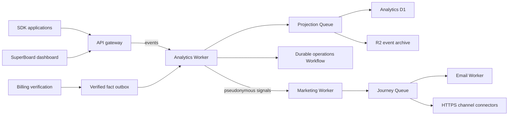

# Architecture Marketing et Analytics

## Décision

SuperBoard reste un monorepo canonique. La bonne granularité n'est pas « un dépôt
Git par fonctionnalité » : c'est un contexte métier indépendant par Worker,
avec son schéma D1, ses files, ses contrats et ses tests dans le même dépôt.

Les références fonctionnelles utilisées pour cette convergence sont figées :

- Dittofeed : `52b2bee909744d07dd5d409fd3974d4b95c66766` ;
- Countly Server : `8af261bec41151b8f50eb2b380973077f286f1ef`.

Ces références servent de catalogue fonctionnel et de provenance. SuperBoard
implémente les capacités dans son architecture Cloudflare native au lieu de
faire tourner deux plateformes parallèles, deux systèmes d'identité et deux
bases d'autorité.



Ce découpage donne deux services déployables séparément sans créer deux nouveaux
dépôts. L'API est le seul point d'entrée public administratif. Tous les appels
inter-Workers passent par des Service Bindings et un contexte de projet signé.

## Responsabilités

### Analytics

Le Worker `workers/analytics` est l'autorité pour :

- l'ingestion unitaire ou par lot d'événements v1 ;
- la validation stricte du vocabulaire et le rejet des événements système
  réservés envoyés par un SDK ;
- la déduplication `(project_id, event_id)` avec détection d'un même identifiant
  réutilisé pour un contenu différent ;
- la pseudonymisation HMAC des identifiants utilisateur, anonyme, installation
  et session, avec rotation current/previous ;
- les profils et alias pseudonymes ;
- les sessions et leur durée ;
- le registre des applications observées et leurs paramètres de collecte ;
- les tableaux de bord configurables et leurs widgets ;
- les vues, écrans, dimensions techniques, navigateurs, appareils, réseaux et
  dimensions géographiques ;
- l'analyse d'événement et la segmentation par propriété ;
- les groupes de crash, occurrences, statuts et commentaires utilisateurs ;
- les cohortes évaluables ;
- Remote Config versionné, ciblé et réparti de façon déterministe ;
- les alertes planifiées, incidents, notifications AWS SES et webhooks signés ;
- les annotations produit ;
- la première installation canonique, unique par projet, application et
  instance ;
- les faits d'achat validés, uniques par boutique, environnement, transaction
  et type d'événement ;
- les métriques journalières, définitions d'événements, explorateur, funnels et
  rétention par cohorte d'installation ;
- les rapports enregistrés ;
- les opérations longues d'export, replay, reconstruction de rollups et
  effacement de sujet via Cloudflare Workflows ;
- l'archive froide R2 et la quarantaine durable ;
- la publication idempotente de signaux pseudonymes vers Marketing.

Les montants ne sont jamais additionnés entre devises. L'overview renvoie un
total net par devise ; le champ scalaire n'est renseigné que lorsqu'une seule
devise est présente.

### Marketing

Le Worker `workers/marketing` reste l'autorité pour :

- les abonnés, consentements, suppressions et préférences applicatives ;
- les listes, segments et memberships ;
- les modèles, médias, campagnes, planification, quotas et statistiques ;
- les identités d'expéditeur, la preuve SPF/DKIM/DMARC, le suivi, les
  désabonnements et les événements de livraison AWS SES ;
- les parcours versionnés déclenchés par un événement Analytics ;
- les conditions d'entrée et la politique de réentrée (`once`,
  `after_completion`, `every_event`) ;
- les étapes email, canal, délai, branche, mise à jour d'attribut et sortie ;
- le verrouillage d'une inscription sur la version du parcours utilisée à son
  entrée ;
- les reçus d'exécution d'étape et de livraison, qui empêchent un replay de
  répéter un effet externe ;
- les connecteurs HTTPS génériques pour webhook, SMS, push, WhatsApp et Slack,
  avec secret chiffré, signature HMAC et clé d'idempotence ;
- la quarantaine, le replay/discard et l'audit opérateur.

L'Email Worker reste la seule autorité de transport. Il possède les identifiants
SMTP AWS SES du compte, ouvre directement STARTTLS vers l'hôte régional SES et
vérifie les signatures SNS avant de réconcilier livraison, rebond et plainte.
Marketing matérialise le message, applique consentement et ciblage, puis délègue
le transport par Service Binding sans recevoir le secret SMTP.

## Répartition des fonctions transverses

Une capacité déjà possédée par un module SuperBoard n'est pas dupliquée dans
Analytics ou Marketing :

| Capacité fonctionnelle                                     | Autorité SuperBoard                                                             |
| ---------------------------------------------------------- | ------------------------------------------------------------------------------- |
| Événements, sessions, profils, funnels, rétention, exports | Analytics                                                                       |
| Installations et attribution de lien                       | Analytics pour le compte canonique, Dynamic Links pour la règle d'attribution   |
| Achats, abonnements, refunds et validation boutique        | Billing pour la preuve, Analytics pour la projection en lecture                 |
| Push et appareils                                          | API Notifications pour le transport, Marketing pour l'orchestration de parcours |
| Comptes applicatifs et politique d'exécution               | App                                                                             |
| Applications observées, Remote Config, crashes et alertes  | Analytics                                                                       |
| Expériences de paywall                                     | Paywalls                                                                        |
| Onboarding, variantes et complétion                        | Onboardings                                                                     |
| Audiences, consentement, campagnes et parcours             | Marketing                                                                       |
| Email SMTP                                                 | Email                                                                           |

Les événements spécialisés comme une vue, une note ou un crash utilisent le
contrat d'événement Analytics et un nom stable (`screen.viewed`, `app.crashed`)
ou leur nom de migration Countly (`[CLY]_view`, `[CLY]_crash`,
`[CLY]_star_rating`). Ils bénéficient des mêmes projections, filtres, funnels,
rapports et exports sans installer un système de plugins séparé.

## Comptage fiable

### Installation

1. L'API authentifie le projet SDK.
2. `installed_apps` accepte une seule ligne `(device_id, project_id)`.
3. La même transaction D1 ajoute le fait à `analytics_fact_outbox` avec la clé
   `installation:<project>:<application>:<device>`.
4. Le drain signé remet le fait à Analytics.
5. Analytics applique son propre reçu d'événement puis l'unicité
   `(project_id, application_id, app_instance_id_hash)`.

Une répétition réseau peut donc être reçue plusieurs fois sans créer plusieurs
installations.

### Achat

1. Apple ou Google est vérifié par Billing.
2. La transaction vérifiée et le fait Analytics sont commités ensemble dans le
   D1 central.
3. La clé métier est
   `purchase:<project>:<store>:<environment>:<transaction>:<event-type>`.
4. Analytics refuse tout événement financier réservé provenant d'un SDK.
5. La projection impose la même unicité métier une seconde fois.

Les lignes sans `verified_at` ne sont pas backfillées. Un refund, chargeback ou
cancel est un fait séparé et ne compte pas comme achat réussi.

## Backfill et réconciliation

La migration `0060_analytics_verified_fact_backfill.sql` transforme les
installations historiques et uniquement les transactions vérifiées en faits
canoniques. Elle est réexécutable sans inflation des compteurs.

Le rapport est non-mutant par défaut :

```bash
npm run analytics:reconcile -- \
  --target mbza-development \
  --environment development \
  --project-ref <instance>-test
```

Après provisionnement et migration, ajouter `--remote --require-ready`. Le
rapport compare :

- le nombre d'installations source et projeté ;
- le nombre d'achats vérifiés source et projeté ;
- les dimensions boutique, environnement, type, devise, volume et montant ;
- les lignes d'outbox livrées ;
- les lignes encore en vol ou en dead letter.

Le rollout est ordonné :

1. MBZA development : bootstrap du D1/R2/Queue/Workflow Analytics, secrets,
   migrations, Workers privés, API/Billing, Dashboard, drain et rapport vert ;
2. VocoStar production : activation du feature flag uniquement après le retour
   MBZA, backup de tous les D1, provisionnement avec confirmation, même séquence,
   puis rapport vert pour les projets test et production ;
3. aucune source ou métrique legacy n'est supprimée avant la fenêtre de
   rétention et un rapport de réconciliation conservé.

Le manifeste MBZA development possède ses identifiants D1, R2 et Queues
Analytics/Marketing et active les deux modules. VocoStar conserve Analytics
derrière son feature flag jusqu'à son propre provisionnement. Les générateurs
refusent un déploiement d'un module activé si une ressource ou un secret requis
n'est pas déclaré.

## Convention de code

1. Un contexte métier possède son dossier `workers/<module>`, ses migrations et
   son package ; aucune requête directe vers le D1 d'un autre module.
2. Les enveloppes partagées vivent dans `packages/contracts`, sont versionnées
   (`schema_version`) et parsées à chaque frontière.
3. TypeScript strict, fonctions petites autour d'un invariant métier, noms en
   anglais et identifiants SQL en `snake_case`.
4. Les routes publiques passent par l'API ; les routes Worker sont sous
   `/internal/v1` et exigent le contexte de projet signé.
5. Toute mutation exige une clé d'idempotence. Tout effet externe est précédé
   d'un reçu ou d'un outbox persisté.
6. Les migrations sont append-only. Une correction de production reçoit un
   nouveau numéro ; un fichier déjà appliqué n'est pas réécrit.
7. Les données sensibles sont réduites à la frontière : identifiants HMAC,
   secrets chiffrés, corps bornés, logs et health sans contenu privé.
8. Les pages Next restent minces ; l'accès réseau est centralisé dans
   `apps/dashboard/src/api/<module>` et les composants interactifs portent
   explicitement `"use client"`.
9. Chaque invariant a un test de contrat et, pour D1/Queue/Workflow, un test
   dans le runtime Cloudflare. Les manifests et générateurs ont leurs tests
   Node séparés.
10. Un feature flag désactivé reste une absence explicite, jamais un fallback
    silencieux vers un ancien dépôt ou une ancienne base.

## Commandes de validation

```bash
npm run contracts:test
npm run analytics:check
npm --prefix workers/marketing run typecheck
npm --prefix workers/marketing test
npm run migration:inventory:test
npm run cloudflare:test:services
npm run cloudflare:test:targets
npm run dashboard:typecheck
npm run dashboard:test
npm run dashboard:lint
```
