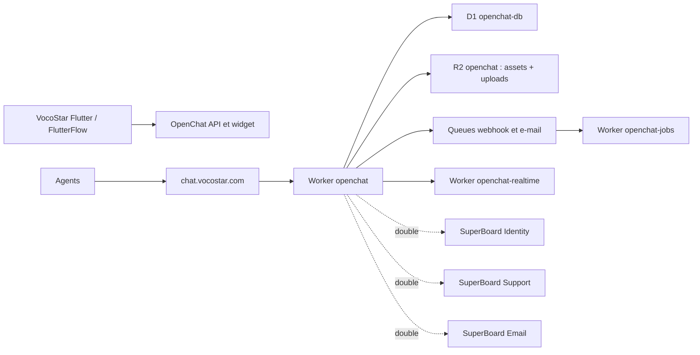
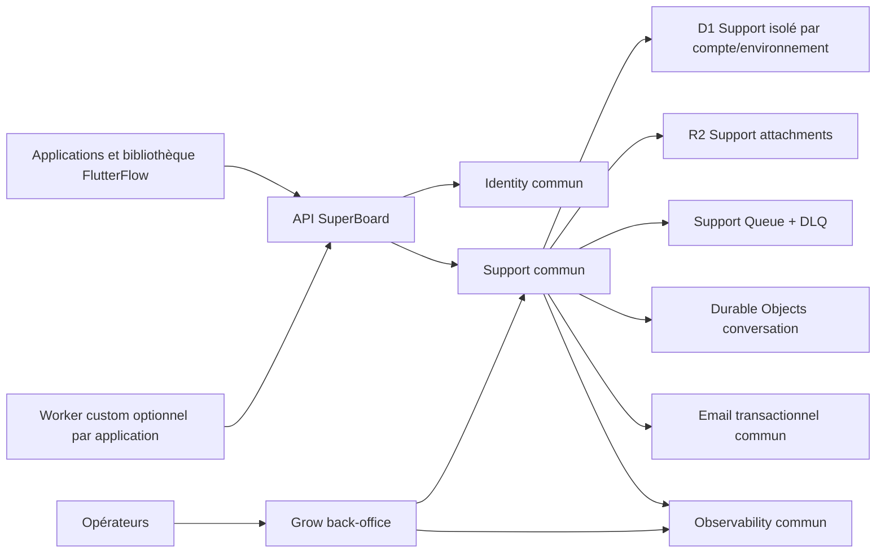

# Convergence OpenChat vers SuperBoard Support

## Décision

OpenChat n'est pas un second socle à maintenir. C'est une source de migration
temporaire et une référence fonctionnelle pour les comportements Chatwoot.
SuperBoard Support reste l'autorité commune pour le support de toutes les
applications. VocoStar ne conserve à terme qu'une configuration Support, un
identifiant de projet et ses choix de fonctionnalités.

Cette décision évite de maintenir en parallèle deux systèmes d'identité, deux
modèles de contacts, deux moteurs de conversations, deux stockages de pièces
jointes, deux systèmes temps réel, deux files de webhooks, deux interfaces
administrateur et deux pipelines de déploiement.

## État réellement observé le 9 août 2026

L'audit a été réalisé en lecture seule, sans lire `.env`,
`tmp/local_secret.txt`, les tokens applicatifs ou des lignes contenant des
données personnelles.

### Dépôt

- dépôt : `mabzadev/openchat`, fork public de `chatwoot/chatwoot` ;
- branche locale : `codex/cloudflare-complete-migration-foundation` ;
- dernier commit local : `0ea73ad7191d6da480b728621774ca1ead53d2bb` ;
- la couche Cloudflare est très largement modifiée ou non suivie localement ;
- la documentation qui qualifie encore le dépôt de privé est obsolète ;
- aucune modification n'a été effectuée dans ce dépôt pendant l'audit.

La branche locale déclare 104 règles de couverture : 79 implémentées, cinq
redirigées, cinq dépendantes d'une configuration externe, trois partielles, six
non portées et six exclues. Cette couverture est utile comme inventaire mais ne
prouve pas une parité comportementale complète avec Chatwoot Rails. Le manifeste
admet lui-même que plusieurs ressources n'ont qu'un CRUD ou des effets de bord
partiels.

### Runtime Cloudflare VocoStar

| Élément | État observé |
| --- | --- |
| Domaine | `https://chat.vocostar.com` répond ; `/ready` et `/health` retournent HTTP 200 |
| Ancien domaine | `sup.vocostar.com` ne résout plus |
| Application | Worker `openchat`, version active déployée le 3 août 2026 |
| Asynchrone | Worker privé `openchat-jobs` |
| Temps réel | Worker privé `openchat-realtime` et Durable Object |
| Base | D1 `openchat-db`, 93 tables, 201 index, migrations déclarées sans attente |
| Fichiers | R2 `openchat`, 1 109 objets, environ 189 Mo, assets et uploads mélangés |
| Webhooks | Queue et DLQ `openchat-webhook-events*` |
| E-mails | Queue et DLQ `openchat-email-events*` |
| Recherche IA | Vectorize `openchat-captain-responses`, 1 536 dimensions, cosine |
| Administration | `/super_admin*` et `/monitoring/sidekiq*` protégés par Cloudflare Access |
| Secrets application | `ACTIVE_STORAGE_SIGNING_SECRET`, `OPENCHAT_SESSION_SECRET`, `WIDGET_TOKEN_SECRET` |
| Secret e-mail | `RESEND_API_KEY` absent du Worker `openchat-jobs` |

Le `/ready` actuel contrôle la présence des bindings mais ne contrôle pas la
capacité réelle d'envoyer un e-mail. Il est donc vert alors que les e-mails de
confirmation, de réinitialisation et de transcript ne peuvent pas être remis au
fournisseur. Ce faux positif doit disparaître avec la convergence : l'état du
transport sera porté par le Worker Email commun et visible dans Grow.

### Données OpenChat

Les agrégats D1 suivants ont été lus sans extraire d'identité, de contenu de
message ou de secret :

| Entité | Nombre |
| --- | ---: |
| Comptes | 2 |
| Utilisateurs agents | 2 |
| Contacts | 12 |
| Inboxes | 1 |
| Conversations | 11 |
| Messages | 15 |
| Pièces jointes | 1 |
| Blobs Active Storage | 2 |
| Widgets web déclarés | 5 |
| Labels | 2 |
| Automatisations, réponses enregistrées, webhooks, CSAT | 0 |
| Canaux e-mail, API, WhatsApp, SMS, Twilio et réseaux sociaux | 0 |
| Intégrations, campagnes, Help Center, Captain, équipes, SLA et appels | 0 |

Cette utilisation réelle est nettement plus petite que la surface Chatwoot
portée dans OpenChat. La migration obligatoire concerne donc les contacts, la
conversation, les messages, les labels utiles, la pièce jointe et la liaison
des identités VocoStar. Les autres fonctionnalités doivent être activées dans
le socle commun uniquement sur preuve d'un besoin produit, pas parce qu'une
route Chatwoot existe.

## Doublons et autorité finale

| Domaine fonctionnel | OpenChat actuel | SuperBoard cible | Décision |
| --- | --- | --- | --- |
| Authentification agent | sessions, Google, SAML, MFA dans OpenChat | Identity + accès opérateur Grow | supprimer le doublon OpenChat |
| Identité utilisateur mobile | contact/token Chatwoot | Identity + application JWT | Identity est l'autorité |
| Contacts et sociétés | tables Chatwoot | Support multi-projet | migrer puis fermer la source |
| Conversations et messages | D1 OpenChat | D1 Support + Durable Object | migrer avec ordre et idempotence |
| Pièces jointes | R2 partagé assets/uploads | R2 Support dédié | copier et vérifier SHA-256 |
| Temps réel | Worker + Durable Object OpenChat | Durable Object Support | SDK Support uniquement |
| Labels, notes, participants, brouillons | Chatwoot | Support operations | transformer vers les entités communes |
| Macros et réponses enregistrées | Chatwoot, non utilisées | configuration Support | ne migrer que les lignes existantes |
| Automatisations | moteur Chatwoot, non utilisé | moteur Support | conserver le moteur commun |
| Webhooks | Queue OpenChat, non utilisés | Queue/DLQ Support + secrets chiffrés | recréer les secrets, jamais les copier |
| CSAT | Chatwoot, aucune réponse | Support | conserver le contrat commun |
| E-mails transactionnels | Queue OpenChat sans fournisseur | Worker Email commun | supprimer le pipeline OpenChat |
| Notifications agent | tables OpenChat | notifications Support/Grow | consolider dans Grow |
| Super administration | mini Super Admin OpenChat | Grow | Grow est l'unique back-office |
| Observabilité | `/ready`, `/metrics`, pseudo-Sidekiq | Infrastructure Grow + Observability | consolider dans Grow |
| Help Center, social, téléphonie, Captain | code présent mais données nulles | extensions optionnelles | ne pas porter dans le noyau maintenant |

## Architecture actuelle transitoire

## Architecture cible

Le Worker custom n'est jamais un clone du Support commun. Il contient seulement
les opérations propres à une application, par exemple la conversion audio de
VocoStar. S'il faut plus tard connecter un canal support propre à une seule
application, l'adaptateur fournisseur vit dans ce Worker custom et publie le
contrat Support commun ; il ne recrée ni contacts, ni conversations, ni inbox.

## Écart de préparation SuperBoard Support

Le Worker `opengrow-support` existe déjà dans le compte VocoStar. Sa version
active utilise encore les ressources de compatibilité Messaging :

- Queue `opengrow-messaging-events` ;
- R2 `opengrow-messaging` ;
- D1 `opengrow-support-db` ;
- secrets `INTERNAL_API_TOKEN` et `SUPPORT_WEBHOOK_ENCRYPTION_KEY`.

La configuration Git de référence prévoit à la place les ressources dédiées
`opengrow-support-events`, `opengrow-support-events-dlq` et
`opengrow-support-attachments`. Elles ont été créées dans le compte de
production le 9 août 2026 et le re-plan distant les réutilise sans conflit. Les
migrations `0007_message_attachments.sql` et
`0008_support_dead_letters.sql` restent en attente et la version active du
Worker reste volontairement reliée à Messaging. La base Support ne contient
actuellement qu'une conversation et un message, sans contact, CSAT ni livraison
webhook.

Il est interdit d'importer OpenChat tant que les deux migrations, la sauvegarde
D1 chiffrée, le redéploiement privé avec les nouvelles ressources et le Worker
Support correspondant ne sont pas validés. Sinon l'import continuerait
d'alimenter le stockage Messaging que l'architecture veut précisément supprimer.

## Plan d'exécution sans double écriture

### Phase 0 — conserver la preuve

1. conserver les versions actives des trois Workers OpenChat ;
2. sauvegarder `openchat-db` et tout le bucket `openchat` ;
3. distinguer dans le bucket les 1 109 objets d'assets des uploads métier ;
4. retrouver ou exclure formellement les anciennes données Dokploy de
   `sup.vocostar.com` avant toute déclaration de migration complète ;
5. garder `chat.vocostar.com` en lecture/écriture tant que la répétition de
   migration n'est pas validée.

### Phase 1 — préparer Support en développement MBZA

1. utiliser `mabzadev/superboard/dev` comme unique source ;
2. déployer les Workers privés contre les ressources MBZA development ;
3. exécuter l'export OpenChat avec un token Chatwoot en lecture seule ;
4. transformer contacts, conversations, messages, labels et pièces jointes ;
5. importer dans le projet de test Support ;
6. exécuter les parcours web, Flutter et FlutterFlow ;
7. vérifier les compteurs, checksums, temps réel, lecture, typage et CSAT ;
8. restaurer les sauvegardes lors d'une répétition de rollback.

### Phase 2 — préparer VocoStar sans bascule

1. sauvegarder et migrer `opengrow-support-db` ;
2. créer le R2 et les Queue/DLQ Support dédiés ;
3. redéployer `opengrow-support` sans route publique et vérifier les bindings ;
4. connecter API, Email et Observability par Service Binding ;
5. mettre à jour la bibliothèque Support FlutterFlow dans le projet de
   référence, pas encore dans VocoStar ;
6. obtenir une acceptation complète de la référence MBZA.

### Phase 3 — répétition VocoStar

1. exporter OpenChat en lecture seule ;
2. rendre le plan d'import idempotent ;
3. importer dans un projet VocoStar de test ;
4. comparer au minimum 12 contacts, 11 conversations, 15 messages et une pièce
   jointe, puis expliquer tout écart par une nouvelle écriture légitime ;
5. vérifier qu'aucune fonction réellement utilisée ne dépend d'une route
   OpenChat non portée ;
6. tester la bibliothèque FlutterFlow mise à jour sur appareils Apple et
   Android.

### Phase 4 — bascule de production

1. activer une fenêtre de maintenance explicite sur les deux systèmes ;
2. produire les quatre preuves exigées par le runbook : PostgreSQL/ancienne
   source le cas échéant, stockage OpenChat, bundle d'export, D1 Support ;
3. refaire un export final ;
4. appliquer l'import reprenable ;
5. basculer le client vers `api.vocostar.com/api/v1/support-client` ;
6. rouvrir uniquement SuperBoard Support ;
7. maintenir OpenChat privé et en lecture seule pendant la rétention.

### Phase 5 — retrait

Après réconciliation, acceptation, restauration prouvée et fin de rétention :

1. retirer `chat.vocostar.com` et son application Cloudflare Access ;
2. supprimer les trois Workers OpenChat ;
3. supprimer les quatre Queues, le Durable Object et Vectorize OpenChat ;
4. supprimer D1/R2 uniquement après vérification des sauvegardes restaurables ;
5. retirer le code Chatwoot du client et le monitor `legacy-chatwoot` ;
6. archiver le dépôt OpenChat comme historique de migration ou le conserver en
   lecture seule, sans pipeline de production ;
7. enregistrer dans Grow les identifiants supprimés, les dates, l'opérateur et
   les emplacements de récupération.

## Conditions de sortie

La convergence n'est terminée que lorsque toutes les conditions suivantes sont
vraies :

- SuperBoard Support utilise ses propres D1/R2/Queue/DLQ ;
- les migrations Support sont à zéro attente ;
- les données OpenChat et l'ancienne source Dokploy sont toutes deux expliquées ;
- les contacts, conversations, messages et pièces jointes sont réconciliés ;
- la bibliothèque FlutterFlow ne contient plus d'appel ni d'état Chatwoot ;
- la référence MBZA et VocoStar passent les parcours appareil ;
- Grow expose santé, compteurs, erreurs, DLQ et configuration Support ;
- Email commun gère les notifications nécessaires ;
- le rollback a été réellement répété ;
- `chat.vocostar.com` n'a plus de lecteur avant sa suppression ;
- la période de rétention et l'approbation de destruction sont enregistrées.

Jusqu'à cette sortie, `chat.vocostar.com` reste déclaré dans le target VocoStar
sous l'identifiant `legacy-chatwoot`. Le moniteur vise `/ready`, mais Grow doit
présenter séparément la santé du transport e-mail et l'état de la migration afin
qu'un simple HTTP 200 ne soit jamais interprété comme une convergence terminée.
