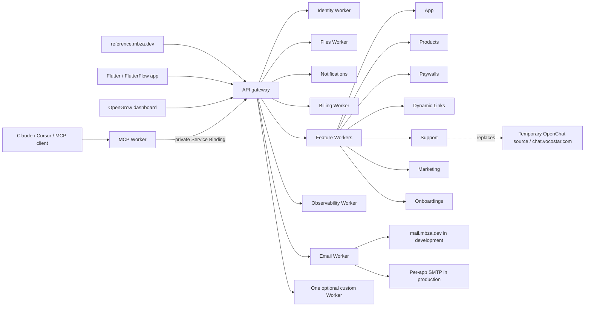

# OpenGrow reference architecture

The source-of-truth boundary is governed by
[ADR-001](./ADR-001-CANONICAL-OPENGROW-SOURCE.md): `opengrow-platform` is the single
canonical platform repository and `opengrow-reference` is its independent acceptance
consumer. Historical upstream trees are provenance, not a second release
authority.

## Objective

OpenGrow is a reusable back-office platform for applications. It is not a SaaS
tenant that owns every application runtime. The platform provides a common,
versioned control plane; each application supplies non-secret configuration,
feature flags, credentials through its Cloudflare account, and at most one
app-specific Worker.

The Dashboard receives API, SDK, short-link, MCP, documentation and optional support
origins from that same target during its Cloudflare build. Copyable integration
snippets never contain an MBZA, VocoStar or generic example hostname.

The two canonical repositories are:

- `mbzadev/opengrow-platform`: this monorepo, containing the dashboard, common
  Workers, deployment automation, contracts, and SDKs;
- `mbzadev/opengrow-reference`: the FlutterFlow reference application consuming
  released OpenGrow libraries without copying their implementation.

The reusable FlutterFlow library project named `OpenGrow` is also owned by the
platform repository: its Git source is `tools/flutterflow-library`, its
machine-readable surface is `config/flutterflow-library.json`, and its remote
FlutterFlow project ID/API key come only from the protected GitHub Environment.
The remote project is never a second source authority.

`mbza.dev` is the development and acceptance deployment of OpenGrow. It is not
the product name and must not appear as a default inside reusable runtime code.

## Development endpoints

| Surface       | URL                                          | Responsibility                                                                          |
| ------------- | -------------------------------------------- | --------------------------------------------------------------------------------------- |
| Reference app | `https://reference.mbza.dev`                 | Executable Flutter Web acceptance specification                                         |
| Back office   | `https://grow.mbza.dev`                      | OpenGrow administration and infrastructure status                                       |
| API           | `https://api.mbza.dev`                       | Authenticated API gateway and SDK orchestration                                         |
| SDK           | `https://sdk.mbza.dev`                       | Mobile and FlutterFlow SDK surface                                                      |
| Short links   | `https://in.mbza.dev`                        | Redirects, attribution and universal/app links                                          |
| Files         | `https://files.mbza.dev`                     | Controlled file delivery                                                                |
| MCP           | `https://mcp.mbza.dev/mcp`                   | OAuth-protected infrastructure status and operator tools over stateless Streamable HTTP |
| Mail preview  | `https://mail.mbza.dev`                      | Protected capture of development email                                                  |
| Support       | `https://api.mbza.dev/api/v1/support-client` | Authenticated mobile Support gateway (HTTP, attachments and realtime tickets)           |

The API and short-link origins are deliberately distinct. Platform endpoints
come from `deploy/targets/mbza-development.json`; the acceptance application's
own URL and Static Assets Worker come from
`opengrow-reference/reference.project.json`. Neither manifest contains a
Cloudflare account ID or credential.

## Runtime topology

All private Worker-to-Worker calls use Cloudflare Service Bindings. Public
domains terminate only on the gateway, dashboard, short-link surface and
protected mail preview where required. Support HTTP and realtime ticket ingress
both pass through the API gateway.

The reference application is not a seventeenth business service. It is a
separately deployed, assets-only Worker whose sole role is end-to-end acceptance
of the public SDK contracts. A push to `opengrow-reference/dev` builds Flutter Web
and publishes it to `reference.mbza.dev` through the protected GitHub
`development` Environment. Pull requests and `main` validate it but do not
publish the MBZA test site.

## Worker catalogue

| Worker          | Scope                        | Purpose                                                                                               | Primary state                                  |
| --------------- | ---------------------------- | ----------------------------------------------------------------------------------------------------- | ---------------------------------------------- |
| `api`           | common, mandatory            | OAuth/JWT gateway, users, projects, notifications, file orchestration, SDK routes, health aggregation | central D1, KV, R2, Queues                     |
| `dashboard`     | common, mandatory            | OpenGrow administrator UI, including `/infrastructure`                                                | OpenNext assets and cache R2                   |
| `email`         | common, mandatory            | transactional/test delivery, SMTP dispatch, retries, capture and preview                              | email D1, Email Queue + DLQ                    |
| `billing`       | optional feature             | store verification, purchases, subscriptions, entitlements, refunds and billing jobs                  | central D1/KV/R2, Billing Queue + DLQ          |
| `identity`      | common, mandatory            | application accounts, email/password, Google/Apple federation, sessions and JWT exchange              | Identity D1                                    |
| `files`         | common, mandatory            | authenticated upload, metadata, streaming download, deletion and account purge                        | Files D1 + common files R2                     |
| `observability` | common, mandatory            | sanitized Tail Worker events and operational summaries                                                | Analytics Engine                               |
| `mcp`           | common, mandatory            | OAuth-protected operator tools for projects, links, analytics, campaigns and SDK configuration        | stateless; private API Service Binding         |
| `messaging`     | legacy migration source only | old realtime implementation; disabled on reference targets                                            | legacy Messaging D1/R2 until retention expires |
| `app`           | optional feature             | customers, referrals, access keys and SDK setup                                                       | module D1                                      |
| `products`      | optional feature             | products, offerings and entitlements                                                                  | module D1                                      |
| `paywalls`      | optional feature             | paywall definitions, versions, placements and events                                                  | module D1                                      |
| `dynamic-links` | optional feature             | links, campaigns, domains, redirect rules and attribution                                             | module D1                                      |
| `support`       | optional feature             | unified inbox, contacts, attachments, webhooks and workflows                                          | module D1/R2, Queue + DLQ, Durable Object      |
| `marketing`     | optional feature             | subscribers, consent, lists, segments, templates, newsletters and campaign analytics                  | module D1/R2, Marketing Queue + DLQ            |
| `onboardings`   | optional feature             | onboarding flows, placements and completion analytics                                                 | module D1                                      |
| `custom`        | optional, one per app        | jobs/integrations that are genuinely unique to one application                                        | only resources declared by that app            |

The target `features` object decides which optional common Workers are deployed.
API, dashboard, email, identity, files, observability and MCP are the mandatory
control-plane baseline. A feature
required by a second application must graduate from `workers/custom/<app>` to a
common Worker.

Files is the sole authority for application objects. Authenticated clients
create, list, download and delete files through opaque identifiers. A custom
Worker never accepts a client-selected source URL: it presents the `fileId` and
the server-derived owner to Files through a private Service Binding. Files may
then issue a short-lived HMAC-signed HTTPS ticket for an external processor.
The public origin, ticket lifetime, byte ceiling and MIME allowlist all come
from the selected target manifest; signing keys remain account-scoped
Cloudflare secrets and support overlap rotation.

## Common versus application-specific configuration

| Concern                       | Common implementation                 | Application-owned input                             |
| ----------------------------- | ------------------------------------- | --------------------------------------------------- |
| Email/password authentication | API Worker and common database schema | registration mode and branding                      |
| Google and Apple sign-in      | common identity routes                | provider client IDs and secrets                     |
| Notifications                 | common API and queues                 | provider credentials, templates, feature enablement |
| Upload/download               | common API, signed operations and R2  | bucket binding and retention policy                 |
| Users/roles                   | common owner/admin/member model       | initial allowlist and operators                     |
| Paywalls/products             | reusable feature Workers              | catalogue and application/store identifiers         |
| Marketing/newsletters         | reusable marketing Worker             | contacts, consent, SMTP profile and campaigns       |
| Transactional email           | common email Worker                   | sender identity and SMTP secret                     |
| Support                       | reusable OpenGrow support Worker      | inbox configuration and webhooks                    |
| Unique conversions/AI jobs    | custom Worker contract                | implementation, queues, model/provider credentials  |
| Domains/resources             | deployment generator                  | target manifest values                              |

## Configuration contract

`deploy/targets/<target>.json` contains only non-secret declarative state:

- target and account alias;
- environment (`development` or `production`);
- domains and Worker names;
- enabled feature modules;
- D1/KV/R2/Queue names and non-secret resource identifiers;
- public OAuth/auth-gateway identifiers;
- email transport and sender identity;
- optional public HTTPS monitors for application-owned surfaces;
- optional custom Worker source and capability list;
- application-identity audiences, exact web origins allowed by CORS and the
  Support project allowlist;
- the per-application upload ceiling, processor-ticket lifetime and
  exact/wildcard MIME allowlist enforced by the common Files Worker.

The current contract is `schemaVersion: 9`. It never contains the Cloudflare account ID, API tokens, SMTP passwords, OAuth
provider secrets, signing keys or preview tokens. Account selection resolves in
this order:

1. `CLOUDFLARE_ACCOUNT_ID_<ACCOUNT_ALIAS>`;
2. `CLOUDFLARE_ACCOUNT_ID` supplied by the GitHub Environment or operator.

The committed development target is `deploy/targets/mbza-development.json`.
Its resource IDs remain `null` until the first authorized bootstrap. Running
bootstrap without `--apply` is a local plan and performs no Cloudflare write.

## Email ownership

The common Email Worker owns transactional/test transport: its message ledger,
capture, queueing, idempotency, delivery lease, retry, DLQ, SMTP and provider
receipts. API and Identity delegate password reset, verification, invitations
and exports through the private `EMAIL_SERVICE` binding. A stable business-event
key returns the original receipt when a caller retries the same normalized
payload and rejects reuse with different content.

The optional Marketing Worker owns the complete newsletter boundary: subscriber
lists, consent, suppression, segments, templates, scheduling, per-project SMTP
profiles, quotas/failover, one-click unsubscribe, tracking, provider events and
reports. It uses the same `@opengrow/email-transport` implementation as Email,
so there is one SMTP protocol implementation without forcing applications that
do not enable Marketing to deploy campaign state or credentials.

Applications read and update their own consent through
`/api/v1/sdk/marketing/v1/preferences`. The client supplies only consent,
attributes, public list identifiers and an idempotency key. The API verifies the
application bearer through the private Identity Service Binding, requires a
verified email, reconstructs the identity and signs the target project context.
It then calls Marketing through a private Service Binding without forwarding
the bearer or trusting client identity headers. Marketing exposes only public
lists to this role and never permits application traffic to weaken complaint,
hard-bounce, privacy or manual suppressions.

Development uses `capture`, so no test message can leave `mbza.dev` by mistake.
The preview UI never exposes messages without `MAIL_PREVIEW_TOKEN`. Production
uses `smtp`; `SMTP_PASSWORD`, `EMAIL_INTERNAL_TOKEN` and preview credentials are
Cloudflare Worker secrets, not database or Git values.

An accepted SMTP test is not treated as sender readiness. Marketing resolves the
sender domain's SPF, DKIM selector and DMARC records through Cloudflare's binary
DNS-over-HTTPS endpoint, persists the result on the profile and exposes it in
the back office and health metrics. Production campaign and double-opt-in
delivery only select profiles whose three checks are verified. Editing a sender
or selector invalidates the previous proof.

Every Queue with a DLQ has two generated consumers: the business consumer sends
terminal failures to its DLQ, and the owning Worker persists that DLQ in its own
D1 before acknowledging it. API events/push/maintenance, Billing, Email,
Support and Marketing all follow this rule. The disabled legacy Messaging
Worker follows it as well for migration safety. Quarantine bodies are limited
to 128 KiB, sensitive fields are redacted and made non-replayable, the original
body receives a SHA-256 fingerprint, and each service retains at most 10,000
quarantine records. `/infrastructure` reports the durable quarantine counters;
Cloudflare Queue backlog remains a separate Analytics/API metric.

APNs private keys, Firebase service accounts and cached FCM OAuth tokens are
encrypted before central D1 persistence with the API Worker's versioned
credential keyring. The secret preflight requires that keyring independently of
the selected Billing execution mode. Migration 0054 adds encrypted columns and
maintenance converges legacy plaintext rows in bounded idempotent batches.
Push consumers use conditional 15-minute claims, recover stale work and apply
hard provider timeouts. The Infrastructure view reports registered devices,
notification/message totals, delivery states and credential-security state.

Dashboard OAuth access/refresh tokens, MCP access/refresh tokens and dashboard
OAuth client secrets are stored only as irreversible SHA-256 digests. Clear
bearer values are returned once to the client and never persisted by new
writes. Authentication accepts legacy rows only during bounded convergence;
maintenance replaces those clear values with digests and Infrastructure
degrades while any legacy plaintext remains.

Dashboard password/OAuth login, registration, invitation acceptance and reset
requests share a ten-minute D1 abuse window. Only a SHA-256 digest of the scope,
Cloudflare client IP and subject is stored; the back office reports active
blocks and maintenance removes expired counters. The public API health endpoint
tests central D1, KV and mandatory public-domain configuration and returns a
no-store `503 degraded` response when readiness is not proven.

## Custom Worker protocol

The app-specific Worker protocol is defined by
`@opengrow/contracts/custom-worker`. It exposes a private manifest and a
versioned job envelope containing a capability, project reference, timestamp and
idempotency key. `workers/custom/reference` is the template used by `mbza.dev`.

Rules:

- one custom Worker maximum per application target;
- one target owner per app-specific package, with `Env` generated from the
  target manifest by Wrangler rather than maintained manually;
- private protocol v2 requires paired project/subject scope for SDK traffic;
- no public administrative route;
- API access only through `CUSTOM_WORKER` Service Binding;
- `CUSTOM_WORKER_TOKEN` stored as a secret on both sides;
- persist idempotency before external side effects;
- publish capability descriptions so the OpenGrow dashboard can explain what
  the app-specific runtime does;
- promote duplicated behavior into a common Worker.

Mobile clients use `POST/GET /api/v1/sdk/custom/v1/jobs` and the scoped
`POST /api/v1/sdk/custom/v1/jobs/:id/cancel` endpoint, never the private
protocol directly. The common SDK middleware first resolves the configured
project, platform and application identifier. The API then verifies the
application JWT, derives `<instance>-prod|test` and the subject server-side,
overrides any caller-provided `userId`, and hashes the caller idempotency key with
the project and subject. The token-protected
`x-custom-worker-project` + `x-custom-worker-subject` pair scopes list, detail
and cancellation inside the custom Worker; sending only half of that scope is
rejected. Global inspection, statistics and retry remain owner/admin
back-office operations.

The MBZA reference Worker exercises the complete public
create/list/detail/cancel contract. Because its validation receipts complete
synchronously, cancellation intentionally proves the terminal
`job_not_cancellable` response rather than inventing asynchronous work. It
persists `reference.echo` jobs and strict `reference.acceptance`
receipts in its own `REFERENCE_DB`, rejects an idempotency key reused with a
different request, paginates with an opaque cursor, scopes SDK reads to the
verified project and subject and exposes D1-backed health and aggregate
statistics to the operator surface. Acceptance receipts require all sixteen
journeys, bounded evidence, a test project, the target identity and exact
platform/reference Git revisions. Their accepted/rejected decision is derived
server-side. Its retention window is a
target variable (`REFERENCE_JOB_RETENTION_DAYS`, 30 on MBZA), is validated before
use and is reported by `/health`; expired acceptance jobs are pruned on the next
creation and by the target-declared daily cron. Custom schedules are explicit
manifest data; the generator never infers them from capability names. This
durable reference is the minimum acceptance contract for every future
application-specific Worker.

The VocoStar adapter deliberately dispatches to its Workflow/Container
orchestrators after it has persisted the enriched D1 rows. Routing those jobs
through the historical VocoStar dispatcher again would duplicate enrichment and
would create a second voice-job identity.

## Back-office observability

`GET /api/v1/platform/status` is restricted to authenticated owners/admins and
feeds the dashboard `/infrastructure` page. It reports:

- API environment and configured public URLs;
- independent routed-HTTPS availability, HTTP status and latency for API, SDK,
  short links, files, Dashboard, MCP, mail preview and manifest-declared external
  surfaces such as `reference.mbza.dev`;
- status, purpose and latency for every enabled Service Binding;
- users, instances, projects and live OAuth token counts;
- persisted billing export and failed-purchase job counts;
- Support contacts, conversations by status, messages, attachments, webhook
  failures and CSAT counters;
- Email transactional/marketing message and delivery totals, queued/sending/
  failed work, delivery-attempt counts and durable DLQ quarantine count;
- Marketing subscribers/consent, lists, segments, templates, campaigns,
  deliveries, bounces, complaints, outbox/dead-letter and Queue quarantine
  counts;
- application Identity and Files counters;
- every D1 owner's runtime schema state (`current`, `behind` or `drifted`),
  expected and latest migration filenames, and applied migration count; a
  reachable Worker without a valid current schema remains degraded;
- the custom Worker manifest, capability list, users and conversion job state;
  an app-key or protocol-version mismatch is marked incompatible and degrades
  the aggregate platform status;
- sanitized Tail Worker invocation, exception, CPU and wall-time summaries.

The same administrator boundary protects
`GET /api/v1/platform/account-erasures`. It is scoped to the authenticated
instance and exposes only a truncated subject reference, project, durable step
progress, attempts, last failure and timestamps. The complete deletion order,
retention boundary and retry contract are defined in
[ACCOUNT_LIFECYCLE.md](./ACCOUNT_LIFECYCLE.md).

Cloudflare Queue backlog, D1 size and R2 usage require Cloudflare Analytics/API
permissions and are never guessed from application tables.

## Legacy VocoStar convergence

`api.vocostar.com` becomes the OpenGrow gateway instead of a separate unmanaged
API island. Existing VocoStar conversion/media workers move behind one
`workers/custom/vocostar` implementation and the common file contract. The
OpenGrow Support Worker replaces both the FlutterFlow/Chatwoot integration and
the temporary Cloudflare OpenChat runtime. `sup.vocostar.com` is already absent
from public DNS; `chat.vocostar.com` remains the live migration source. Only
after Support parity, data reconciliation, attachment export, rollback
validation and retention sign-off should the OpenChat Workers/resources and
`chat.vocostar.com` be removed.

No DNS, Worker or data deletion is performed by this baseline branch.
