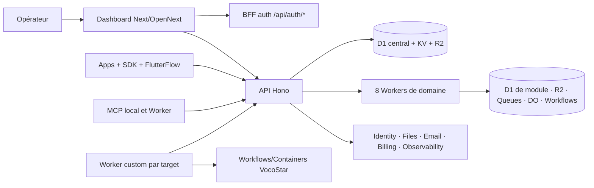

# Inventaire de l’état actuel de SuperBoard — 29 août 2026

> Recherche pour [Inventorier la surface et les contrats actuels de SuperBoard](https://github.com/mabzadev/superboard/issues/35), enfant de la carte [Migration complète de SuperBoard vers EmDash CMS](https://github.com/mabzadev/superboard/issues/33).
>
> Référence immuable : [`d1850233e97b79c3cde7eae18a0123d4d39c8ae2`](https://github.com/mabzadev/superboard/tree/d1850233e97b79c3cde7eae18a0123d4d39c8ae2), commit du 13 août 2026. Tous les liens de source « livré », « partiel » ou « historique » ci-dessous sont épinglés à ce SHA.

## Réponse courte

La migration EmDash doit préserver bien davantage qu’une liste d’écrans. Au commit de référence, SuperBoard est un plan de contrôle composé de quatre couches liées :

1. un Dashboard Next.js/OpenNext de **93 pages**, dont **84 sous la garde cliente protégée**, avec 10 sections et 60 destinations de navigation explicites ;
2. un Worker API Hono qui conserve les contrats historiques et agit comme gateway vers huit Workers de domaine au moyen d’un contexte de projet signé ;
3. un graphe Cloudflare déclaratif de Workers, D1, KV, R2, Queues, DLQ, Durable Objects, Workflows, Containers, Analytics Engine et Service Bindings ;
4. des SDK et consommateurs dont la compatibilité repose encore sur des versions OpenGrow publiées pendant que les deux SDK SuperBoard 3.0 actifs restent en attente de release.

Le commit contient une surface riche et testée, mais il ne constitue pas une production totalement convergée. Le target de développement MBZA est en routage public actif ; le target VocoStar est en routage privé `staged`, désactive Analytics et Messaging, n’a pas de reçu de convergence FlutterFlow, et son pont voix/média présente trois blocages explicites. Support reste en transition depuis Chatwoot/OpenChat et l’ancien Worker Messaging demeure une compatibilité historique. L’inventaire local calcule 320 routes Worker et 120 tables D1, mais la comparaison avec l’ancien upstream est indisponible et volontairement retirée comme gate de release. [Sources : gouvernance][adr-canonical], [inventaire][inventory-script], [target MBZA][target-mbza], [target VocoStar][target-vocostar], [plan de déploiement][deploy-plan].

La frontière à préserver peut se résumer ainsi :

## Méthode et légende

L’inventaire a été produit dans un worktree isolé créé directement depuis le SHA ci-dessus. Les seules autorités utilisées sont le code, les tests, les manifestes, les schémas, les migrations et la documentation du dépôt à ce commit. Les affirmations sur le checkout partagé non validé sont isolées dans une section dédiée et ne reçoivent volontairement aucun permalink : par définition, GitHub ne peut pas épingler un fichier qui n’est pas commité.

Les statuts signifient :

| Statut | Sens précis dans ce document |
| --- | --- |
| **Livré** | Présent au commit, relié à la surface d’exécution ou à un gate. Cela ne prouve pas à lui seul l’état du runtime distant. |
| **Partiel / bloqué** | Présent au commit, mais un manifeste, un gate, un reçu, une migration ou une preuve externe reste explicitement incomplet. |
| **Historique / compatibilité** | Conservé pour rollback, migration ou anciens clients ; il ne doit pas devenir la nouvelle autorité EmDash. |
| **Checkout non validé** | Différence locale par rapport au SHA, non commitée et non livrée. |

Le dépôt ne contient pas, à ce commit, les fichiers `CONTEXT-MAP.md`, `CONTEXT.md`, `apps/CONTEXT.md` et `workers/CONTEXT.md` mentionnés plus tard dans la carte Wayfinder. Le vocabulaire ci-dessous est donc dérivé des autorités réellement présentes : [manifestes de target][target-schema], [registre de services][service-registry], [contrats partagés][contracts-index] et [documentation d’architecture][architecture].

## 1. Dashboard : shell, routes, navigation et états

### 1.1 Contrat du shell

Le Dashboard est une application Next.js 16 rendue sur Cloudflare Workers avec OpenNext. Le layout racine installe thèmes, TanStack Query, contexte utilisateur, analytics et notifications. Le layout protégé ajoute la garde d’authentification, le sélecteur de projet/environnement, la sidebar, le header et les providers de dialogs. La configuration de build dérive les URL publiques et le client OAuth du target ; `CLIENT_SECRET` reste côté serveur. [Sources : package Dashboard][dashboard-package], [layout racine][dashboard-root-layout], [layout protégé][dashboard-protected-layout], [build Cloudflare][dashboard-cloudflare], [configuration Next][dashboard-next].

Contrats d’état à préserver :

- la racine `/` redirige vers `/login` ou `/dashboard` selon la présence d’un token local ; [source][dashboard-root-page]
- la garde est **cliente**, pas un middleware serveur : elle lit `access_token`, accepte aussi `token` et `refresh_token` dans l’URL pour compatibilité, les retire immédiatement de l’historique, charge `/users/me`, puis renvoie vers `/login?backTo=...` si nécessaire ; [source][protected-route]
- le BFF `/api/auth/token` échange email, mot de passe et OTP contre OAuth auprès de l’API avec le secret serveur, puis charge l’utilisateur ; `/api/auth/refresh` et `/api/auth/revoke` protègent les autres opérations sensibles ; [sources : token][auth-token-route], [refresh][auth-refresh-route], [revoke][auth-revoke-route]
- le navigateur conserve `access_token`, `refresh_token`, `current_user` et `login_type` dans `localStorage`; le client API ajoute `Authorization: Bearer`, crée une clé d’idempotence sur les mutations, retente les méthodes idempotentes sur 500/502/503/504 et sérialise un seul refresh après 401 ; [sources : stockage][local-storage], [client HTTP][dashboard-api-client], [refresh][dashboard-refresh]
- l’instance sélectionnée et l’environnement `production` ou `test` sont reflétés dans `instance_id` et `env_type` dans la query string. Une instance inaccessible retombe sur la plus récente ; l’absence de toute instance ouvre le formulaire de premier projet ; [sources : layout client][dashboard-client-layout], [contexte projet][dashboard-project-context]
- les pages utilisent des limites d’erreur globales, protégées et locales, des squelettes de chargement et une page 404. Les surfaces métier exposent également des états vides, `unavailable`, `disabled`, `misconfigured`, `degraded`, ainsi que la santé de schéma `current`, `behind` ou `drifted`. [Sources : erreur protégée][dashboard-protected-error], [erreur globale][dashboard-global-error], [loading][dashboard-protected-loading], [404][dashboard-not-found], [contrat Infrastructure][platform-status-route].

### 1.2 Surface de routes

Le comptage du tree donne 93 `page.tsx`, 19 `layout.tsx`, 4 route handlers Next, 6 limites d’erreur, 5 fichiers de chargement et une 404. Les 84 pages protégées partagent le même shell. Le tableau suivant est l’index de parité à conserver ; les routes de détail dynamiques sont indiquées comme patterns. [Source : arbre App Router][dashboard-app-tree].

| Surface | Routes présentes au commit | État et backing |
| --- | --- | --- |
| Entrée et compte public | `/`, `/login`, `/register`, `/register/with_email`, `/reset_password`, `/new_password`, `/accept-invite` | **Livré.** Compte Dashboard, invitation, reset, OTP et redirections sont reliés à l’API centrale. [Sources : service utilisateur][dashboard-user-service], [contexte utilisateur][dashboard-user-context] |
| OAuth/MCP et preview | `/mcp/authorize`, `/message-preview-craft` | **Livré.** Ces routes sont hors du groupe protégé ; MCP effectue ses propres contrôles, tandis que la preview Craft est une surface de rendu isolée à auditer lors de la migration. [Sources : consentement MCP][dashboard-mcp-authorize], [preview][dashboard-message-preview] |
| BFF/health Next | `/api/health`, `/api/auth/token`, `/api/auth/refresh`, `/api/auth/revoke` | **Livré.** Ces quatre handlers sont distincts de l’API Worker publique. [Source][dashboard-api-routes] |
| Shell opérateur | `/dashboard`, `/account`, `/infrastructure`, `/project-settings` | **Livré.** Account, Infrastructure et Project Settings sont accessibles depuis le menu utilisateur, pas depuis les 10 sections principales. [Sources : menu utilisateur][dashboard-user-nav], [header][dashboard-header] |
| App | `/app/customers`, `/app/users`, `/app/referrals`, `/app/access-key`, `/app/libraries`, `/app/android-setup`, `/app/ios-setup`, `/app/web-setup` | **Livré.** Données App, utilisateurs Identity/Billing, catalogue SDK et configuration par plateforme. [Sources : navigation][dashboard-navigation], [service App][dashboard-app-api], [wizard SDK][dashboard-sdk-wizard] |
| Identity | `/identity`, `/identity/[lang]`, puis `dashboard`, `users`, `users/[authId]`, `user-attributes`, `user-attributes/new`, `user-attributes/[id]`, `roles`, `roles/new`, `roles/[id]`, `apps`, `apps/new`, `apps/[id]`, `apps/banners/new`, `apps/banners/[id]`, `scopes`, `scopes/new`, `scopes/[id]`, `orgs`, `orgs/new`, `orgs/[id]`, `logs`, `logs/email/[id]`, `logs/sign-in/[id]`, `logs/sms/[id]`, `saml`, `saml/new`, `saml/[id]`, `account` | **Livré en source.** Le segment de langue accepte au moins `en`/`fr`; le target désactive SSO par défaut. L’admin Melody est proxifié par le Worker Identity. [Sources : arbre Identity][dashboard-identity-tree], [Worker Identity][identity-worker], [targets][target-mbza] |
| Products | `/products/purchases`, `/products/customers`, `/products/offerings`, `/products/entitlements` | **Livré.** Catalogue/offerings/entitlements viennent des Workers Products/Billing ; Customers a une surface Billing dédiée. [Sources : pages][dashboard-products-pages], [Worker Products][products-worker], [API Billing][billing-routes] |
| Paywalls | `/paywalls`, `/paywalls/statistics` | **Livré.** Définitions, versions publiées/archivées, placements, expériences, variants et statistiques. [Sources : pages][dashboard-paywalls-page], [Worker][paywalls-worker] |
| Dynamic Links | `/dynamic-links/links`, `/dynamic-links/campaigns`, `/dynamic-links/campaigns/[id]`, `/dynamic-links/redirect-rules`, `/dynamic-links/domain`, `/dynamic-links/social-media-preview`, `/dynamic-links/tracking` | **Livré.** CRUD, résolution, campagnes, règles, domaines, social preview, tracking et statistiques. [Sources : navigation][dashboard-navigation], [Worker][dynamic-links-worker] |
| Support | `/support/inbox`, `/support/configuration`, `/support/contacts`, `/support/quality` | **Livré en source, convergence VocoStar partielle.** Inbox, realtime, pièces jointes, contacts, sociétés, notes, configuration, audit, CSAT, webhooks et DLQ existent ; la migration Chatwoot/OpenChat et le retrait du legacy ne sont pas terminés. [Sources : Worker][support-worker], [architecture Support][messaging-architecture], [convergence][openchat-convergence] |
| Marketing | `/marketing/in-app-messages`, `/marketing/email`, `/marketing/campaigns`, `/marketing/journeys`, `/marketing/channels`, `/marketing/statistics`, `/marketing/settings` | **Livré.** In-app historique/central, abonnés, consentement, listes, segments, templates, campagnes, journeys, connecteurs, SMTP, webhooks provider, outbox et dead letters. [Sources : pages][dashboard-marketing-pages], [Worker][marketing-worker] |
| Analytics | `/analytics`, puis `dashboards`, `users`, `events`, `dimensions`, `views`, `installations`, `purchases`, `insights`, `cohorts`, `crashes`, `feedback`, `remote-config`, `alerts`, `reports`, `settings` | **Livré pour MBZA ; désactivé pour VocoStar.** Toutes les pages pointent vers le Worker Analytics, mais `features.analytics=false` sur VocoStar et son ID D1 est nul. [Sources : pages][dashboard-analytics-pages], [Worker][analytics-worker], [target][target-vocostar] |
| Onboardings | `/onboardings`, `/onboardings/statistics` | **Livré.** Définitions/versioning, placements, targeting, expériences, résolution SDK, événements et statistiques. [Sources : pages][dashboard-onboarding-pages], [Worker][onboardings-worker] |

### 1.3 Navigation et permissions

`DASHBOARD_SECTIONS` code 10 sections et 60 liens ; le sous-menu de section normalise les langues Identity. La sidebar ne vient donc ni d’un CMS ni d’un registre runtime. Toute migration EmDash doit conserver une correspondance explicite entre slug de section, URL, renderer, état d’activation par target et permission avant de rendre cette configuration éditable. [Sources : registre de navigation][dashboard-navigation], [sidebar][dashboard-sidebar], [navigation de section][dashboard-section-nav].

Le modèle d’autorisation visible est plus fin qu’un simple « connecté/non connecté » :

- un utilisateur Dashboard peut avoir un rôle par instance ; les valeurs typées sont `owner`, `admin`, `member` ; [source][dashboard-instance-types]
- certains contrôles UI sont seulement masqués aux non-`owner/admin` par `AdminOnlyDisplay` ; cette protection d’affichage n’est pas une autorité serveur ; [source][dashboard-admin-only]
- l’API authentifie les bearer tokens stockés en D1, associe l’instance principale et applique ensuite ses propres contrôles ; [source][api-auth]
- le gateway transforme l’instance et `production/test` en `projectRef` de forme `<instance>-prod|test`, refuse les mutations en maintenance read-only, exige une clé d’idempotence et signe un contexte HMAC pour le Worker de domaine ; [sources : gateway][domain-gateway], [contrat signé][project-context]
- les Workers vérifient ce contexte avec une fenêtre d’horloge de 60 secondes. Analytics, Marketing et Support restreignent certaines mutations ou opérations à `owner/admin`; les rôles `sdk`, `application` et `system` existent pour des chemins non Dashboard. [Sources : Analytics][analytics-http], [Marketing][marketing-worker], [Support][support-worker]
- l’endpoint Infrastructure exige `owner/admin`, même si la page peut être atteinte par tout utilisateur authentifié ; [source][platform-status-route].

La migration ne doit donc pas déduire les permissions uniquement de la navigation actuelle. Il faut conserver les checks serveur comme autorité et construire séparément une matrice « route → capacité → rôle → target » pour le Front EmDash.

## 2. API et contrats à préserver

### 2.1 Surface du gateway

Le Worker API monte les namespaces suivants. La liste est volontairement au niveau des contrats stables ; le fichier d’entrée et les routeurs liés contiennent l’inventaire endpoint par endpoint. [Sources : entrée API][api-index], [routeurs API][api-routes-tree].

| Namespace public ou administratif | Responsabilité |
| --- | --- |
| `/health`, `/health/billing`, `/up`, `/.well-known/*` | Santé centrale, santé Billing, JWKS achats/Identity, métadonnées OAuth et associations mobile. |
| `/oauth/*`, `/api/v1/auth/*`, `/api/v1/users/*` | Password/refresh/revoke OAuth Dashboard, utilisateur, invitation, reset et 2FA. |
| `/auth/*` | Gateway d’identité application vers le Worker Identity. |
| `/api/v1/instances/*`, `/api/v1/projects/*`, `/api/v1/links/*` | Instances, membres, plateformes, projets, métriques historiques, liens, campagnes, notifications et exports. |
| `/api/v1/sdk/*` | Surface SDK historique plus achats v1/v2, custom jobs, Marketing preferences et effacement de compte. |
| `/api/v1/{app,products,paywalls,dynamic-links,support,analytics,marketing,onboardings}/*` | Proxies Dashboard vers les huit Workers de domaine. |
| Routes SDK de domaine | App runtime policy/events, Products offerings, Paywalls resolve/events, Analytics events/remote config, Onboardings resolve/events. |
| `/api/v1/support-client/*`, `/api/v1/support/realtime/*` | Surface application Support authentifiée et ticket realtime. |
| `/api/v1/app-files/*` et domaine Files | Alias de fichiers et téléchargement par ticket. |
| `/api/v1/billing/*`, `/api/v2/purchases/*`, `/api/v1/iap/*` | Catalogue et clients historiques, achats v2, certifications, providers, refunds, exports et billing local/service. |
| `/api/v1/platform/*` | Catalogue SDK, statut des Workers, compteurs, effacements, opérations Email et Custom. |
| `/api/v1/mcp/*`, routes OAuth MCP | Consentement, tokens, projets, liens, analytics, campagnes et SDK config pour le MCP. |
| `/api/v1/admin/*`, `/api/v1/automation/*`, `/api/v1/diagnostics/*` | Maintenance/cutover, automatisations historiques et diagnostics protégés. |
| `/api/v1/marketing/tracking/*`, `/opt-in/*`, webhooks Marketing/Email | Entrées publiques signées ou vérifiées par provider. |
| `/` et routes de short link | Résolution, assets et compatibilité des liens courts. |

L’exécution de `npm run migration:inventory` sur le SHA a compté **320 routes Worker** et **120 tables D1**. Elle a aussi retourné `upstreamAvailable=false`, sans liste fiable de routes ou tables manquantes. Ce n’est pas un résultat de parité : le script et l’ADR refusent explicitement de traiter l’absence d’upstream comme un succès. [Sources : script][inventory-script], [tests fail-closed][inventory-tests], [ADR][adr-canonical].

### 2.2 Contrats partagés et contrats encore locaux

`@superboard/contracts` exporte dix familles : contexte projet signé, Email, Worker custom v2, Observability, santé SQL, secrets, lecture de body bornée, sécurité URL, dead letters et Analytics v1. `@superboard/email-transport` encapsule l’unique transport SMTP Worker-to-Worker. [Sources : manifeste][contracts-package], [exports][contracts-index], [transport Email][email-transport].

Contrats structurants :

- le contexte signé porte `projectId`, `projectRef`, `instanceId`, environnement, acteur, rôle, request ID, instant, module, méthode et pathname ; [source][project-context]
- les erreurs de gateway de domaine ont une enveloppe stable avec `code`, `message`, `status`, `request_id`, `retryable` et `details` optionnel ; [source][domain-gateway]
- le protocole Worker custom v2 expose manifest, stats et jobs idempotents avec les statuts `accepted`, `queued`, `dispatched`, `running`, `completed`, `failed`, `cancelled`, `rejected` ; [source][custom-contract]
- Analytics v1 limite les batches, réserve le préfixe `superboard.`, normalise les identifiants/timestamps et sérialise de façon stable ; [source][analytics-contract]
- Email sépare message métier, reçu, transport SMTP privé, événements provider sans destinataire, opérations body-free et dead letters ; [source][email-contract]
- les secrets à rotation acceptent la valeur courante et l’éventuelle valeur `*_PREVIOUS`; les déploiements produisent des versions inactives puis une promotion liée aux IDs de rollback. [Sources : registre][service-registry], [readiness][platform-readiness-script].

Écart important : au SHA, les contrats Products, Paywalls, Onboardings, Support et Marketing sont surtout définis dans les Workers et les services Dashboard, pas dans le package partagé. Les fichiers `packages/contracts/src/support.ts`, `support-notifications.ts` et `flows.ts` n’existent que dans le checkout non validé. Une migration de renderer sans gel de ces shapes risquerait de transformer des types locaux en API implicite.

### 2.3 Headers et compatibilité client

Le gateway accepte encore plusieurs familles de headers : `Authorization`, `X-Api-Key`, `PROJECT-KEY`, `PLATFORM`, `IDENTIFIER`, `ENVIRONMENT`, les variantes `X-OpenGrow-*` et `X-SuperBoard-*`, `Idempotency-Key`, les headers de diagnostics et les headers du contexte interne. L’auth SDK distingue trois modes : mobile par `PROJECT-KEY` + plateforme/identifiant, serveur par `PROJECT-KEY` + environnement, et legacy par `X-Api-Key`. [Sources : CORS et montage][api-index], [middleware SDK][api-auth-middleware].

Ces aliases sont des contrats de compatibilité, même quand leur nom est historique. Les supprimer au profit d’un schéma EmDash unique casserait les clients existants ; ils doivent rester au gateway ou être versionnés avec une migration séparée.

## 3. Modules, Workers, traitements asynchrones et stockages

### 3.1 Catalogue des services

Le registre déclare 8 services de domaine et 10 rôles de plateforme, soit 18 rôles logiques avant les Workers managés propres à une application. `configuration:check` a validé 17 services actifs pour chacun des targets actuels, car Messaging ou Analytics peut être désactivé et les orchestrateurs managés ne sont pas des clés du registre de base. [Sources : registre][service-registry], [catalogue opérateur][platform-status-route], [targets][target-schema].

| Service | Surface et données possédées | État au SHA |
| --- | --- | --- |
| Dashboard | Back-office Next/OpenNext, cache OpenNext target-scoped. | **Livré** sur les deux manifests. [source][dashboard-package] |
| API | Gateway, OAuth Dashboard/MCP, instances/projets, compatibilité SDK, notifications, orchestration, maintenance et D1 central/KV/R2. | **Livré** ; 60 migrations centrales jusqu’à `0060_analytics_verified_fact_backfill.sql`. [source][api-migrations] |
| App | Customers, referrals, access key, setup plateforme, runtime policy et customer events ; D1 App. | **Livré**, activé sur les deux targets. [source][app-worker] |
| Products | Produits, packages, offerings, entitlements, achats/refunds/subscriptions et catalog sync ; D1 Products. | **Livré**, activé sur les deux targets. [source][products-worker] |
| Paywalls | Paywalls/versioning, placements, résolution, expériences/variants et événements ; D1 Paywalls. | **Livré**, activé sur les deux targets. [source][paywalls-worker] |
| Dynamic Links | Liens, campagnes, règles, domaines, social preview, tracking et statistiques ; D1 Dynamic Links. | **Livré**, activé sur les deux targets. [source][dynamic-links-worker] |
| Support | Client app, inbox opérateur, contacts, sociétés, notes, participants, drafts, CSAT, config, realtime, attachments et webhooks ; D1/R2/Queue/DLQ/DO. | **Livré en source ; partiel en production** tant que Chatwoot/OpenChat, les données et ressources legacy restent nécessaires. [sources][openchat-convergence] |
| Analytics | Ingestion, events, sessions, profils, applications, dashboards/widgets, views, dimensions, crashes, feedback, remote config, cohorts, alerts, hooks, annotations, funnels, retention, reports et opérations ; D1/R2/Queue/Workflow. | **Livré MBZA ; désactivé VocoStar.** [source][analytics-worker] |
| Marketing | Consentement, subscribers, listes, segments, templates/media, campagnes, transactional, journeys/signals/connectors, SMTP, provider events, outbox et DLQ ; D1/R2/Queue. | **Livré**, activé sur les deux targets. [source][marketing-worker] |
| Onboardings | Définitions, versions, placements, targeting, expériences, résolution/events et statistiques ; D1. | **Livré**, activé sur les deux targets. [source][onboardings-worker] |
| Billing | Autorité achats/entitlements/providers, projections, certifications et jobs ; D1 central, KV/R2, Queue et binding Analytics. | **Livré en source.** MBZA est déclaré `local`, VocoStar `service`; la certification provider/appareil reste un gate externe. [sources : Worker][billing-worker], [cutover][billing-cutover] |
| Identity | Melody Auth intégré, utilisateurs application, email/password, providers, refresh, profile, reset, logs et admin proxifié ; D1 Identity, assets, Email et Files bindings. | **Livré en source**, SSO target désactivé. [source][identity-worker] |
| Files | Upload/list/download/delete, metadata, tickets, effacement ; D1 Files + R2 principal. | **Livré**. [source][files-worker] |
| Email | Capture/preview ou SMTP, AWS SES, idempotence, opérations et dead letters ; D1 Email + Queue/DLQ. | **Livré**. [source][email-worker] |
| Observability | Lecture bornée d’Analytics Engine et résumé d’invocations/CPU/wall time. | **Livré**, sans D1 propre. [source][observability-worker] |
| MCP | Worker public stateless lié en privé à l’API ; adapter local, serveur stdio/HTTP et catalogue d’outils dans `apps/mcp`. | **Livré**. [sources : Worker][mcp-worker], [app MCP][mcp-app] |
| Messaging | Ancien inbox/conversations/realtime avec D1/R2/Queue/DO. | **Historique**, `features.messaging=false` sur les deux targets ; conservé pour lecture/migration/rollback. [source][messaging-architecture] |
| Custom reference | `reference.echo` et reçu d’acceptance, D1 durable, cron de rétention. | **Livré** pour MBZA development. [source][custom-reference] |
| Custom VocoStar | Jobs voix/média, annulation/retry, D1 VocoStar et bindings vers Files et orchestrateurs. | **Partiel/bloqué** : le runtime bridge est `blocked`. [sources : Worker][custom-vocostar], [target][target-vocostar] |
| Orchestrateurs VocoStar | Workflows vocaux/médias, Durable Objects Dispatcher, pools Containers Standard/Premium et R2 legacy. | **Présents mais bloqués pour activation** par les routes Files/callbacks legacy. [sources : vocals][vocals-orchestrator], [medias][medias-orchestrator] |

### 3.2 Traitements asynchrones

| Producteur/consommateur | Traitements et garanties visibles |
| --- | --- |
| API | Cron : drain de l’outbox de faits Analytics, reprise des effacements de compte, refresh Apple notifications et maintenance. Queues : events, push, maintenance et Billing selon le mode. Les DLQ sont mises en quarantaine avant ack. [source][api-index] |
| Billing | Cron de réconciliation ; Queue Billing en mode service ou local ; DLQ persistée, replay/discard audité et idempotence financière. [sources][billing-worker] |
| Email | Queue de livraison avec idempotence, retry, événements de transport et quarantaine DLQ. Le Worker est l’unique autorité de socket SMTP. [sources : Worker][email-worker], [contrat][email-contract] |
| Support | Queue + DLQ pour webhooks/événements, D1 de livraison, R2 attachments et un `ConversationRoom` Durable Object par conversation pour séquence et WebSocket hibernant. [sources : registre][service-registry], [architecture][messaging-architecture] |
| Analytics | Queue d’ingestion, cron chaque minute, archive R2 et `AnalyticsOperationsWorkflow` pour export, replay, rebuild de rollups et effacement de sujet avec retries bornés. [sources : registre][service-registry], [Workflow][analytics-operations] |
| Marketing | Queue de delivery, cron chaque minute, outbox/double opt-in, journeys, retry et quarantaine ; délègue le transport à Email. [sources : registre][service-registry], [Worker][marketing-worker] |
| Custom reference | Cron quotidien et D1 de jobs/acceptance. [source][custom-reference] |
| Custom VocoStar | Cron chaque minute pour dispatch/reprise ; deux Workflows Cloudflare pilotent Durable Objects et Containers, avec leases et tentatives bornées. [sources : target][target-vocostar], [orchestrateurs][vocals-orchestrator] |
| Services synchrones | App, Products, Paywalls, Dynamic Links et Onboardings possèdent un D1 mais aucun Queue/cron propre au registre. Files et Identity sont synchrones ; Observability lit Analytics Engine ; MCP appelle l’API par Service Binding. [source][service-registry] |

### 3.3 Chaînes de migrations D1

Le nom de fichier est une partie du contrat Cloudflare. Les chaînes suivantes existent au SHA :

| Propriétaire | Nombre | Dernière migration |
| --- | ---: | --- |
| API central | 60 | `0060_analytics_verified_fact_backfill.sql` [source][api-migrations] |
| Identity | 51 | `0149_superboard_identity_log_scope.sql` [source][identity-migrations] |
| Email | 7 | `0007_aws_ses_events.sql` [source][email-migrations] |
| Files | 1 | `0001_files.sql` [source][files-migrations] |
| Messaging historique | 4 | `0004_messaging_dead_letters.sql` [source][messaging-migrations] |
| App | 4 | `0004_sdk_secret_references.sql` [source][app-migrations] |
| Products | 3 | `0003_audit_context.sql` [source][products-migrations] |
| Paywalls | 3 | `0003_audit_context.sql` [source][paywalls-migrations] |
| Dynamic Links | 3 | `0003_campaign_analytics.sql` [source][dynamic-links-migrations] |
| Support | 10 | `0009_application_user_erasure.sql` (la chaîne contient aussi `0002a_support_base_upgrade.sql`) [source][support-migrations] |
| Analytics | 2 | `0002_countly_capabilities.sql` [source][analytics-migrations] |
| Marketing | 11 | `0011_marketing_journeys.sql` [source][marketing-migrations] |
| Onboardings | 3 | `0003_full_onboardings.sql` [source][onboardings-migrations] |
| Custom reference | 2 | `0002_reference_acceptance.sql` [source][custom-reference-migrations] |
| Custom VocoStar | 4 | `0004_owner_scoped_file_ids.sql` [source][custom-vocostar-migrations] |

Billing ne possède pas de répertoire de migrations indépendant : son Worker utilise la base centrale et ses tables/migrations vivent dans la chaîne API. Observability, MCP et Dashboard n’ont pas de D1 métier propre ; le Dashboard a un KV de cache OpenNext target-scoped. [Sources : types Billing][billing-types], [registre D1][d1-registry].

Une migration EmDash qui déplace seulement le contenu visuel ne doit pas déplacer l’autorité de ces données dans le CMS. Les drafts/releases EmDash doivent référencer les capacités ; les migrations et écritures métier restent chez leurs propriétaires actuels jusqu’à une décision explicite différente.

## 4. SDK, catalogues et consommateurs

### 4.1 Catalogue de release canonique

Le catalogue machine-validé contient 7 entrées. Son état est : [source][sdk-catalog].

| Entrée | Lifecycle | Source au SHA | Baseline immuable | État |
| --- | --- | --- | --- | --- |
| Flutter | active | `superboard_flutter` candidat 3.0.0 dans `sdks/flutter` | `opengrow_flutter` 2.1.4, `sdk-flutter-v2.1.4` | **Partiel : pending-release** |
| FlutterFlow | active | `superboard_flutterflow` candidat 3.0.0 | `opengrow_flutterflow` 2.2.5, `sdk-flutterflow-v2.2.5` | **Partiel : pending-release** |
| FlutterFlow Support | archived | 1.3.0 gelé | `sdk-flutterflow-messaging-v1.3.0` | **Historique/released** |
| iOS | internal | 1.0.3 | tag/release 1.0.3 | **Interne/released** |
| Android | internal | 1.0.3 | `sdk-android-v1.0.3` | **Interne/released** |
| JavaScript | archived | 1.0.2 | `sdk-js-v1.0.2` | **Historique/released** |
| React Native | archived | 1.0.2 | `sdk-react-native-v1.0.2` | **Historique/released** |

Le catalogue affirme explicitement que seules les deux bibliothèques Dart sont actives, que iOS/Android sont des implémentations internes de Flutter, et que JavaScript/React Native/Support standalone restent reproductibles sans nouvelles releases. La promotion de Flutter et FlutterFlow 3.0 est atomique. [Sources : catalogue][sdk-catalog], [contrat Reference][reference-sdk-coverage].

### 4.2 FlutterFlow et application de référence

Le manifeste FlutterFlow décrit 11 Library Values, 64 actions, 5 widgets et 3 pages. Il couvre bootstrap, Identity, runtime App, Analytics/links, purchases, Files, custom jobs et Support. [Sources : manifeste][flutterflow-library], [gate][flutterflow-library-script].

L’application `apps/reference` matérialise 16 parcours : bootstrap, auth, création de compte, reset, home, profile, notifications, Files, Products, Paywall, Dynamic Links, Support, Marketing consent, Onboarding, Custom extension et Diagnostics. Elle compile volontairement les tags OpenGrow publiés, pas le candidat 3.0 non publié. [Sources : baseline][reference-baseline], [projet][reference-project], [tests][reference-tests].

État **partiel** au SHA : `platform:readiness` signale une incohérence `flutterflow_source_version` entre le contrat Reference et le catalogue candidat, et deux releases actives en attente. La Reference reste donc un consommateur de rollback utile, mais pas encore la preuve d’un frontend SuperBoard 3.0 entièrement promu. [Sources : readiness][platform-readiness-script], [catalogue][sdk-catalog].

### 4.3 Autres consommateurs

- la famille Identity conserve cinq SDK Melody : Web, React, Vue, Angular et Next.js. Ils ciblent le même Worker Identity, utilisent OAuth code + PKCE et sont testés par `identity-sdks:check`, mais ils ne figurent pas dans le catalogue de release SuperBoard à 7 entrées. Leur politique de publication/compatibilité est donc une lacune à clarifier avant EmDash ; [sources : README][identity-sdks], [packages][identity-sdk-tree]
- `apps/mcp` est un serveur/adaptateur local tandis que `workers/mcp` est le Worker distant stateless lié à l’API ; les deux consomment le même contrat opérateur ; [sources : app][mcp-app], [Worker][mcp-worker]
- VocoStar est déclaré comme unique application FlutterFlow externe. Son plan compte 7 phases, 10 work items, 35 checks et 36 symboles de remplacement, mais sa source n’est pas dans le dépôt ; le readiness offline la marque `source-not-inspected`. [Sources : application][flutterflow-applications], [plan][flutterflow-vocostar-plan]
- les anciens repos `superboard-platform` et `superboard-reference` sont déclarés legacy ; l’autorité est le monorepo actuel. [Sources : gouvernance][platform-governance], [provenance][history-migration].

## 5. Targets, domaines et ressources Cloudflare

### 5.1 Topologie déclarée

| Dimension | `mbza-development / development` | `vocostar / production` |
| --- | --- | --- |
| Identité physique | `superboard`, stratégie canonique | logique `superboard`, physique `opengrow`, conservation du nom legacy |
| Routage public | `active` | `staged` — Workers privés, routes publiques désactivées |
| Features | Billing, App, Products, Paywalls, Dynamic Links, Support, Analytics, Marketing, Onboardings ; Messaging false | Les mêmes sauf Analytics false ; Messaging false |
| Mode Billing | `local` | `service` |
| Worker custom | Reference, D1, cron quotidien | VocoStar + deux Workers managés, D1/R2, Workflows, DO, Containers, cron chaque minute |
| IDs de ressources | 14 requis/configurés selon le gate offline | 13 requis/configurés selon le gate offline ; slot Analytics D1 nul car désactivé |
| Plan de déploiement calculé | 17 services, aucun blocker | 18 services incluant 2 orchestrateurs ; 3 blockers runtime bridge |
| Client acceptance | Reference activée par la matrice | Pas de reference acceptance ; convergence FlutterFlow externe requise |

[Sources : target MBZA][target-mbza], [target VocoStar][target-vocostar], [registre][service-registry], [matrice][deployment-matrix].

### 5.2 Domaines publics

| Surface | MBZA development | VocoStar production |
| --- | --- | --- |
| API | `api.mbza.dev` | `api.vocostar.com` |
| Auth | `auth.mbza.dev` | `auth.vocostar.com` |
| Short links | `in.mbza.dev` | `go.vocostar.com` |
| SDK | `sdk.mbza.dev` | `sdk.vocostar.com` |
| Dashboard | `board.mbza.dev` | `grow.vocostar.com` |
| Files | `files.mbza.dev` | `files.vocostar.com` |
| MCP | `mcp.mbza.dev` | `mcp.vocostar.com` |
| Mail/Messaging legacy | `mail.mbza.dev` preview | `messages.vocostar.com` historique |

Le target MBZA déclare aussi `grow.mbza.dev` comme domaine retiré qui doit rester non assigné. VocoStar surveille `chat.vocostar.com/ready` uniquement comme source legacy Chatwoot/OpenChat jusqu’à la migration et la rétention. [Sources : MBZA][target-mbza], [VocoStar][target-vocostar].

### 5.3 Ressources à ne pas confondre avec le CMS

Les deux manifests possèdent : D1 central, KV central, R2 central, cache Dashboard, D1 Email/Identity/Files/Custom, D1 par module, R2 Support/Analytics/Marketing, Queues et DLQ centrales et par module, dataset Analytics Engine, IDs de projets Support et paramètres publics d’application. VocoStar conserve en plus le D1/R2 Messaging legacy et le R2 custom `app-vocostar`. [Sources : manifests][targets-tree], [schéma][target-schema].

Les IDs et noms de ressources sont une frontière de compatibilité. Le bootstrap adopte seulement une ressource au nom et au compte attendus, bloque les drifts et ne remplace pas silencieusement une base existante. EmDash ne doit jamais devenir une seconde registry physique ni générer des IDs Cloudflare indépendamment des targets. [Sources : bootstrap][bootstrap-script], [limites de configuration][configuration-boundaries].

## 6. Déploiement, sauvegarde, rollback et gates

### 6.1 Autorités de déploiement

La matrice versionnée utilise deux autorités, chacune exclusive pour son target :

- `dev` → `mbza-development` par **Cloudflare Workers Builds**, un build par service, sans builds de branches non production ;
- `main` → `vocostar-production` par **GitHub Actions**, après succès de `CI` et dans l’environnement protégé `production`.

[Sources : matrice][deployment-matrix], [documentation opérationnelle][cloudflare-doc], [tests de policy][backoffice-policy].

Il existe une dérive documentaire : `docs/IMPLEMENTATION_AUDIT_2026-08-08.md` affirme que GitHub Actions est l’unique autorité et que Workers Builds a été retiré, alors que la matrice, `docs/CLOUDFLARE.md`, `docs/DEVELOPMENT_WORKFLOW.md` et les tests imposent encore Workers Builds en développement. Pour toute décision EmDash, les manifestes et tests opérationnels doivent primer sur cette phrase obsolète. [Sources : phrase contradictoire][implementation-audit], [matrice][deployment-matrix].

Autre dérive : le README référence `packages/shared`, mais aucun path `packages/shared` n’existe au SHA ; seuls `packages/contracts` et `packages/email-transport` sont présents. [Sources : README][readme], [tree packages][packages-tree].

### 6.2 CI et gates avant mutation

La CI sélectionne les checks affectés et agrège un gate unique. Elle valide notamment : copy/catalogues, migrations, contrôle Cloudflare/GitHub, secrets scan, Workers, Dashboard OpenNext, SDK Dart, SDK historiques, SDK Identity, application Reference et sécurité non-Node. Les branches `dev` et `main` exigent le check `CI gate`, PR, CODEOWNERS et une approbation. [Sources : workflow CI][ci-workflow], [control plane GitHub][github-control-plane].

Limite opérationnelle : les protections des environnements `development`, `production` et `sdk-release` sont encore `pending-external`; production et SDK release attendent notamment un second reviewer de confiance. [Source][github-control-plane].

Pour la production, le workflow :

1. refuse une révision superseded et résout la matrice au SHA exact ;
2. valide targets, types générés, ordre, code et Worker custom ;
3. applique le gate de routage public et vérifie domaines et **noms** de secrets sans afficher les valeurs ;
4. valide la clé de chiffrement des backups ;
5. charge des versions preflight isolées sans routes/crons/consumers ;
6. sauvegarde et migre toutes les bases avant de déployer les Workers ;
7. chiffre les SQL/receipts et conserve l’artefact 30 jours, y compris les artefacts récupérables après échec.

[Source : workflow][deploy-workflow].

### 6.3 Sauvegarde et convergence D1

Un déploiement production complet ne peut pas utiliser `--skip-backup` ou `--skip-migrations`. Le plan sauvegarde tous les propriétaires de schéma avant la première écriture, vérifie taille et SHA-256 de chaque export, migre toutes les bases, écrit un receipt batch mode `0600`, vérifie le cutover Identity, puis seulement déploie dans l’ordre : Observability, Email, Files, Identity, domaines activés, Billing/Messaging éventuel, Workers managés, Custom, API, MCP, Dashboard. [Sources : plan][deploy-plan], [converger][d1-converge], [backup][d1-backup], [batch receipt][migration-batch].

Le plan calculé au SHA donne :

- MBZA development : 17 services, convergence par service, aucun blocker structurel ;
- VocoStar production : 18 services, 12 propriétaires D1 dans le batch, puis Identity et Workers, mais trois blockers — runtime bridge non vérifié, Files input routing inactif et callbacks encore possédés par `api-auth-gateway`.

[Sources : algorithme][deploy-plan], [target VocoStar][target-vocostar].

Le gate de routage retourne actuellement `active-development` pour MBZA et `staged-private-workers` pour VocoStar. `staged` est un succès de sécurité, pas une preuve de bascule : aucune route publique de production ne doit être attachée et aucun reçu client n’est vérifié. [Sources : gate][routing-gate], [runbook][public-routing].

### 6.4 Rollback réellement disponible

Les mécanismes existants ne forment pas une transaction globale automatique :

- rollback de trafic : remettre le propriétaire/version Worker précédents et repasser `publicRouting` à `staged` dans une révision reviewée ; [source][public-routing]
- rollback D1 : réservé à une corruption prouvée, après vérification du batch chiffré ; ne jamais écraser des écritures post-cutover sans reverse delta ; [sources][deployment-doc]
- cutover de modules : maintenance read-only, checkpoints, checksums, reverse delta, preuve de replayabilité et plan de rollback ; le legacy reste 30 jours ; [source][module-cutover]
- Billing : retour de `billingExecutionMode` à `local`, transfert confirmé du consumer vers API, sans modifier les événements immuables ni supprimer la Queue ; [source][billing-cutover]
- rotations de secrets : receipts liés au compte et aux versions, consommateurs dual-token promus avant les producteurs, récupération en ordre inverse ; [source][secret-management]
- le loop général de `cloudflare-deploy-all` s’arrête au premier échec mais ne restaure pas automatiquement les Workers déjà déployés. Les versions et backups rendent la récupération possible ; l’opération reste orchestrée par le runbook. [Source][deploy-all].

La migration EmDash doit donc ajouter son propre rollback atomique de **Release Front** sans prétendre rendre atomique le rollout multi-Worker. Le front doit pouvoir revenir à la release immuable précédente tandis que les Workers restent compatibles avec les deux releases pendant la fenêtre d’observation.

## 7. Ce qui est effectivement incomplet au commit

### 7.1 Bloqué ou partiel

1. **VocoStar n’est pas publiquement basculé.** `publicRouting=staged`, pas de `productionCutover`, pas de client receipt ; le gateway public et le Dashboard historique restent des propriétaires à traiter pendant la bascule. [sources][target-vocostar]
2. **Le pont custom voix/média est bloqué.** Files routing, callbacks `/internal/notify` et `/ws/*/progress`, et propriété du gateway ne correspondent pas encore au target. [sources][target-vocostar]
3. **Analytics VocoStar est désactivé.** Les routes/pages existent mais ne doivent pas être présentées comme disponibles pour cette cible. [sources][target-vocostar]
4. **Support/OpenChat n’est pas convergé.** Export, import, ressources dédiées, client FlutterFlow, acceptation, rollback, rétention et retrait restent à prouver. [source][openchat-convergence]
5. **Les SDK Flutter/FlutterFlow 3.0 sont pending-release.** La Reference reste sur 2.x/1.3 et le readiness signale une incohérence de version source. [sources : catalogue][sdk-catalog], [Reference][reference-project]
6. **La source FlutterFlow VocoStar n’est pas dans le dépôt.** Le plan est contracté mais la convergence réelle ne peut pas être inspectée sans un export frais. [source][flutterflow-vocostar-plan]
7. **Les environnements GitHub de haute valeur attendent une protection externe.** [source][github-control-plane]
8. **La parité historique n’est pas calculable.** Les chiffres 320/120 décrivent le présent, pas une équivalence à un upstream absent. [sources][adr-canonical]
9. **Le contrat partagé ne couvre pas encore tous les domaines.** Les formes Support/Flows partagées observées localement ne sont pas livrées au SHA. [source][contracts-index]
10. **La documentation contient au moins deux drifts** : autorité Workers Builds et répertoire `packages/shared`. Ils imposent de lier les futures décisions aux manifestes/tests, pas à des résumés narratifs isolés.

### 7.2 Historique à conserver pendant la migration

- aliases OpenGrow dans les headers, noms de packages et modèles de données ;
- Worker/D1/R2/Queue Messaging désactivés tant qu’un lecteur ou rollback en dépend ;
- Chatwoot/OpenChat et son monitor jusqu’à fin de la preuve de Support ;
- SDK FlutterFlow Support, JavaScript et React Native gelés ;
- tags iOS/Android et tags OpenGrow 2.x utilisés par la Reference ;
- anciennes routes API et SDK v1/v2 ;
- anciens noms physiques `opengrow` sur VocoStar et historiques de migrations SQL.

[Sources : historique][history-migration], [Messaging][messaging-architecture], [catalogue SDK][sdk-catalog], [target][target-vocostar].

## 8. Checkout partagé non validé — ne pas traiter comme livré

Au 29 août 2026, le checkout partagé comparé à `d1850233` contient **172 entrées tracked modifiées/supprimées** et **128 entrées untracked** dans `git status --porcelain` ; les répertoires untracked peuvent contenir plusieurs fichiers. Sur le périmètre produit suivi par le diff, 140 fichiers trackés représentent environ 13 527 insertions et 2 673 suppressions. Aucun de ces changements n’a été modifié par cette recherche.

Les ensembles les plus structurants sont :

| Ensemble local | Paths observés | Classification |
| --- | --- | --- |
| Flows | `workers/flows/`, `sdks/flows/`, `apps/dashboard/src/app/(protected)/flows/`, `apps/dashboard/src/api/flows/`, `packages/contracts/src/flows.ts`, migration API `0061_flows_legacy_cutover.sql`, scripts de sync/cutover | **Checkout non validé.** Verticale apparemment complète, totalement absente du SHA. |
| Support étendu | nouvelles pages `automations`, `captain`, `channels`, `help-center`, `integrations`, `proactive-support`, `reports`, `settings`, `workforce`; migrations Support `0010` à `0023`; nouveaux contrats/SDK/tests/runtime | **Checkout non validé.** Ne pas l’inclure dans la parité livrée sans commit reviewé. |
| Notifications Support et Email inbound | `support-notifications.*`, migration API `0062`, gateway Support, `workers/email/src/inbound.ts`, changements Push/Email | **Checkout non validé.** |
| SDK | nouveaux clients Flutter Flows/Support, FlutterFlow Flows, typings/support JavaScript, changements de catalogue/release | **Checkout non validé.** |
| Contrôle Cloudflare | modifications targets, schéma, services, bootstrap, secrets, D1, contrôle GitHub et readiness | **Checkout non validé.** Peut changer la topologie ; ne pas mélanger avec le baseline. |
| Documentation de domaine et hooks | `CONTEXT*.md`, `docs/agents/`, `AGENTS.md`, Husky/lint-staged/Prettier | **Checkout non validé.** Ces fichiers expliquent le travail en cours, pas l’état livré du SHA. |

Il faut prendre une décision explicite avant la conception finale EmDash : soit rebaser l’inventaire sur un futur commit reviewé contenant ces travaux, soit maintenir `d1850233` comme baseline et traiter Flows/Support étendu comme une migration parallèle. Mélanger les deux créerait une parité impossible à auditer.

## 9. Obligations de préservation pour la migration EmDash

La migration est compatible uniquement si elle prouve les invariants suivants :

### Front et navigation

- les 93 routes actuelles ont chacune une décision : renderer EmDash, route système hors CMS, alias/redirect conservé, ou retrait explicitement accepté ;
- les 10 sections, 60 liens, routes de détail, sélecteur de target/projet et choix `production/test` restent adressables ;
- Account, Infrastructure, Project Settings, auth BFF, MCP consent et preview ne disparaissent pas parce qu’ils ne sont pas des entrées de section ;
- loading, empty, unavailable, degraded, misconfigured, disabled, not-found et error retry restent des états de première classe ;
- une Release Front est validée puis publiée atomiquement, et la release précédente reste restorable sans mutation des données métier.

### Auth, permissions et session

- le nouveau Front conserve le flux Dashboard OAuth, OTP, refresh/revoke, invitation/reset, `backTo` et `/users/me` ;
- toute décision de remplacer le `localStorage` par une session cookie doit inclure un bridge explicite, pas une coupure silencieuse ;
- le CMS ne devient jamais l’autorité des rôles métier : `owner/admin/member`, `sdk/application/system` et les checks serveurs demeurent ;
- les routes configurables dans EmDash ne peuvent pas contourner la garde de route, le contexte projet signé ou les checks `owner/admin` ;
- l’admin EmDash et le Front SuperBoard doivent avoir des sessions et des audiences clairement séparées.

### API et Workers

- la surface calculée de 320 routes, les aliases historiques, les headers SDK, les versions v1/v2 et les enveloppes d’erreur sont gelés par tests de contrat avant bascule ;
- `projectRef`, `production/test`, idempotence, maintenance read-only et signatures HMAC restent identiques pour les Workers ;
- les renderers EmDash appellent le gateway ; ils ne parlent pas directement aux D1, aux bindings privés ni aux Workers de domaine ;
- les huit domaines conservent leur ownership et leurs migrations ; les ressources ne sont pas copiées dans EmDash ;
- Queues, DLQ, DO, Workflows, cron et opérations longues restent observables depuis Infrastructure, y compris les compteurs `null/unavailable` plutôt que de faux zéros.

### SDK et consommateurs

- les tags OpenGrow actuels restent le rollback client jusqu’à promotion réelle de Flutter/FlutterFlow 3.0 ;
- le Front EmDash ne doit pas imposer une release SDK non publiée ;
- la Reference et VocoStar doivent être testées séparément, car la première est dans le repo et la seconde dépend d’un export externe ;
- la famille Identity Melody hors catalogue doit recevoir une décision de lifecycle ;
- Support legacy, JavaScript et React Native restent reproductibles même s’ils n’obtiennent plus de nouvelles features.

### Targets et opérations

- EmDash consomme `deploy/targets/*` et le registre de services ; il ne les remplace pas ;
- MBZA development et VocoStar production gardent leurs domaines, noms physiques, IDs et modes de routage ;
- aucune nouvelle autorité de déploiement automatique ne s’ajoute à Workers Builds/GitHub Actions sans décision et tests ;
- la publication du Front doit s’insérer après les gates CI, routing, domains, secrets et backup applicables ;
- le rollback du Front doit être prouvé indépendamment du rollback Worker/D1 ;
- VocoStar ne peut être déclaré migré tant que ses trois blockers runtime bridge, sa convergence FlutterFlow, Support et les preuves de rollback ne sont pas fermés.

## 10. Risques prioritaires pour la carte Wayfinder

| Priorité | Risque / décision révélée | Pourquoi cela bloque la suite |
| --- | --- | --- |
| P0 | Choisir le baseline entre `d1850233` et un futur commit intégrant Flows/Support étendu | La surface à migrer change fortement et le checkout actuel n’est pas auditable comme release. |
| P0 | Définir le modèle de session Front SuperBoard vs EmDash Admin | Le Dashboard actuel est client-side/localStorage ; une session fusionnée pourrait exposer des privilèges admin CMS ou casser les refresh/backTo. |
| P0 | Définir un registre versionné route/renderer/capacité/permission/target | Navigation et permissions sont aujourd’hui dispersées entre React, API et Workers. |
| P0 | Geler les contrats non partagés et la surface API/SDK | Les contrats Support/Products/etc. sont locaux et 320 routes rendent une migration ad hoc risquée. |
| P0 | Décider comment une Release Front est compilée, validée, publiée et rollbackée | EmDash ne fournit pas encore dans ce dépôt l’artefact atomique requis par la destination. |
| P1 | Fermer ou isoler les travaux VocoStar déjà bloqués | Le nouveau front ne peut pas transformer un target `staged` et un runtime bridge bloqué en « production migrée ». |
| P1 | Coordonner la promotion SDK 3.0 avec le front | La Reference compile le rollback 2.x ; changer le front et le SDK simultanément supprimerait une preuve de retour arrière. |
| P1 | Unifier l’autorité documentaire de déploiement | Le résumé d’audit contredit les manifests/tests ; une troisième pipeline EmDash augmenterait le risque de double déploiement. |
| P1 | Construire la matrice de rollback multi-couche | Le repo a de bons outils D1/secret/module, mais aucun rollback transactionnel global des Workers et du Front. |
| P2 | Décider du lifecycle des SDK Identity Melody et des routes hors navigation | Ils sont réels mais ne figurent pas dans le catalogue/dashboard principal. |

## 11. Vérifications exécutées dans le worktree isolé

Les commandes suivantes ont été exécutées sur le SHA après `npm ci --ignore-scripts`. Elles n’ont effectué aucune opération distante ni mutation Cloudflare/GitHub :

| Vérification | Résultat |
| --- | --- |
| `npm run migration:inventory` | succès ; 320 routes, 120 tables, upstream indisponible et non vérifié |
| `npm run migration:inventory:test` | 8/8 tests réussis, dont schéma D1 frais et fail-closed upstream |
| `npm run cloudflare:test:services` | 28/28 tests réussis, dont huit domaines, migrations attendues, configs privées, Support stateful, Analytics durable et policy Workers |
| `npm run sdk:catalog:check` | succès ; 7 bibliothèques |
| `npm run sdk:catalog:test` | 16/16 tests réussis, dont promotion atomique et lifecycle gelé |
| `npm run configuration:check` | succès ; 1 240 fichiers runtime, 17 services logiques, 14 IDs et 17 Workers déclarés par target, zéro valeur de secret dans les configs |
| `cloudflare:deploy:all --plan` MBZA | succès ; 17 services, aucun blocker |
| `cloudflare:deploy:all --plan` VocoStar | plan calculé ; 18 services, 12 schémas, 3 blockers runtime bridge |
| `cloudflare:routing:check` | MBZA `active-development`; VocoStar `staged-private-workers` |
| `npm run platform:readiness` offline | commande réussie mais `ready=false` : releases SDK, Reference, client VocoStar, credentials absents du processus et branche de recherche empêchent un résultat global vert |

Les scripts correspondants sont eux-mêmes versionnés et testés : [inventaire][inventory-script], [services][service-registry], [catalogue SDK][sdk-catalog-script], [configuration][configuration-boundaries-script], [readiness][platform-readiness-script], [plan][deploy-plan] et [routing][routing-gate]. Un readiness offline rouge n’est pas une preuve d’indisponibilité distante ; il indique seulement que toutes les preuves requises ne sont pas présentes dans ce worktree/processus.

## Conclusion

Le baseline préservable est désormais explicite : un shell Dashboard codé, 93 routes, un gateway de 320 routes et 120 tables, huit domaines isolés, des contrats de projet/session/idempotence, une topologie Cloudflare target-driven, des pipelines de données asynchrones, sept SDK catalogués plus cinq SDK Identity, deux consommateurs de référence de maturité différente et des runbooks de sauvegarde/rollback non atomiques à l’échelle globale.

La voie EmDash ne doit commencer la construction qu’après cinq décisions : baseline commitée, modèle de session séparé, registre route/renderer/permission, contrat de Release Front atomique, et ordre de coexistence avec les travaux VocoStar/SDK/Support déjà incomplets. Sans ces décisions, « migrer toutes les pages » produirait une nouvelle interface mais perdrait le plan de contrôle que la destination exige de préserver.

<!-- Permaliens de sources primaires, tous épinglés au commit de référence. -->

[adr-canonical]: https://github.com/mabzadev/superboard/blob/d1850233e97b79c3cde7eae18a0123d4d39c8ae2/docs/ADR-001-CANONICAL-SUPERBOARD-SOURCE.md
[analytics-contract]: https://github.com/mabzadev/superboard/blob/d1850233e97b79c3cde7eae18a0123d4d39c8ae2/packages/contracts/src/analytics.ts
[analytics-http]: https://github.com/mabzadev/superboard/blob/d1850233e97b79c3cde7eae18a0123d4d39c8ae2/workers/analytics/src/http.ts
[analytics-migrations]: https://github.com/mabzadev/superboard/tree/d1850233e97b79c3cde7eae18a0123d4d39c8ae2/workers/analytics/migrations
[analytics-operations]: https://github.com/mabzadev/superboard/blob/d1850233e97b79c3cde7eae18a0123d4d39c8ae2/workers/analytics/src/operations.ts
[analytics-worker]: https://github.com/mabzadev/superboard/blob/d1850233e97b79c3cde7eae18a0123d4d39c8ae2/workers/analytics/src/index.ts
[api-auth]: https://github.com/mabzadev/superboard/blob/d1850233e97b79c3cde7eae18a0123d4d39c8ae2/workers/api/src/lib/auth.ts
[api-auth-middleware]: https://github.com/mabzadev/superboard/blob/d1850233e97b79c3cde7eae18a0123d4d39c8ae2/workers/api/src/middleware/auth.ts
[api-index]: https://github.com/mabzadev/superboard/blob/d1850233e97b79c3cde7eae18a0123d4d39c8ae2/workers/api/src/index.ts
[api-migrations]: https://github.com/mabzadev/superboard/tree/d1850233e97b79c3cde7eae18a0123d4d39c8ae2/workers/api/migrations
[api-routes-tree]: https://github.com/mabzadev/superboard/tree/d1850233e97b79c3cde7eae18a0123d4d39c8ae2/workers/api/src/routes
[app-migrations]: https://github.com/mabzadev/superboard/tree/d1850233e97b79c3cde7eae18a0123d4d39c8ae2/workers/app/migrations
[app-worker]: https://github.com/mabzadev/superboard/blob/d1850233e97b79c3cde7eae18a0123d4d39c8ae2/workers/app/src/index.ts
[architecture]: https://github.com/mabzadev/superboard/blob/d1850233e97b79c3cde7eae18a0123d4d39c8ae2/docs/ARCHITECTURE_CIBLE_FR.md
[auth-refresh-route]: https://github.com/mabzadev/superboard/blob/d1850233e97b79c3cde7eae18a0123d4d39c8ae2/apps/dashboard/src/app/api/auth/refresh/route.ts
[auth-revoke-route]: https://github.com/mabzadev/superboard/blob/d1850233e97b79c3cde7eae18a0123d4d39c8ae2/apps/dashboard/src/app/api/auth/revoke/route.ts
[auth-token-route]: https://github.com/mabzadev/superboard/blob/d1850233e97b79c3cde7eae18a0123d4d39c8ae2/apps/dashboard/src/app/api/auth/token/route.ts
[backoffice-policy]: https://github.com/mabzadev/superboard/blob/d1850233e97b79c3cde7eae18a0123d4d39c8ae2/scripts/backoffice-policy.test.mjs
[billing-cutover]: https://github.com/mabzadev/superboard/blob/d1850233e97b79c3cde7eae18a0123d4d39c8ae2/docs/BILLING_WORKER_CUTOVER.md
[billing-routes]: https://github.com/mabzadev/superboard/tree/d1850233e97b79c3cde7eae18a0123d4d39c8ae2/workers/api/src/routes
[billing-types]: https://github.com/mabzadev/superboard/blob/d1850233e97b79c3cde7eae18a0123d4d39c8ae2/workers/api/src/types.ts
[billing-worker]: https://github.com/mabzadev/superboard/blob/d1850233e97b79c3cde7eae18a0123d4d39c8ae2/workers/billing/src/index.ts
[bootstrap-script]: https://github.com/mabzadev/superboard/blob/d1850233e97b79c3cde7eae18a0123d4d39c8ae2/scripts/cloudflare-bootstrap.mjs
[ci-workflow]: https://github.com/mabzadev/superboard/blob/d1850233e97b79c3cde7eae18a0123d4d39c8ae2/.github/workflows/ci.yml
[cloudflare-doc]: https://github.com/mabzadev/superboard/blob/d1850233e97b79c3cde7eae18a0123d4d39c8ae2/docs/CLOUDFLARE.md
[configuration-boundaries]: https://github.com/mabzadev/superboard/blob/d1850233e97b79c3cde7eae18a0123d4d39c8ae2/config/configuration-boundaries.json
[configuration-boundaries-script]: https://github.com/mabzadev/superboard/blob/d1850233e97b79c3cde7eae18a0123d4d39c8ae2/scripts/configuration-boundaries.mjs
[contracts-index]: https://github.com/mabzadev/superboard/blob/d1850233e97b79c3cde7eae18a0123d4d39c8ae2/packages/contracts/src/index.ts
[contracts-package]: https://github.com/mabzadev/superboard/blob/d1850233e97b79c3cde7eae18a0123d4d39c8ae2/packages/contracts/package.json
[custom-contract]: https://github.com/mabzadev/superboard/blob/d1850233e97b79c3cde7eae18a0123d4d39c8ae2/packages/contracts/src/custom-worker.ts
[custom-reference]: https://github.com/mabzadev/superboard/blob/d1850233e97b79c3cde7eae18a0123d4d39c8ae2/workers/custom/reference/src/index.ts
[custom-reference-migrations]: https://github.com/mabzadev/superboard/tree/d1850233e97b79c3cde7eae18a0123d4d39c8ae2/workers/custom/reference/migrations
[custom-vocostar]: https://github.com/mabzadev/superboard/blob/d1850233e97b79c3cde7eae18a0123d4d39c8ae2/workers/custom/vocostar/src/index.ts
[custom-vocostar-migrations]: https://github.com/mabzadev/superboard/tree/d1850233e97b79c3cde7eae18a0123d4d39c8ae2/workers/custom/vocostar/migrations
[d1-backup]: https://github.com/mabzadev/superboard/blob/d1850233e97b79c3cde7eae18a0123d4d39c8ae2/scripts/cloudflare-d1-backup.mjs
[d1-converge]: https://github.com/mabzadev/superboard/blob/d1850233e97b79c3cde7eae18a0123d4d39c8ae2/scripts/cloudflare-d1-converge.mjs
[d1-registry]: https://github.com/mabzadev/superboard/blob/d1850233e97b79c3cde7eae18a0123d4d39c8ae2/scripts/cloudflare-d1-registry.mjs
[dashboard-admin-only]: https://github.com/mabzadev/superboard/blob/d1850233e97b79c3cde7eae18a0123d4d39c8ae2/apps/dashboard/src/lib/adminOnlyDisplay.tsx
[dashboard-analytics-pages]: https://github.com/mabzadev/superboard/blob/d1850233e97b79c3cde7eae18a0123d4d39c8ae2/apps/dashboard/src/components/analytics/AnalyticsPages.tsx
[dashboard-api-client]: https://github.com/mabzadev/superboard/blob/d1850233e97b79c3cde7eae18a0123d4d39c8ae2/apps/dashboard/src/lib/api.ts
[dashboard-api-routes]: https://github.com/mabzadev/superboard/tree/d1850233e97b79c3cde7eae18a0123d4d39c8ae2/apps/dashboard/src/app/api
[dashboard-app-api]: https://github.com/mabzadev/superboard/tree/d1850233e97b79c3cde7eae18a0123d4d39c8ae2/apps/dashboard/src/api/app
[dashboard-app-tree]: https://github.com/mabzadev/superboard/tree/d1850233e97b79c3cde7eae18a0123d4d39c8ae2/apps/dashboard/src/app
[dashboard-client-layout]: https://github.com/mabzadev/superboard/blob/d1850233e97b79c3cde7eae18a0123d4d39c8ae2/apps/dashboard/src/app/%28protected%29/ClientLayout.tsx
[dashboard-cloudflare]: https://github.com/mabzadev/superboard/blob/d1850233e97b79c3cde7eae18a0123d4d39c8ae2/scripts/dashboard-cloudflare.mjs
[dashboard-global-error]: https://github.com/mabzadev/superboard/blob/d1850233e97b79c3cde7eae18a0123d4d39c8ae2/apps/dashboard/src/app/global-error.tsx
[dashboard-header]: https://github.com/mabzadev/superboard/blob/d1850233e97b79c3cde7eae18a0123d4d39c8ae2/apps/dashboard/src/components/layout/app-header.tsx
[dashboard-identity-tree]: https://github.com/mabzadev/superboard/tree/d1850233e97b79c3cde7eae18a0123d4d39c8ae2/apps/dashboard/src/app/%28protected%29/identity
[dashboard-instance-types]: https://github.com/mabzadev/superboard/blob/d1850233e97b79c3cde7eae18a0123d4d39c8ae2/apps/dashboard/src/types/instance.ts
[dashboard-marketing-pages]: https://github.com/mabzadev/superboard/blob/d1850233e97b79c3cde7eae18a0123d4d39c8ae2/apps/dashboard/src/components/modules/MarketingPages.tsx
[dashboard-mcp-authorize]: https://github.com/mabzadev/superboard/blob/d1850233e97b79c3cde7eae18a0123d4d39c8ae2/apps/dashboard/src/app/mcp/authorize/page.tsx
[dashboard-message-preview]: https://github.com/mabzadev/superboard/blob/d1850233e97b79c3cde7eae18a0123d4d39c8ae2/apps/dashboard/src/app/message-preview-craft/page.tsx
[dashboard-navigation]: https://github.com/mabzadev/superboard/blob/d1850233e97b79c3cde7eae18a0123d4d39c8ae2/apps/dashboard/src/config/navigation.ts
[dashboard-next]: https://github.com/mabzadev/superboard/blob/d1850233e97b79c3cde7eae18a0123d4d39c8ae2/apps/dashboard/next.config.ts
[dashboard-not-found]: https://github.com/mabzadev/superboard/blob/d1850233e97b79c3cde7eae18a0123d4d39c8ae2/apps/dashboard/src/app/%28protected%29/not-found.tsx
[dashboard-onboarding-pages]: https://github.com/mabzadev/superboard/blob/d1850233e97b79c3cde7eae18a0123d4d39c8ae2/apps/dashboard/src/components/modules/OnboardingPages.tsx
[dashboard-package]: https://github.com/mabzadev/superboard/blob/d1850233e97b79c3cde7eae18a0123d4d39c8ae2/apps/dashboard/package.json
[dashboard-paywalls-page]: https://github.com/mabzadev/superboard/blob/d1850233e97b79c3cde7eae18a0123d4d39c8ae2/apps/dashboard/src/components/modules/PaywallsPage.tsx
[dashboard-products-pages]: https://github.com/mabzadev/superboard/blob/d1850233e97b79c3cde7eae18a0123d4d39c8ae2/apps/dashboard/src/components/modules/ProductsPages.tsx
[dashboard-project-context]: https://github.com/mabzadev/superboard/blob/d1850233e97b79c3cde7eae18a0123d4d39c8ae2/apps/dashboard/src/context/useProjectSelection.tsx
[dashboard-protected-error]: https://github.com/mabzadev/superboard/blob/d1850233e97b79c3cde7eae18a0123d4d39c8ae2/apps/dashboard/src/app/%28protected%29/error.tsx
[dashboard-protected-layout]: https://github.com/mabzadev/superboard/blob/d1850233e97b79c3cde7eae18a0123d4d39c8ae2/apps/dashboard/src/app/%28protected%29/layout.tsx
[dashboard-protected-loading]: https://github.com/mabzadev/superboard/blob/d1850233e97b79c3cde7eae18a0123d4d39c8ae2/apps/dashboard/src/app/%28protected%29/loading.tsx
[dashboard-refresh]: https://github.com/mabzadev/superboard/blob/d1850233e97b79c3cde7eae18a0123d4d39c8ae2/apps/dashboard/src/lib/RefreshTokenHelper.ts
[dashboard-root-layout]: https://github.com/mabzadev/superboard/blob/d1850233e97b79c3cde7eae18a0123d4d39c8ae2/apps/dashboard/src/app/layout.tsx
[dashboard-root-page]: https://github.com/mabzadev/superboard/blob/d1850233e97b79c3cde7eae18a0123d4d39c8ae2/apps/dashboard/src/app/page.tsx
[dashboard-sdk-wizard]: https://github.com/mabzadev/superboard/blob/d1850233e97b79c3cde7eae18a0123d4d39c8ae2/apps/dashboard/src/components/app/SdkSetupWizard.tsx
[dashboard-section-nav]: https://github.com/mabzadev/superboard/blob/d1850233e97b79c3cde7eae18a0123d4d39c8ae2/apps/dashboard/src/components/layout/section-navigation.tsx
[dashboard-sidebar]: https://github.com/mabzadev/superboard/blob/d1850233e97b79c3cde7eae18a0123d4d39c8ae2/apps/dashboard/src/components/layout/app-sidebar.tsx
[dashboard-user-context]: https://github.com/mabzadev/superboard/blob/d1850233e97b79c3cde7eae18a0123d4d39c8ae2/apps/dashboard/src/context/useUserContext.tsx
[dashboard-user-nav]: https://github.com/mabzadev/superboard/blob/d1850233e97b79c3cde7eae18a0123d4d39c8ae2/apps/dashboard/src/components/layout/nav-user.tsx
[dashboard-user-service]: https://github.com/mabzadev/superboard/blob/d1850233e97b79c3cde7eae18a0123d4d39c8ae2/apps/dashboard/src/api/auth/userService.ts
[deploy-all]: https://github.com/mabzadev/superboard/blob/d1850233e97b79c3cde7eae18a0123d4d39c8ae2/scripts/cloudflare-deploy-all.mjs
[deploy-plan]: https://github.com/mabzadev/superboard/blob/d1850233e97b79c3cde7eae18a0123d4d39c8ae2/scripts/cloudflare-deploy-plan.mjs
[deploy-workflow]: https://github.com/mabzadev/superboard/blob/d1850233e97b79c3cde7eae18a0123d4d39c8ae2/.github/workflows/deploy-cloudflare.yml
[deployment-doc]: https://github.com/mabzadev/superboard/blob/d1850233e97b79c3cde7eae18a0123d4d39c8ae2/docs/DEPLOYMENT.md
[deployment-matrix]: https://github.com/mabzadev/superboard/blob/d1850233e97b79c3cde7eae18a0123d4d39c8ae2/config/cloudflare-deployments.json
[domain-gateway]: https://github.com/mabzadev/superboard/blob/d1850233e97b79c3cde7eae18a0123d4d39c8ae2/workers/api/src/lib/domain-modules.ts
[dynamic-links-migrations]: https://github.com/mabzadev/superboard/tree/d1850233e97b79c3cde7eae18a0123d4d39c8ae2/workers/dynamic-links/migrations
[dynamic-links-worker]: https://github.com/mabzadev/superboard/blob/d1850233e97b79c3cde7eae18a0123d4d39c8ae2/workers/dynamic-links/src/index.ts
[email-contract]: https://github.com/mabzadev/superboard/blob/d1850233e97b79c3cde7eae18a0123d4d39c8ae2/packages/contracts/src/email.ts
[email-migrations]: https://github.com/mabzadev/superboard/tree/d1850233e97b79c3cde7eae18a0123d4d39c8ae2/workers/email/migrations
[email-transport]: https://github.com/mabzadev/superboard/blob/d1850233e97b79c3cde7eae18a0123d4d39c8ae2/packages/email-transport/src/index.ts
[email-worker]: https://github.com/mabzadev/superboard/blob/d1850233e97b79c3cde7eae18a0123d4d39c8ae2/workers/email/src/index.ts
[files-migrations]: https://github.com/mabzadev/superboard/tree/d1850233e97b79c3cde7eae18a0123d4d39c8ae2/workers/files/migrations
[files-worker]: https://github.com/mabzadev/superboard/blob/d1850233e97b79c3cde7eae18a0123d4d39c8ae2/workers/files/src/index.ts
[flutterflow-applications]: https://github.com/mabzadev/superboard/blob/d1850233e97b79c3cde7eae18a0123d4d39c8ae2/config/flutterflow-applications.json
[flutterflow-library]: https://github.com/mabzadev/superboard/blob/d1850233e97b79c3cde7eae18a0123d4d39c8ae2/config/flutterflow-library.json
[flutterflow-library-script]: https://github.com/mabzadev/superboard/blob/d1850233e97b79c3cde7eae18a0123d4d39c8ae2/scripts/flutterflow-library-contract.mjs
[flutterflow-vocostar-plan]: https://github.com/mabzadev/superboard/blob/d1850233e97b79c3cde7eae18a0123d4d39c8ae2/config/flutterflow-migrations/vocostar.json
[github-control-plane]: https://github.com/mabzadev/superboard/blob/d1850233e97b79c3cde7eae18a0123d4d39c8ae2/config/github-control-plane.json
[history-migration]: https://github.com/mabzadev/superboard/blob/d1850233e97b79c3cde7eae18a0123d4d39c8ae2/docs/HISTORY_MIGRATION.md
[identity-migrations]: https://github.com/mabzadev/superboard/tree/d1850233e97b79c3cde7eae18a0123d4d39c8ae2/workers/identity/migrations
[identity-sdk-tree]: https://github.com/mabzadev/superboard/tree/d1850233e97b79c3cde7eae18a0123d4d39c8ae2/sdks/identity
[identity-sdks]: https://github.com/mabzadev/superboard/blob/d1850233e97b79c3cde7eae18a0123d4d39c8ae2/sdks/identity/README.md
[identity-worker]: https://github.com/mabzadev/superboard/blob/d1850233e97b79c3cde7eae18a0123d4d39c8ae2/workers/identity/src/index.ts
[implementation-audit]: https://github.com/mabzadev/superboard/blob/d1850233e97b79c3cde7eae18a0123d4d39c8ae2/docs/IMPLEMENTATION_AUDIT_2026-08-08.md
[inventory-script]: https://github.com/mabzadev/superboard/blob/d1850233e97b79c3cde7eae18a0123d4d39c8ae2/scripts/superboard-inventory.mjs
[inventory-tests]: https://github.com/mabzadev/superboard/blob/d1850233e97b79c3cde7eae18a0123d4d39c8ae2/scripts/superboard-inventory.test.mjs
[local-storage]: https://github.com/mabzadev/superboard/blob/d1850233e97b79c3cde7eae18a0123d4d39c8ae2/apps/dashboard/src/lib/LocalStorage.ts
[marketing-migrations]: https://github.com/mabzadev/superboard/tree/d1850233e97b79c3cde7eae18a0123d4d39c8ae2/workers/marketing/migrations
[marketing-worker]: https://github.com/mabzadev/superboard/blob/d1850233e97b79c3cde7eae18a0123d4d39c8ae2/workers/marketing/src/index.ts
[mcp-app]: https://github.com/mabzadev/superboard/tree/d1850233e97b79c3cde7eae18a0123d4d39c8ae2/apps/mcp
[mcp-worker]: https://github.com/mabzadev/superboard/blob/d1850233e97b79c3cde7eae18a0123d4d39c8ae2/workers/mcp/src/index.ts
[medias-orchestrator]: https://github.com/mabzadev/superboard/blob/d1850233e97b79c3cde7eae18a0123d4d39c8ae2/workers/custom/vocostar/orchestrators/medias/src/index.ts
[messaging-architecture]: https://github.com/mabzadev/superboard/blob/d1850233e97b79c3cde7eae18a0123d4d39c8ae2/docs/MESSAGING_ARCHITECTURE.md
[messaging-migrations]: https://github.com/mabzadev/superboard/tree/d1850233e97b79c3cde7eae18a0123d4d39c8ae2/workers/messaging/migrations
[migration-batch]: https://github.com/mabzadev/superboard/blob/d1850233e97b79c3cde7eae18a0123d4d39c8ae2/scripts/cloudflare-migration-batch.mjs
[module-cutover]: https://github.com/mabzadev/superboard/blob/d1850233e97b79c3cde7eae18a0123d4d39c8ae2/docs/MODULE_CUTOVER_RUNBOOK.md
[observability-worker]: https://github.com/mabzadev/superboard/blob/d1850233e97b79c3cde7eae18a0123d4d39c8ae2/workers/observability/src/index.ts
[onboardings-migrations]: https://github.com/mabzadev/superboard/tree/d1850233e97b79c3cde7eae18a0123d4d39c8ae2/workers/onboardings/migrations
[onboardings-worker]: https://github.com/mabzadev/superboard/blob/d1850233e97b79c3cde7eae18a0123d4d39c8ae2/workers/onboardings/src/index.ts
[openchat-convergence]: https://github.com/mabzadev/superboard/blob/d1850233e97b79c3cde7eae18a0123d4d39c8ae2/docs/OPENCHAT_SUPPORT_CONVERGENCE.md
[packages-tree]: https://github.com/mabzadev/superboard/tree/d1850233e97b79c3cde7eae18a0123d4d39c8ae2/packages
[paywalls-migrations]: https://github.com/mabzadev/superboard/tree/d1850233e97b79c3cde7eae18a0123d4d39c8ae2/workers/paywalls/migrations
[paywalls-worker]: https://github.com/mabzadev/superboard/blob/d1850233e97b79c3cde7eae18a0123d4d39c8ae2/workers/paywalls/src/index.ts
[platform-governance]: https://github.com/mabzadev/superboard/blob/d1850233e97b79c3cde7eae18a0123d4d39c8ae2/config/platform-governance.json
[platform-readiness-script]: https://github.com/mabzadev/superboard/blob/d1850233e97b79c3cde7eae18a0123d4d39c8ae2/scripts/platform-readiness.mjs
[platform-status-route]: https://github.com/mabzadev/superboard/blob/d1850233e97b79c3cde7eae18a0123d4d39c8ae2/workers/api/src/routes/platform-status.ts
[products-migrations]: https://github.com/mabzadev/superboard/tree/d1850233e97b79c3cde7eae18a0123d4d39c8ae2/workers/products/migrations
[products-worker]: https://github.com/mabzadev/superboard/blob/d1850233e97b79c3cde7eae18a0123d4d39c8ae2/workers/products/src/index.ts
[project-context]: https://github.com/mabzadev/superboard/blob/d1850233e97b79c3cde7eae18a0123d4d39c8ae2/packages/contracts/src/project-context.ts
[protected-route]: https://github.com/mabzadev/superboard/blob/d1850233e97b79c3cde7eae18a0123d4d39c8ae2/apps/dashboard/src/lib/ProtectedRoute.tsx
[public-routing]: https://github.com/mabzadev/superboard/blob/d1850233e97b79c3cde7eae18a0123d4d39c8ae2/docs/PUBLIC_ROUTING_CUTOVER.md
[readme]: https://github.com/mabzadev/superboard/blob/d1850233e97b79c3cde7eae18a0123d4d39c8ae2/README.md
[reference-baseline]: https://github.com/mabzadev/superboard/blob/d1850233e97b79c3cde7eae18a0123d4d39c8ae2/apps/reference/docs/BASELINE.md
[reference-project]: https://github.com/mabzadev/superboard/blob/d1850233e97b79c3cde7eae18a0123d4d39c8ae2/apps/reference/reference.project.json
[reference-sdk-coverage]: https://github.com/mabzadev/superboard/blob/d1850233e97b79c3cde7eae18a0123d4d39c8ae2/apps/reference/docs/SDK_COVERAGE.md
[reference-tests]: https://github.com/mabzadev/superboard/tree/d1850233e97b79c3cde7eae18a0123d4d39c8ae2/apps/reference/test
[routing-gate]: https://github.com/mabzadev/superboard/blob/d1850233e97b79c3cde7eae18a0123d4d39c8ae2/scripts/public-routing-gate.mjs
[sdk-catalog]: https://github.com/mabzadev/superboard/blob/d1850233e97b79c3cde7eae18a0123d4d39c8ae2/config/sdk-libraries.json
[sdk-catalog-script]: https://github.com/mabzadev/superboard/blob/d1850233e97b79c3cde7eae18a0123d4d39c8ae2/scripts/sdk-catalog.mjs
[secret-management]: https://github.com/mabzadev/superboard/blob/d1850233e97b79c3cde7eae18a0123d4d39c8ae2/docs/SECRET_MANAGEMENT.md
[service-registry]: https://github.com/mabzadev/superboard/blob/d1850233e97b79c3cde7eae18a0123d4d39c8ae2/scripts/cloudflare-services.mjs
[support-migrations]: https://github.com/mabzadev/superboard/tree/d1850233e97b79c3cde7eae18a0123d4d39c8ae2/workers/support/migrations
[support-worker]: https://github.com/mabzadev/superboard/blob/d1850233e97b79c3cde7eae18a0123d4d39c8ae2/workers/support/src/index.ts
[target-mbza]: https://github.com/mabzadev/superboard/blob/d1850233e97b79c3cde7eae18a0123d4d39c8ae2/deploy/targets/mbza-development.json
[target-schema]: https://github.com/mabzadev/superboard/blob/d1850233e97b79c3cde7eae18a0123d4d39c8ae2/deploy/targets/schema.json
[target-vocostar]: https://github.com/mabzadev/superboard/blob/d1850233e97b79c3cde7eae18a0123d4d39c8ae2/deploy/targets/vocostar.json
[targets-tree]: https://github.com/mabzadev/superboard/tree/d1850233e97b79c3cde7eae18a0123d4d39c8ae2/deploy/targets
[vocals-orchestrator]: https://github.com/mabzadev/superboard/blob/d1850233e97b79c3cde7eae18a0123d4d39c8ae2/workers/custom/vocostar/orchestrators/vocals/src/index.ts
