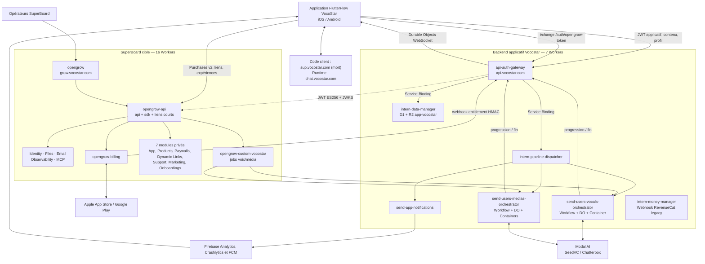
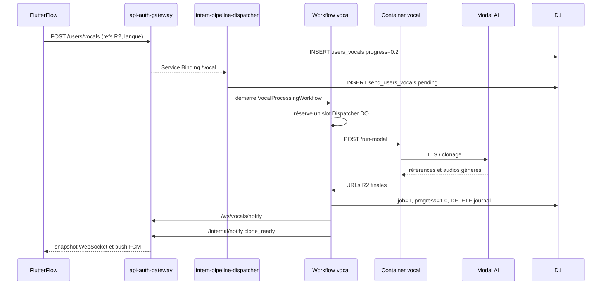
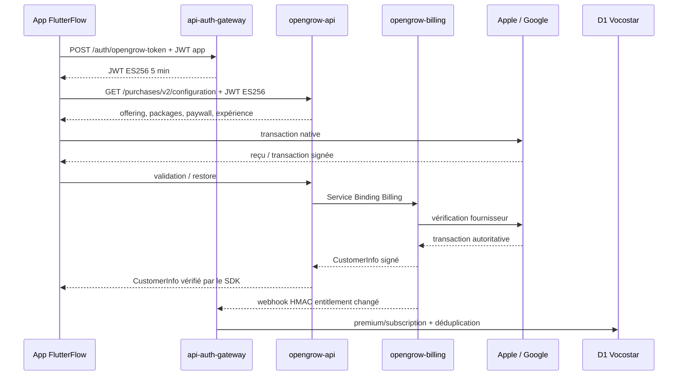
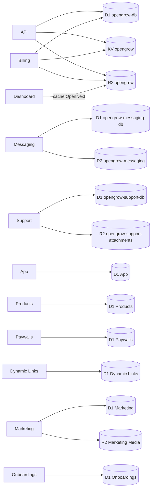

# Architecture complète de Vocostar

> **Document historique.** Cette page décrit l'état constaté avant la
> convergence SuperBoard. Elle ne doit pas servir de procédure de déploiement.
> L'architecture cible et son état d'implémentation sont décrits dans
> [Architecture cible SuperBoard et VocoStar](./ARCHITECTURE_CIBLE_FR.md), tandis
> que le détail réutilisable se trouve dans
> [SuperBoard reference architecture](./REFERENCE_ARCHITECTURE.md).
> La décision de migration de chaque page, état et custom code FlutterFlow se
> trouve dans
> [Convergence FlutterFlow VocoStar](./VOCOSTAR_FLUTTERFLOW_CONVERGENCE.md).
> Un inventaire direct effectué le 9 août 2026 a depuis identifié la source
> Cloudflare active à `chat.vocostar.com`; `sup.vocostar.com` ne résout plus.
> Voir [Convergence OpenChat](./OPENCHAT_SUPPORT_CONVERGENCE.md).

État analysé : worktree local du 8 août 2026.

Périmètre inspecté :

- `/Users/appmonster/Workspace/app-vocostar/cloudflare` : backend applicatif Vocostar ;
- `/Users/appmonster/Workspace/app-vocostar-ff` : projet FlutterFlow et export Flutter généré ;
- `/Users/appmonster/Workspace/opengrow` : back-office et plan de contrôle commun, achats applicatifs, liens et domaines.

Les nombres de services et les expositions ci-dessous décrivent les configurations
locales. Ils ne constituent pas un inventaire interrogé en direct sur le compte
Cloudflare.

## Synthèse

Pendant la coexistence de migration, l'ensemble contient **23 déploiements Worker
déclarés** : **7 Workers propres au backend mobile Vocostar** et les **16 rôles de
la cible SuperBoard**. Le Worker Messaging historique existe encore dans le dépôt,
mais `features.messaging=false` l'exclut des deux cibles actives. FlutterFlow n'appelle pas
directement tous ces Workers. Il utilise principalement `api.vocostar.com` pour le
métier historique et `sdk.vocostar.com`/`go.vocostar.com` via le SDK SuperBoard pour
les achats et les liens.

Le système se divise en trois plans :

1. l'application FlutterFlow, qui porte l'interface, l'état local, Firebase et les
   appels mobiles ;
2. le backend Vocostar, autorité des utilisateurs, crédits, voix, médias et fichiers ;
3. SuperBoard, back-office opérateur et autorité de monétisation applicative vérifiée.

SuperBoard suit une architecture de type _strangler_ : `opengrow-api` reste la façade
publique et l'orchestrateur, tandis que les domaines App, Products, Paywalls,
Dynamic Links, Support, Marketing et Onboardings sont progressivement isolés dans
leur propre Worker et leur propre base D1.

Pour les seize rôles SuperBoard, le manifeste de cible
[`deploy/targets/vocostar.json`](../deploy/targets/vocostar.json) est la source de
vérité du déploiement. Les sept Workers du backend mobile gardent chacun leur propre
configuration Wrangler sous `app-vocostar/cloudflare`; il n'existe pas de manifeste
transversal commun. Les fichiers SuperBoard sous `deploy/generated` sont des artefacts
Wrangler générés et ne doivent pas être modifiés manuellement.

## Topologie générale

## Les deux architectures Cloudflare

Le backend Vocostar et SuperBoard partagent le compte et le domaine `vocostar.com`,
mais pas leur autorité métier :

| Plan                              | Entrée principale                                                        | Autorité                                                     | Stockage principal                                                  |
| --------------------------------- | ------------------------------------------------------------------------ | ------------------------------------------------------------ | ------------------------------------------------------------------- |
| Application Vocostar              | `api.vocostar.com`                                                       | utilisateurs, JWT, crédits, contenus, voix, médias           | D1 `vocostar-db`, R2 `app-vocostar`, deux Durable Objects WebSocket |
| SuperBoard                          | `sdk.vocostar.com`, `go.vocostar.com`                                    | achats vérifiés, entitlements, paywalls, liens et croissance | D1/KV/R2 centraux et bases D1 de domaine                            |
| Support référencé par FlutterFlow | `sup.vocostar.com` ne résout plus ; runtime trouvé à `chat.vocostar.com` | contacts et conversations Chatwoot/OpenChat                  | fork `mabzadev/openchat`, trois Workers, D1/R2/Queues/Vectorize      |

`api-auth-gateway` est le pont d'identité et de projection entre les deux plans : il
émet un JWT ES256 SuperBoard à partir du JWT HS256 de Vocostar et reçoit le webhook
signé qui projette `premium` et `subscription` dans la table `users` de Vocostar.

## Catalogue des 7 Workers du backend Vocostar

| Worker configuré                 | Exposition observée                                                           | Rôle                                                                                          | Ressources                                                                                |
| -------------------------------- | ----------------------------------------------------------------------------- | --------------------------------------------------------------------------------------------- | ----------------------------------------------------------------------------------------- |
| `api-auth-gateway`               | domaine attendu `api.vocostar.com`; aucune route custom dans `wrangler.jsonc` | API mobile, JWT, données app, crédits, création de jobs, JWKS SuperBoard, webhooks et WebSocket | D1 `vocostar-db`, DO `UserVocalsRoom` et `UserMediasRoom`, Service Bindings Pipeline/Data |
| `intern-data-manager`            | URL `workers.dev` construite explicitement par le code                        | upload R2 direct et suppression D1/R2                                                         | D1 `vocostar-db`, R2 `app-vocostar`                                                       |
| `intern-pipeline-dispatcher`     | annoncé interne, mais `workers_dev=false` absent                              | enrichit les jobs et les distribue aux orchestrateurs/notifications                           | D1, trois Service Bindings                                                                |
| `send-users-medias-orchestrator` | privé (`workers_dev=false`, sans route), généré depuis la target              | traitement vidéo/audio/texte, pools Standard/Premium                                          | D1, Workflow, Dispatcher DO, 2 classes Container                                          |
| `send-users-vocals-orchestrator` | privé (`workers_dev=false`, sans route), généré depuis la target              | clonage/TTS vocal                                                                             | D1, Workflow, Dispatcher DO, 1 classe Container                                           |
| `send-app-notifications`         | annoncé interne, mais `workers_dev=false` absent                              | envoi Firebase Cloud Messaging v1 et audit du résultat                                        | D1, secret de compte de service FCM                                                       |
| `intern-money-manager`           | route publique non déclarée dans le fichier local                             | compatibilité webhook RevenueCat et ajout de crédits legacy                                   | D1, secret `RC_WEBHOOK_SECRET`                                                            |

L'inventaire historique révélait l'absence de `workers_dev=false`. La
configuration canonique corrige ce point : ces deux Workers n'ont ni URL
`workers.dev`, ni preview URL, ni route publique. Ils restent joignables
uniquement par les Service Bindings déclarés dans la target.

Les deux orchestrateurs ne dépendent plus de fichiers Wrangler locaux non suivis.
Leur code canonique est sous `workers/custom/vocostar/orchestrators`, leur
provenance historique et les empreintes du snapshot importé sont conservées dans
`PROVENANCE.json`, et `deploy/targets/vocostar.json` possède leurs noms par
environnement, Workflow, Durable Objects, Containers, variables et noms de
secrets. Le plan de déploiement les place avant l'adaptateur `custom`, dont les
Service Bindings pointent exactement vers ces mêmes noms. Toute target incohérente
est rejetée avant génération ou déploiement.

Le contrat de transition distingue maintenant trois frontières qui ne sont pas
interchangeables : les tickets d'entrée proviennent de `files.vocostar.com` et
du bucket commun `opengrow`, les artefacts historiques restent dans
`app-vocostar` sous `file.vocostar.com`, et les callbacks restent temporairement
servis par `api-auth-gateway`. Les conteneurs téléchargent les tickets Files par
HTTPS avec origine exacte, redirections interdites et plafond d'octets ; seules
les URLs de sortie legacy sont converties en clés du bucket applicatif.

Cette transition est volontairement **bloquée pour tout déploiement actif**.
Le plan expose `runtime-bridge-unverified`, `files-input-routing-inactive` et
`gateway-callback-owner-mismatch`. Les versions peuvent être générées et chargées
sans trafic, mais la promotion ne devient possible qu'après activation vérifiée
de Files, portage et test des quatre callbacks dans l'API SuperBoard, changement du
propriétaire déclaré du gateway et revue explicite de `deploymentStatus`. Ainsi,
aucune bascule de `api.vocostar.com` ou des orchestrateurs ne peut être déduite de
la simple présence du code migré.

Le bucket média historique est lui aussi une ressource applicative déclarée par
la target (`customR2`) et inventoriée par le bootstrap. Les conteneurs reçoivent
son nom à l'exécution ; ils ne peuvent donc ni basculer silencieusement vers le
bucket de fichiers SuperBoard, ni embarquer un nom de bucket dans leur source.
Les tailles de pools sont dérivées de `maxInstances` et les réservations de slot
ont un bail borné déclaré dans la target : un arrêt brutal de Workflow ne peut
donc pas bloquer définitivement une instance dans le Dispatcher.

## Fonctionnement du backend Vocostar

### Gateway, auth et API mobile

`api-auth-gateway` est une application Hono qui expose :

| Famille             | Routes principales                                                                   | Fonction                                                                            |
| ------------------- | ------------------------------------------------------------------------------------ | ----------------------------------------------------------------------------------- |
| Santé               | `GET /health`                                                                        | disponibilité du gateway                                                            |
| Auth applicative    | `POST /auth/anonymous`, `/auth/refresh`, `/auth/logout`                              | utilisateur anonyme lié au device, access JWT HS256, refresh JWT et sessions D1     |
| Comptes sociaux     | `/auth/link/google`, `/auth/link/apple`, `/auth/signin/google`, `/auth/signin/apple` | vérification des JWT Google/Apple et liaison au profil D1                           |
| Identité SuperBoard   | `POST /auth/opengrow-token`, `GET /.well-known/jwks.json`                            | échange du JWT applicatif contre un JWT ES256 de 5 minutes, vérifiable par SuperBoard |
| Profil              | `GET/PATCH /users/me`                                                                | profil, langue, onboarding, FCM et préférences vocales                              |
| Contenu app         | `/app/vocals`, `/app/categories`, `/app/questions`, `/app/board`                     | catalogue vocal et contenu d'onboarding provenant de D1                             |
| Jobs                | `/users/vocals`, `/users/medias`, `/users/credits-check`                             | création/listage des transformations et débit atomique des crédits                  |
| Fichiers/nettoyage  | `/upload/media`, `/clean/medias`, `/clean/vocals`, `/clean/user`                     | proxy authentifié vers `intern-data-manager`                                        |
| Temps réel          | `/ws/vocals`, `/ws/medias` et routes de notification/progression                     | WebSocket par utilisateur via Durable Objects                                       |
| Configuration       | `GET /settings/active`                                                               | maintenance, version forcée et ancien JSON de paywall                               |
| Projection SuperBoard | `POST /webhook/opengrow/entitlements`                                                | vérifie HMAC, déduplique et projette premium/subscription                           |

L'access token applicatif dure actuellement 1 296 000 secondes (15 jours) et le
refresh token 3 888 000 secondes (45 jours). Les documents historiques qui parlent
d'une heure et de trente jours ne correspondent plus au `wrangler.jsonc` analysé.

### Données et fichiers

Tous les Workers du backend Vocostar partagent le même D1 `vocostar-db` : profils,
sessions, contenu de l'app, jobs, achats legacy et audit des notifications. Les
tables `send_users_vocals` et `send_users_medias` sont des journaux de dispatch D1,
pas des Cloudflare Queues.

Le bucket R2 `app-vocostar`, publié via `file.vocostar.com`, contient les sources
uploadées et les sorties des traitements. `intern-data-manager` fournit l'upload PUT
et supprime à la fois les objets R2 et les lignes D1 lors d'un nettoyage.

Les deux Durable Objects du gateway sont partitionnés par identifiant utilisateur :

- `UserVocalsRoom` relit `users_vocals` et diffuse un snapshot ou une mise à jour ;
- `UserMediasRoom` relit la vue `v_users_medias` et diffuse le même type d'événement.

Ils ne stockent pas le contenu métier dans leur propre SQLite : D1 reste l'autorité,
le DO sert de hub WebSocket hibernant.

### Pipeline voix

Le Workflow fournit les retries, les timeouts durables et le `finally` qui arrête le
Container et libère le slot. Le pool vocal autorise jusqu'à 20 instances Standard.

### Pipeline média

Le média suit le même principe, avec plus d'étapes :

1. Flutter demande une URL d'upload au gateway puis envoie le fichier en PUT vers
   `intern-data-manager`, qui l'écrit dans R2.
2. `POST /users/medias` débite les crédits si le solde est suffisant et écrit
   `users_medias` plus `send_users_medias`.
3. Le dispatcher résout la voix de référence dans D1, lit le statut Premium, enrichit
   le payload puis déclenche le Workflow média.
4. Le Workflow réserve le pool Standard (20 × 1 vCPU/3 Gio) ou Premium
   (10 × 2 vCPU/6 Gio), appelle `/prepare`, Modal, puis `/run-ffmpeg` pour la vidéo.
5. Les URLs R2 finales sont enregistrées, `job=1`, `progress=1.0`; le gateway diffuse
   l'état par WebSocket et fait envoyer la notification FCM localisée.

Le pipeline traite trois formes : vidéo (audio extrait, voix transformée, mux SD/HD,
watermark et miniature), audio (source + voix transformée) et texte (TTS transformé).

### Notifications et achats legacy

`send-app-notifications` récupère un access token OAuth Google avec son compte de
service, appelle FCM v1, puis marque l'audit D1 `sent` ou `failed`.

`intern-money-manager` ne participe pas au parcours SuperBoard moderne. Il reçoit un
webhook RevenueCat legacy, journalise l'achat et ajoute les crédits de manière
idempotente. Aucun Service Binding ne le relie au gateway dans la configuration
actuelle ; son routage de production doit donc être confirmé séparément.

## Architecture de l'application FlutterFlow

L'analyse s'appuie sur le SDK typé FlutterFlow et sur l'export runtime marqué
`fresh` au 9 août 2026, commit `RllpTDAzXqy5vRMb1dk4`. Le projet est `VocoStar`,
version d'app `1.0.5+1`, bundle
`com.createurs.vocostar`, avec sept langues : anglais, français, espagnol,
portugais, allemand, japonais et coréen.

### Écrans et responsabilités

| Zone                  | Pages principales                                                       | Fonctionnement                                                                                               |
| --------------------- | ----------------------------------------------------------------------- | ------------------------------------------------------------------------------------------------------------ |
| Entrée                | `index`                                                                 | restaure l'état, ré-authentifie anonymement, initialise SuperBoard puis oriente vers onboarding ou application |
| Onboarding            | `onboard00` à `onboard05`                                               | contenu D1 `app_board`, questions/catégories, sélection des voix, FCM puis page Paywall SuperBoard             |
| Navigation principale | `UserClone`, `UserVocals`, `UserLibrary`                                | trois onglets : créer un clone, choisir une voix, consulter les médias                                       |
| Création              | `UserRecordVideo`, `UserRecordAudio`, `UserRecordText`, `UserUpload`    | capture locale, contrôle crédits, upload R2 et création du job                                               |
| Lecture               | `UserPlayerMedia`                                                       | résout la sortie JSON, lit, partage ou supprime le média                                                     |
| Compte                | `UserLinkAccount`, `UserSignAccount`                                    | liaison ou connexion Google/Apple au compte anonyme                                                          |
| Réglages              | `SettingsUser`, `SettingsLanguage`, `SettingsSupport`, `SettingsTicket` | profil, langue, suppression, documents et chat Chatwoot                                                      |
| Monétisation          | route de bibliothèque `/opengrow-paywall`                               | `paywallR1`, Settings Premium et la fin de l'onboarding ouvrent l'unique page Paywall SuperBoard               |

### État local

Les éléments structurants de `FFAppState` sont :

- identité : `authAccessToken`, `authRefreshToken`, `authExpiresIn`, `authUserId`,
  `authUserData` ;
- catalogue : `appVocals`, `appMenu`, `appQuestions`, `appBoard`, `appPaywall` ;
- utilisateur : `appUserVocals`, `appUserMedias`, catégories, crédits et Premium ;
- temps réel/support : flags média/voix, progression d'upload, IDs Chatwoot et messages ;
- SuperBoard : `opengrowPurchasesReady` indique qu'un `CustomerInfo` signé a été reçu.

Les JWT applicatifs et le refresh token sont persistés dans `SharedPreferences` par
le code généré. Le device UUID, lui, utilise `flutter_secure_storage` et le
trousseau synchronisable iCloud en secours.

### Démarrage et authentification

1. `main()` initialise les valeurs SuperBoard, Firebase, Crashlytics, Analytics et le
   listener de `CustomerInfo` SuperBoard.
2. `userAuthenticate()` choisit un identifiant stable du device, construit un email
   invité et appelle `POST /auth/anonymous`.
3. Le gateway crée ou retrouve l'utilisateur puis renvoie access token, refresh token
   et profil. FlutterFlow les persiste et ouvre la session de son auth custom.
4. L'app remet l'access token au package SuperBoard. Celui-ci appelle
   `POST /auth/opengrow-token`, obtient le JWT ES256 court, puis initialise Purchases
   sur `https://sdk.vocostar.com/purchases/v2`.
5. Le `CustomerInfo` signé met à jour `premium`, `subscription` et
   `opengrowPurchasesReady`. Le gateway reçoit également le webhook entitlement pour
   que D1 reflète l'autorité SuperBoard côté serveur.

Ce paragraphe décrit encore le runtime observé dans l'export VocoStar. La cible
de remplacement est désormais implémentée dans le SDK FlutterFlow `2.2.4` : le
SDK conserve et tourne la session dans le stockage chiffré natif, tandis que
l'auth FlutterFlow ne reçoit qu'un access token éphémère. Les trois champs de
tokens/expiration persistés dans l'App State VocoStar doivent donc disparaître ;
aucune application ne doit réimplémenter un second gestionnaire de session.

### Achats SuperBoard : architecture prévue et câblage réel

L'export historique embarquait une ancienne révision privée du package
FlutterFlow. La cible utilise exclusivement la référence immuable publiée dans
`config/sdk-libraries.json`; aucun document d'architecture ne redéfinit sa
version.
Le package cible sait charger les offerings, afficher le paywall distant, déclencher l'achat Store,
restaurer les achats, vérifier localement le `CustomerInfo` JWS et remonter les
événements de paywall. iOS et Android contiennent la clé projet, `sdk.vocostar.com`,
le scheme `vocostar` et `go.vocostar.com` pour les Universal/App Links.

Le câblage du paywall a été unifié dans les commits FlutterFlow
`VPKyiIFyhMCjM6cMn1hC` puis `FjoaBuXpywlA7rEFYJGP`; les migrations suivantes
jusqu'à `RllpTDAzXqy5vRMb1dk4` ont conservé ce parcours unique :

- `paywallR1`, Settings Premium et la fin de l'onboarding ouvrent la route
  `/opengrow-paywall`, qui est remplacée par la page de bibliothèque
  `SuperBoardPaywallPage` et son widget canonique `SuperBoardPaywall` ;
- `userLoginRevenueCat`, `userSubscriptionActivate`, `Paywallv1` et la page
  `onboardWall` ont été supprimés ;
- la migration Git de la bibliothèque remappe les anciens widgets
  `OGBootstrapBridge`, `OGPaywallBridge` et `OGRestoreBridge` vers
  `SuperBoardBootstrap`, `SuperBoardPaywall` et
  `SuperBoardRestorePurchasesButton`, puis supprime ces trois doublons ;
- il reste à certifier les achats/restaurations Apple et Google sur MBZA ;
- `SuperBoardBootstrap` doit être monté dans l'écran hôte de VocoStar lors de la
  synchronisation contrôlée de la bibliothèque ; tant que cette migration distante
  n'est pas publiée, le transfert des deep links et certains callbacks globaux
  restent volontairement bloqués par la readiness.

### Temps réel et support dans l'app

`UserLibrary` dérive désormais `wss://<cible>/ws/medias` de la constante
d'environnement `gatewayUrl`; aucune origine VocoStar n'est codée dans l'action ou
son appel. Chaque snapshot ou update déclenche encore un nouveau GET
`/users/medias`, et le bearer reste temporairement placé en query string. En
revanche, `UserClone` ferme un canal `users_vocals` à sa destruction mais ne s'y
abonne jamais à l'initialisation : les mises à jour temps réel du clone vocal ne
sont donc pas consommées par l'écran.

Le code FlutterFlow appelle directement `sup.vocostar.com` en REST et WebSocket
ActionCable, mais ce domaine ne résout plus. Le runtime trouvé en ligne est le
fork OpenChat à `chat.vocostar.com`. Le client n'utilise actuellement ni
`opengrow-messaging` ni `opengrow-support`; il doit passer au contrat Support
commun après import et non être simplement redirigé vers OpenChat.

## Flux d'achat de bout en bout

Ce diagramme représente le parcours voulu par l'architecture SuperBoard. Le paywall
visible de l'export FlutterFlow doit encore être basculé vers ce parcours.

## Catalogue des 16 rôles de la cible SuperBoard

| Worker déployé             | Entrée du code                         | Exposition                                             | Responsabilité principale                                                                                              | Ressources Cloudflare                                                           |
| -------------------------- | -------------------------------------- | ------------------------------------------------------ | ---------------------------------------------------------------------------------------------------------------------- | ------------------------------------------------------------------------------- |
| `opengrow-observability`   | `workers/observability/src/index.ts`   | privé, récepteur Tail                                  | télémétrie nettoyée, erreurs, CPU, latence et agrégats                                                                 | Analytics Engine                                                                |
| `opengrow-email`           | `workers/email/src/index.ts`           | privé; preview protégée selon cible                    | emails transactionnels/marketing, capture, SMTP, tentatives et quarantaine                                             | D1 Email, Queue/DLQ                                                             |
| `opengrow-files`           | `workers/files/src/index.ts`           | relayé par l'API et domaine Files                      | upload authentifié, métadonnées, streaming, suppression et purge                                                       | D1 Files, R2                                                                    |
| `opengrow-identity`        | `workers/identity/src/index.ts`        | relayé par l'API                                       | comptes applicatifs, email/mot de passe, Google, Apple, sessions et JWT                                                | D1 Identity                                                                     |
| `opengrow-billing`         | `workers/billing/src/index.ts`         | Privé (`workers_dev=false`, aucune route)              | Vérification Apple/Google, CustomerInfo signé, achats, restauration, rapprochement, remboursements et catalogues Store | D1/KV/R2 centraux partagés, Queue Billing + DLQ, cron                           |
| `opengrow-app`             | `workers/app/src/index.ts`             | Privé                                                  | Clients, referrals, clés d'accès, configuration SDK, événements client et statistiques                                 | D1 App                                                                          |
| `opengrow-products`        | `workers/products/src/index.ts`        | Privé                                                  | Produits, variantes Store, packages, offerings, entitlements, achats, abonnements et remboursements                    | D1 Products                                                                     |
| `opengrow-paywalls`        | `workers/paywalls/src/index.ts`        | Privé                                                  | Paywalls versionnés, publication, placements, ciblage, expériences A/B, événements et statistiques                     | D1 Paywalls                                                                     |
| `opengrow-dynamic-links`   | `workers/dynamic-links/src/index.ts`   | Privé                                                  | CRUD des liens/campagnes/domaines, règles de redirection, social preview, tracking et statistiques                     | D1 Dynamic Links                                                                |
| `opengrow-support`         | `workers/support/src/index.ts`         | Privé ; ticket WebSocket public relayé par l'API       | Support cible : Inbox, conversations, contacts, équipes, automatisations, CSAT, audit et WebSocket                     | D1 Support, R2 pièces jointes, Queue Support, Durable Object `ConversationRoom` |
| `opengrow-marketing`       | `workers/marketing/src/index.ts`       | Privé ; tracking et webhooks publics relayés par l'API | Abonnés, listes, segments, modèles, médias, campagnes email, SMTP, double opt-in, tracking et retours fournisseur      | D1 Marketing, R2 médias, Queue Marketing, cron, TCP Sockets pour SMTP           |
| `opengrow-onboardings`     | `workers/onboardings/src/index.ts`     | Privé                                                  | Onboardings versionnés, placements, ciblage, expériences/variantes, résolution SDK, événements et statistiques         | D1 Onboardings                                                                  |
| `opengrow-custom-vocostar` | `workers/custom/vocostar/src/index.ts` | privé                                                  | persistance/idempotence, orchestration voix/média, lecture, retry et statistiques                                      | D1 VocoStar, deux Service Bindings Workflow/Container                           |
| `opengrow-api`             | `workers/api/src/index.ts`             | API, SDK, liens courts et domaine Files de la cible    | façade publique, OAuth/dashboard, SDK, liens, webhooks, orchestration et état                                          | D1 central, KV, R2, Queues et Service Bindings                                  |
| `opengrow-mcp`             | `workers/mcp/src/index.ts`             | domaine MCP de la cible                                | outils opérateur OAuth en Streamable HTTP stateless                                                                    | Service Binding privé vers API                                                  |
| `opengrow`                 | `apps/dashboard/.open-next/worker.js`  | `grow.vocostar.com`                                    | Interface opérateur Next.js compilée par OpenNext                                                                      | Static Assets, Images, Service Binding API, R2 cache dédié                      |

Les Workers privés sont joignables uniquement depuis `opengrow-api` par Service
Binding. App, Products, Paywalls, Dynamic Links et Onboardings n'ont ni hostname
`workers.dev`, ni route publique, ni Queue, ni Durable Object.

`opengrow-messaging` reste un composant de compatibilité testé, mais il n'est pas un
des seize déploiements de la cible active. Support est son remplacement canonique.

## Rôle détaillé des composants

### 1. Dashboard `opengrow`

Le dashboard est un Worker Cloudflare généré depuis Next.js avec OpenNext. Les
assets sont servis directement depuis le binding `ASSETS`; les requêtes dynamiques
passent par le Worker. Il consomme l'API publique à `https://go.vocostar.com/api/v1`.
Le bucket `opengrow` est utilisé comme cache incrémental Next.js et le binding
Cloudflare Images est disponible pour les transformations d'images.

### 2. Gateway `opengrow-api`

Ce Worker est le centre de contrôle actuel. Il assure notamment :

- les comptes opérateur, invitations, mot de passe, TOTP, OAuth et SSO optionnel ;
- les instances, projets, rôles et configurations iOS/Android/Web/Desktop ;
- les routes SDK historiques, événements, visiteurs, notifications et push ;
- les liens courts publics, quick links, social preview et fichiers well-known ;
- MCP OAuth 2.1 et les outils MCP protégés ;
- l'entrée des webhooks Apple/Google et l'orchestration Billing ;
- le proxy authentifié vers chacun des sept Workers de domaine ;
- le proxy public limité vers le tracking Marketing et le WebSocket Support.

Pour un domaine privé, l'API authentifie d'abord l'utilisateur ou le SDK, résout le
projet `<instance>-prod|test`, vérifie les rôles et le mode maintenance, puis signe
un contexte projet HMAC à durée courte. Le Worker de domaine vérifie à la fois le
token interne et la signature avant d'accéder à son D1.

Le cron `*/10 * * * *` déclenche la maintenance via Queue et vérifie périodiquement
la configuration des notifications Apple. L'API consomme les travaux génériques
d'agrégation, push et maintenance. En mode Billing `service`, elle produit les
travaux financiers mais ne les consomme pas.

### 3. Billing `opengrow-billing`

Billing est l'autorité d'exécution financière privée. Il partage encore la base D1,
le KV et le R2 centraux avec l'API, mais l'exécution est isolée dans un Worker sans
route publique. Il :

- vérifie les transactions Apple et Google auprès des Stores ;
- résout/fusionne les identités financières ;
- signe le `CustomerInfo` avec ES256 ;
- traite les événements fournisseurs, abonnements, remboursements et exports ;
- chiffre les credentials Store ;
- exécute les rapprochements périodiques ;
- consomme la Queue Billing et met en quarantaine sa DLQ dans D1.

Le mode actuel est `billingExecutionMode: service` : Billing est donc l'unique
consommateur attendu de `opengrow-billing`, avec un cron toutes les dix minutes.

### 4. Messaging `opengrow-messaging`

Messaging est le service temps réel historique d'SuperBoard. Ses clients SDK peuvent
l'appeler directement sur `messages.vocostar.com` avec un JWT applicatif délivré par
`api-auth-gateway`, mais l'export FlutterFlow Vocostar analysé appelle Chatwoot et non
ce service. D1 conserve conversations, messages, configuration, contacts et audits ;
R2 conserve les pièces jointes. Une instance Durable Object `ConversationRoom` par
conversation attribue les séquences et diffuse les événements sur WebSocket hibernant.

L'API utilise aussi le Service Binding `MESSAGING` pour les fonctions opérateur
exposées sous `/api/v2/messaging` et `/api/v2/inbox`.

### 5. App `opengrow-app`

Attention : ce Worker n'est pas l'interface web. Il représente le domaine
« application cliente » : clients, referrals, clés SDK, configuration des plateformes,
événements d'usage et agrégats. Les routes SDK `app/events` sont relayées directement
par l'API vers ce Worker.

### 6. Products `opengrow-products`

Products porte le catalogue commercial et ses projections : produits canoniques,
identifiants Apple/Google, packages, offerings, entitlements, clients financiers,
achats, abonnements, remboursements et synchronisations Store. Le SDK appelle
`products/offerings/resolve` via l'API.

La vérification cryptographique et fournisseur reste dans Billing. Les concepts
financiers présents dans Products sont le modèle de domaine isolé issu du cutover,
alors que les tables `billing_*` du D1 central restent encore l'autorité Billing.

### 7. Paywalls `opengrow-paywalls`

Paywalls gère le contenu versionné, la publication, les placements, les règles de
ciblage, les expériences et variantes, ainsi que la télémétrie. Le SDK utilise
`paywalls/resolve` et `paywalls/events`, relayés par l'API.

### 8. Dynamic Links `opengrow-dynamic-links`

Ce Worker gère les données des liens, campagnes, domaines, règles de redirection,
social preview et tracking. Il n'est pas lui-même le point d'entrée public des liens
courts : les redirections publiques restent dans `opengrow-api` sur
`go.vocostar.com`. Dynamic Links est pour l'instant un module privé de gestion et de
résolution.

### 9. Support `opengrow-support`

Support est la cible de remplacement du domaine Messaging pour l'Inbox. Il reprend
les conversations, messages, contacts, sociétés, notes privées, équipes, labels,
macros, automatisations, CSAT, notifications agent et webhooks, avec :

- un D1 isolé ;
- un Durable Object par conversation ;
- des tickets WebSocket mono-usage relayés par l'API ;
- des écritures idempotentes et un audit immuable ;
- des secrets de webhook chiffrés dans D1 ;
- le bucket R2 historique partagé pour préserver les clés de pièces jointes.

### 10. Marketing `opengrow-marketing`

Marketing gère l'email de bout en bout : abonnés, listes, segments, templates,
campagnes, médias, suppressions, double opt-in, SMTP, tracking open/click/unsubscribe,
provider feedback et statistiques. Le cron exécuté chaque minute récupère les
campagnes arrivées à échéance et les opt-ins en attente. La Queue découpe les
campagnes en livraisons idempotentes et effectue l'envoi SMTP via
`cloudflare:sockets`.

Les URLs publiques de tracking, opt-in et webhooks fournisseur sont exposées par
`opengrow-api`, puis relayées au Worker privé.

### 11. Onboardings `opengrow-onboardings`

Onboardings gère les parcours d'accueil versionnés, leur publication, les placements,
les règles de ciblage, les expériences pondérées, la résolution pour le SDK, les
événements d'étape et les statistiques. Les routes SDK `onboardings/resolve` et
`onboardings/events` passent par l'API.

## Données et état Cloudflare

| Ressource                         | Producteurs/lecteurs             | Usage                                                                                       |
| --------------------------------- | -------------------------------- | ------------------------------------------------------------------------------------------- |
| D1 `opengrow-db`                  | API + Billing                    | Identité opérateur, instances/projets, legacy SuperBoard, Billing, analytics et orchestration |
| KV `opengrow`                     | API + Billing                    | Cache/état léger, notamment clés publiques Google et compatibilité Billing                  |
| R2 `opengrow`                     | API + Billing + Dashboard        | Exports/fichiers API, besoins Billing, cache incrémental OpenNext                           |
| D1 `opengrow-messaging-db`        | Messaging                        | État historique de messagerie                                                               |
| R2 `opengrow-messaging`           | Messaging historique             | Pièces jointes de la source temporaire de migration                                         |
| R2 `opengrow-support-attachments` | Support                          | Pièces jointes canoniques et objets migrés depuis Chatwoot                                  |
| Sept D1 de module                 | Un Worker chacun                 | Autorité isolée par domaine                                                                 |
| R2 `opengrow-marketing-media`     | Marketing                        | Médias des campagnes email                                                                  |
| Durable Objects Messaging/Support | Chaque Worker dans son namespace | Ordonnancement et WebSocket par conversation                                                |
| Email Sending `EMAIL`             | API                              | Mot de passe, invitations et mails transactionnels de plateforme                            |
| Images `IMAGES`                   | Dashboard                        | Transformation d'images côté Cloudflare                                                     |

## Flux asynchrones et crons

| Queue                         | Producteur(s) déclaré(s) | Consommateur attendu                                  | Travaux                                                                   | DLQ                                                                         |
| ----------------------------- | ------------------------ | ----------------------------------------------------- | ------------------------------------------------------------------------- | --------------------------------------------------------------------------- |
| `opengrow-events`             | API                      | API                                                   | Agrégation/maintenance générique                                          | `opengrow-events-dlq`, consommée par API pour quarantaine                   |
| `opengrow-push`               | API                      | API                                                   | Livraison APNs/FCM                                                        | `opengrow-push-dlq`, consommée par API pour quarantaine                     |
| `opengrow-maintenance`        | API cron                 | API                                                   | Agrégats et nettoyage R2/MCP/actions                                      | `opengrow-maintenance-dlq`, consommée par API pour quarantaine              |
| `opengrow-billing`            | API + Billing            | Billing en mode `service`                             | Webhooks, rapprochement, abonnements, remboursements, inventaire, exports | `opengrow-billing-dlq`, consommée par Billing pour quarantaine              |
| `opengrow-email-delivery`     | Email                    | Email                                                 | Transport SMTP des messages transactionnels et de test                    | `opengrow-email-delivery-dlq`, consommée par Email pour quarantaine         |
| `opengrow-support-events`     | Support                  | Support                                               | Webhooks `support.*` canoniques                                           | `opengrow-support-events-dlq`, consommée par Support pour quarantaine       |
| `opengrow-messaging-events`   | Messaging historique     | Messaging uniquement tant que la compatibilité existe | Webhooks `messaging.*` historiques                                        | `opengrow-messaging-events-dlq`, consommée par Messaging pour quarantaine   |
| `opengrow-marketing-delivery` | Marketing                | Marketing                                             | Dispatch de campagne, envoi email, double opt-in                          | `opengrow-marketing-delivery-dlq`, consommée par Marketing pour quarantaine |

Crons actifs :

- API : toutes les 10 minutes ;
- Billing : toutes les 10 minutes ;
- Marketing : toutes les minutes ;
- aucun cron pour les autres Workers actifs.

## Authentification et isolation

Il existe trois couches distinctes :

1. **Dashboard/operator** : OAuth, rôles d'instance et allowlist gérés dans le D1
   central par l'API.
2. **Identité applicative** : `api-auth-gateway` émet des JWT ES256 à audience
   `opengrow`; Messaging, Support et Billing les vérifient via le JWKS externe.
3. **Inter-Worker** : l'API transmet aux sept modules un secret interne et un
   contexte projet signé HMAC comprenant module, méthode, chemin, projet, instance,
   environnement, acteur, rôle, request ID et timestamp.

Les mutations des modules exigent une clé d'idempotence. Le gateway peut mettre un
projet en lecture seule pendant le cutover et bloque alors les mutations avec une
erreur 503 stable.

## Architecture de migration et autorité des données

Le cutover documenté est ponctuel et par projet ; il ne s'agit pas d'une réplication
continue. Les bases historiques restent présentes pour le rollback, puis les Workers
de domaine deviennent la nouvelle cible après réouverture des écritures.

| Domaine cible | Source historique                                           | Destination                                           |
| ------------- | ----------------------------------------------------------- | ----------------------------------------------------- |
| App           | visiteurs, événements, applications et liens du D1 API      | D1 App                                                |
| Products      | tables `billing_*` du D1 central                            | D1 Products                                           |
| Paywalls      | paywalls, placements et expériences `billing_*`             | D1 Paywalls                                           |
| Dynamic Links | liens, campagnes, domaines, actions et événements du D1 API | D1 Dynamic Links                                      |
| Support       | D1 Messaging                                                | D1 Support, en conservant les identifiants et clés R2 |

Marketing et Onboardings sont déjà des domaines autonomes sans source legacy dans le
registre de cutover.

## Points d'attention prioritaires

### Corrigé — liaison de la Library Value FlutterFlow

Le commit `FP4iR0KkMm5jpto4nfvZ` rattache `authGatewayBaseUrl` au véritable projet
de bibliothèque SuperBoard, puis `9p0A3lMth8sLkly8lDis` fait passer l'action block
Paywall par un adaptateur compilable. L'export n'émet plus les symboles invalides
`null_library_values` ou `$open_grow_private_4m5us1` sans import. L'analyse Dart
complète confirme zéro erreur de compilation; les warnings et informations de
style générés restent un chantier de qualité distinct.

Le commit `pKUaEmdUwqE4QnHiy47l` remplace aussi le faux login exécuté après
refresh dans `UserLibrary` par `Update Auth User`. La session est actualisée sans
navigation et FlutterFlow ne rapporte plus aucune erreur de validation.

Le commit `RllpTDAzXqy5vRMb1dk4` retire ensuite l'origine WebSocket média codée en
dur et la dérive de la cible API sélectionnée, ce qui rend cette connexion portable
entre MBZA, VocoStar et les futurs projets.

### Critique — les routes dites internes du backend Vocostar ne sont pas privées

Les cinq Workers auxiliaires concernés ne déclarent pas `workers_dev=false`. Si le
hostname `workers.dev` est actif comme le laisse entendre la configuration, plusieurs
handlers sont accessibles sans secret de Service Binding :

- le dispatcher accepte `/vocal`, `/media` et `/notify` ;
- les deux orchestrateurs acceptent tout POST et peuvent démarrer un Workflow/Container ;
- `send-app-notifications` accepte un payload avec n'importe quel token FCM ;
- Data Manager accepte le PUT upload et protège ses suppressions par la seule
  présence d'un `X-User-Id` forgeable si son URL publique reste active.

Cela ouvre un risque d'abus de calcul Modal/Containers, d'envoi de push, de
falsification de progression et de coût. La cible doit imposer `workers_dev=false`
sur les services réellement internes et une authentification inter-service signée,
même derrière les Service Bindings.

Le snapshot du 8 août a en revanche corrigé les callbacks gateway :
`/internal/notify`, `/ws/vocals/notify`, `/ws/vocals/progress` et
`/ws/medias/progress` exigent désormais `X-VocoStar-Internal-Token`, comparé en
temps constant, avec tests unitaires. Cette correction réduit l'exposition du
gateway mais ne rend pas privés les autres Workers listés ci-dessus.

### Critique — l'URL d'upload R2 n'est pas pré-signée

Le gateway vérifie bien que le chemin demandé commence par `users/<userId>/`, mais
retourne ensuite une URL statique
`intern-data-manager.vocostar.workers.dev/upload?file=...`. Le PUT ne vérifie aucun
token, aucune signature, aucune expiration, aucune taille et accepte un chemin R2
arbitraire. Cette URL est donc un endpoint d'écriture public, pas une URL pré-signée.

Les routes `/clean/*` du même Worker vérifient seulement la présence d'un header
`X-User-Id` fourni par l'appelant. Si le Worker est public, ce header est forgeable et
permet de tenter des suppressions D1/R2 hors du gateway.

### Critique — secrets en clair dans une documentation locale

`app-vocostar/cloudflare/DEPLOIEMENT_GROVS_VOCOSTAR.md` contient un mot de passe
administrateur et un secret OAuth en clair. Même si ce dossier est actuellement non
suivi par Git, ces valeurs doivent être considérées compromises : rotation, retrait
du document et vérification qu'elles n'existent dans aucun historique, backup ou
artefact partagé.

### Élevé — les configurations legacy ne sont pas portables entre comptes

Plusieurs `wrangler.toml` historiques contiennent directement `account_id`, les
identifiants D1, les noms R2, `api.vocostar.com`, `file.vocostar.com`, l'endpoint R2
du compte et les URLs Modal. Ce ne sont pas tous des secrets, mais ce sont des
paramètres de déploiement propres à un compte et une application; ils empêchent une
promotion sûre dev/main et favorisent les déploiements sur la mauvaise cible.

La base SuperBoard corrige cette classe de problème par les manifestes versionnés
`deploy/targets/*`, les IDs de compte fournis uniquement par GitHub Environment et
les configurations Wrangler générées. Les deux orchestrateurs VocoStar suivent
désormais le même générateur et sont découverts depuis la target. Ils restent
néanmoins des dépendances de migration tant que le runtime bridge fail-closed
décrit plus haut n'est pas vérifié.

### Résolu le 9 août — paywall unique SuperBoard

Tous les points d'entrée partagés de l'application naviguent désormais vers la
page de bibliothèque SuperBoard. Les actions client RevenueCat et l'ancienne
implémentation visuelle ont été supprimées. Le risque restant n'est plus un doublon
d'architecture : c'est la certification externe des produits, achats et restaurations
Apple/Google sur MBZA, puis la promotion immuable vers VocoStar.

### Résolu dans le snapshot du 8 août — identité durable du journal média

Le gateway insère `send_users_medias.id = queueId` et transmet maintenant ce même
`send_id` au dispatcher. `resolveMediaSendId()` conserve cet identifiant, vérifie que
la mise à jour concerne exactement la ligne et le média attendus, puis le transmet au
Workflow. Les anciens appelants sans `send_id` peuvent encore résoudre la dernière
ligne existante. Trois tests couvrent la conservation, le fallback et l'échec fermé.

### Élevé — le contrat de persistance Chatwoot est cassé

`supportInit()` veut lire/écrire `support_contact_id` et
`support_conversation_id` via `/users/me`. Or le gateway ne renvoie pas ces champs et
le PATCH les ignore car ils ne figurent pas dans l'allowlist. En plus,
`supportConversationId` n'est pas persisté localement. Après un redémarrage, l'app
peut donc recréer un ContactInbox ou une conversation au lieu de retrouver l'existant,
malgré les commentaires du code qui annoncent le contraire.

### Élevé — le callback entitlement doit être aligné dans la configuration live

La route réellement exposée par le gateway est au singulier
`/webhook/opengrow/entitlements`. Plusieurs exemples/tests SuperBoard utilisent le
pluriel `/webhooks/opengrow/entitlements`. La destination est stockée dans les données
du projet SuperBoard et n'est pas visible dans les fichiers analysés : il faut vérifier
la valeur live, le secret HMAC des deux côtés et une livraison de bout en bout.

### Résolu dans la base cible — collision de consommateur Queue entre Messaging et Support

Le manifeste historique donnait à Support la même Queue et la même DLQ que Messaging.
Les deux configurations Wrangler déclarent cette Queue comme consommateur, alors que
les handlers n'acceptent pas le même type de message : `messaging.webhook.dispatch`
contre `support.webhook.dispatch`.

Cloudflare n'autorise qu'un seul Worker consommateur push par Queue
([documentation Cloudflare Queues](https://developers.cloudflare.com/queues/get-started/#5-create-your-consumer-worker)).
Le déploiement du second consommateur échouera ou remplacera le propriétaire selon
l'opération utilisée.
La cible VocoStar actuelle utilise désormais `opengrow-support-events` et
`opengrow-support-events-dlq`, ainsi qu'un R2 Support dédié. Messaging reste
désactivé et ne peut plus entrer en concurrence avec Support.

### Résolu dans la base cible — artefact Growth obsolète

`deploy/generated/vocostar-growth-production.jsonc` a été supprimé. `growth` n'est plus
dans le manifeste, le registre des services, les workspaces npm ni les sources actives.
Dans le worktree actuel, le dossier `workers/growth` est supprimé et les migrations API
retirent les projections Growth/Store Reviews. Le registre et les tests refusent
désormais de réintroduire ce Worker inexistant.

### Résolu dans la base cible — dépendance Auth Gateway hors inventaire

`api.vocostar.com`, son issuer, son audience, son JWKS et ses origines applicatives
sont maintenant portés par la cible SuperBoard. Identity, Files et les modules privés
reçoivent ces valeurs par génération, et l'API devient l'unique façade après le
cutover. Le déploiement live et la rotation des clés restent des opérations externes.

### Résolu dans la base cible — DLQ sans consommateur opérationnel

API events/push/maintenance, Billing, Email, Support, Marketing et la compatibilité
Messaging possèdent maintenant un consommateur DLQ qui persiste le message dans la
D1 du service avant acquittement. Les corps sont bornés, les champs sensibles sont
masqués, l'empreinte SHA-256 est conservée et `/infrastructure` expose les compteurs
des services actifs.

### Résolu dans la base SuperBoard — CORS API plus large que le manifeste

L'API génère désormais `CORS_ORIGINS_JSON` depuis le Dashboard et les `webOrigins`
de l'identité applicative; aucune origine générique n'est acceptée. Support et la
compatibilité Messaging utilisent également l'origine exacte du manifeste. Les
anciens Workers VocoStar hors SuperBoard doivent encore être fermés lors de leur
absorption ou de leur retrait.

### Moyen — jetons applicatifs persistés hors stockage sécurisé

FlutterFlow écrit access token et refresh token dans `SharedPreferences`, alors qu'il
utilise déjà `flutter_secure_storage` pour l'identifiant du device. Le refresh token
devrait être migré vers Keychain/Keystore. Le provider SuperBoard de la version SDK
embarquée capture aussi l'access token applicatif au moment de l'initialisation ; un
refresh FlutterFlow ultérieur ne remplace pas automatiquement cette valeur dans la
closure du SDK.

### Moyen — WebSocket vocal non consommé et deep-link bootstrap absent

`UserClone` se désabonne de `users_vocals` à la destruction sans jamais s'y abonner,
donc la fin d'un clonage n'actualise pas cet écran en temps réel. Par ailleurs les
manifests natifs SuperBoard sont configurés, mais `SuperBoardBootstrap` n'est monté dans
aucun écran hôte. Les App/Universal Links peuvent ouvrir l'app au niveau natif sans
que le bridge Flutter consomme et redistribue complètement leur payload.

### Moyen — le Worker de notifications ne passe plus son type-check TypeScript 6

Les orchestrateurs média et voix ont été modernisés et leur `npx tsc --noEmit`
réussit. `send-app-notifications` utilise encore `moduleResolution=node10`; son
type-check s'arrête sur TS5107 avec TypeScript 6. Le code peut encore être compilé
par une chaîne Wrangler différente, mais ce Worker n'a ni test fonctionnel déclaré
ni contrôle TypeScript vert et doit être modernisé avant toute reprise canonique.

### Moyen — bindings Queue inutilisés dans le code actuel

`EVENT_QUEUE` et `PUSH_QUEUE` sont déclarées comme producteurs dans Wrangler, mais
aucun envoi vers ces bindings n'apparaît dans le code Worker actuel. Les consommateurs
et types de jobs existent. Il faut décider si la production est externe/manuelle ou si
ces bindings sont devenus des vestiges.

### Moyen — partage du bucket R2 central

L'état historique utilisait le même bucket `opengrow` pour le cache OpenNext du
Dashboard et les objets API/Billing. La cible actuelle déclare désormais
`opengrow-dashboard-cache` séparément; son provisioning reste requis avant cutover.

### Documentation à remettre à niveau

La vue cible et son ordre des seize rôles sont maintenant centralisés dans
`ARCHITECTURE_CIBLE_FR.md` et `REFERENCE_ARCHITECTURE.md`. Le présent document reste
une photographie de convergence : il ne doit jamais remplacer les manifestes et les
runbooks exécutables.

## Architecture cible recommandée

1. Conserver la Library Value FlutterFlow `authGatewayBaseUrl` et l'action
   `openGrowPaywall` sous test de non-régression. Le remplacement des appels
   `paywallR1` par le paywall SuperBoard est réalisé; certifier maintenant Purchase
   et Restore sur appareils réels.
2. Fermer tous les Workers Vocostar internes (`workers_dev=false`) et signer les appels
   inter-service. Remplacer l'upload statique par une autorisation courte, non
   rejouable, limitée à une clé, une taille et un type MIME.
3. Conserver la correction de l'identifiant unique `send_users_medias`, migrer les
   créations/lectures/annulations mobile vers
   `/api/v1/sdk/custom/v1/jobs`, corriger le contrat Chatwoot et l'abonnement
   WebSocket vocal, puis tester les trois pipelines de bout en bout, y compris
   le remboursement idempotent d'un job annulé avant démarrage.
4. Faire une livraison SuperBoard réelle en sandbox : échange d'identité, offering,
   achat/restore, CustomerInfo signé et webhook entitlement jusqu'au D1 Vocostar.
5. Conserver uniquement les ingress SuperBoard déclarés par la cible : Dashboard,
   API/SDK/liens/fichiers, MCP et mail-preview protégée. Garder Billing et les sept
   domaines uniquement derrière les Service Bindings de l'API.
6. Exploiter la Queue Support dédiée, surveiller les compteurs de quarantaine et
   garder Messaging désactivé tant qu'il ne sert qu'au rollback de migration.
7. Achever le cutover d'`api-auth-gateway` vers l'API cible, puis appliquer sa rotation
   de clés, ses SLO et sa procédure de rollback documentée.
8. Décider explicitement de la migration du support Chatwoot vers `opengrow-support` ;
   tant que ce n'est pas fait, ne pas présenter le Worker Support comme le backend du
   chat mobile.
9. Terminer le cutover SuperBoard projet par projet, valider les buckets séparés et
   exécuter les runbooks GitHub/Cloudflare sur les comptes autorisés.

## Sources inspectées

- [`app-vocostar/cloudflare/README.md`](/Users/appmonster/Workspace/app-vocostar/cloudflare/README.md)
- [`api-auth-gateway/src/index.ts`](/Users/appmonster/Workspace/app-vocostar/cloudflare/workers/api-auth-gateway/src/index.ts)
- les routes, orchestrateurs, Workflows, configurations Wrangler, Dockerfiles,
  migrations et schéma D1 sous `/Users/appmonster/Workspace/app-vocostar/cloudflare` ;
- [`FlutterFlow app_state.dart`](/Users/appmonster/Workspace/app-vocostar-ff/lib/flutterflow_project/app_state.dart)
- [`FlutterFlow apis.dart`](/Users/appmonster/Workspace/app-vocostar-ff/lib/flutterflow_project/apis.dart)
- [`export Flutter main.dart`](/Users/appmonster/Workspace/app-vocostar-ff/generated_code/lib/main.dart)
- les pages, actions custom, auth, API calls, manifests natifs et package privé
  SuperBoard sous `/Users/appmonster/Workspace/app-vocostar-ff/generated_code` ;
- [`deploy/targets/vocostar.json`](../deploy/targets/vocostar.json)
- [`scripts/cloudflare-config.mjs`](../scripts/cloudflare-config.mjs)
- [`scripts/cloudflare-services.mjs`](../scripts/cloudflare-services.mjs)
- [`workers/api/src/index.ts`](../workers/api/src/index.ts)
- les entrées, migrations et handlers de tous les dossiers sous `workers/`
- [`docs/MODULE_CUTOVER_RUNBOOK.md`](./MODULE_CUTOVER_RUNBOOK.md)
- [`docs/BILLING_WORKER_CUTOVER.md`](./BILLING_WORKER_CUTOVER.md)
- [`docs/MESSAGING_ARCHITECTURE.md`](./MESSAGING_ARCHITECTURE.md)
- [`scripts/module-cutover/registry.mjs`](../scripts/module-cutover/registry.mjs)

## Vérifications exécutées

| Zone                         | Commande                                    | Résultat                                                                                  |
| ---------------------------- | ------------------------------------------- | ----------------------------------------------------------------------------------------- |
| SuperBoard cibles/contrats     | `npm run cloudflare:test:targets`           | 73 tests réussis                                                                          |
| SuperBoard API custom SDK      | test ciblé + type-check                     | 3 tests réussis, type-check réussi                                                        |
| SuperBoard custom VocoStar     | `npm run custom-vocostar:check`             | 6 tests unitaires + 4 tests D1 runtime, type-check réussi                                 |
| Gateway Vocostar             | `npm test`                                  | 17 tests réussis sur 7 fichiers                                                           |
| Gateway Vocostar             | `npm run type-check`                        | réussi                                                                                    |
| Money Manager                | `npm test`                                  | 4 tests réussis sur 2 fichiers                                                            |
| Money Manager                | `npm run type-check`                        | réussi                                                                                    |
| Pipeline Dispatcher          | `npm test` + `npm run typecheck`            | 3 tests réussis, type-check réussi                                                        |
| Orchestrateurs média et voix | `npx tsc --noEmit`                          | réussi                                                                                    |
| Notifications                | `npx tsc --noEmit`                          | échec TS5107 (`moduleResolution=node10`)                                                  |
| FlutterFlow                  | snapshot typé + vérificateur de convergence | commit `RllpTDAzXqy5vRMb1dk4`, 48 fichiers vérifiés, 20 avertissements, aucune validation |
| Widgets audio/caméra         | `flutter analyze` ciblé                     | aucune erreur; tests iOS/Android réels encore requis                                      |
| Export Flutter complet       | `dart analyze --format machine`             | zéro erreur de compilation; 1 210 warnings et 1 065 informations de qualité générée       |
