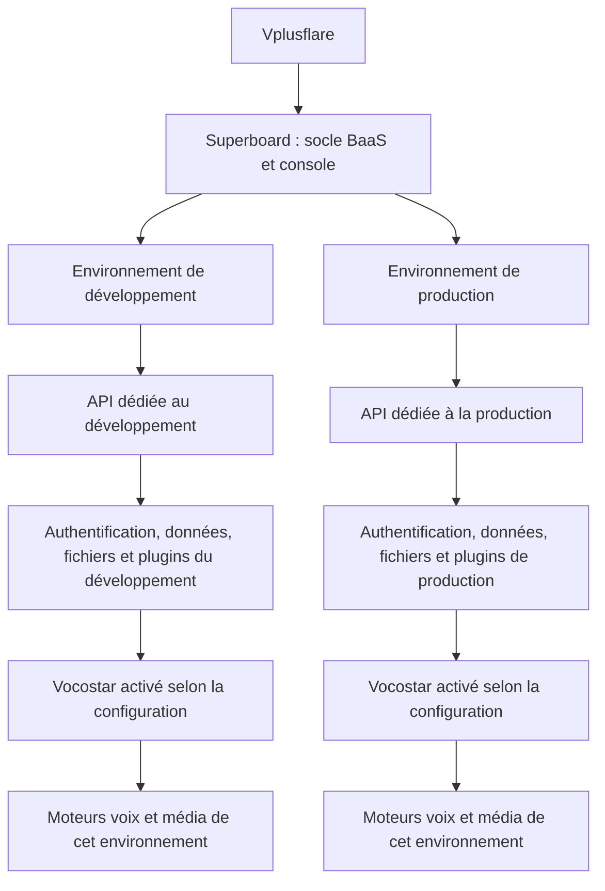

# Proposition de réorganisation de SuperBoard

Le [compte rendu d’implémentation](./SUPERBOARD_REORGANISATION_IMPLEMENTATION_2026-09-07.md) décrit les changements et les conditions de mise en service.

Proposition du 7 septembre 2026, fondée sur le code et les manifestes de ce checkout. Elle définit une organisation à implémenter ; elle ne décrit pas une refonte déjà livrée ni un état de production vérifié.

SuperBoard est le Backend as a Service de Vplusflare. Il fournit le socle commun, sa console d’administration, ses API et ses paramètres d’authentification. Chaque environnement déploie ce socle avec ses ressources et sa configuration. Vocostar est un plugin métier distinct, personnalisable et activable séparément dans chaque environnement.

L’[inventaire associé](./SUPERBOARD_FONCTIONNALITES_2026-09-07.md) détaille les fonctionnalités, les 121 vues enregistrées et les contrats de plugins présents dans le dépôt.

## Constats dans le code

| Constat | Conséquence pour la proposition | Source |
| --- | --- | --- |
| Le front canonique est `apps/site`, avec les vues dans les plugins. Le dashboard historique est retiré. | Modifier le shell Astro/React existant et les contributions des plugins. | [Contexte des applications](../../apps/CONTEXT.md) |
| La barre latérale possède déjà un mode réduit, mémorisé par instance. Chaque groupe est un `details` indépendant. | Conserver la réduction, ajouter un état d’accordéon exclusif et rendre les niveaux visibles. | [NativeFrontApp](../../apps/site/src/components/NativeFrontApp.tsx) |
| Le contrat de navigation contient un groupe et une liste d’items, sans arbre de sous-groupes. | Garder deux niveaux dans la barre et déplacer les réglages détaillés dans les pages. | [Contrat de navigation](../../packages/supbrd-core/src/native-front.ts) |
| Les initiales des libellés servent d’icônes pour les groupes et pour les liens. | Utiliser des pictogrammes distincts pour les rubriques et un retrait visuel pour leurs pages. | [Shell](../../apps/site/src/components/NativeFrontApp.tsx), [styles](../../apps/site/src/styles/native-front.css) |
| `App / Users`, `Identity / Users`, `App / Customers` et `Products / Customers` coexistent. | Distinguer compte applicatif, installation/profil, identité de connexion et client payant ; les relier dans une fiche. | [Catalogue des vues](../../config/superboard-front-view-implementations.json) |
| Le registre contient 19 rôles de services, dont `messaging` historique et `custom`. | Base de comparaison : 17 rôles communs hors ces deux rôles. Un rôle déclaré ne prouve pas un déploiement actif. | [Registre des services](../../scripts/cloudflare-services.mjs) |
| La topologie contient 18 plugins concrets et un modèle `supbrd-plugmod-custom-*`, indiqué `not_ready`. | Créer une identité de plugin explicite pour Vocostar. | [Topologie](../../config/emdash-plugin-topology.json), [catalogue runtime](../../packages/supbrd-runtime-plugins/src/entries/front-catalog.ts) |
| Vocostar possède un adaptateur custom et deux orchestrateurs. Son `runtimeBridge` est `blocked` ; les callbacks dépendent de l’ancien `api-auth-gateway`. | Traiter la bascule des callbacks comme une étape de séparation du plugin. | [Cible Vocostar](../../deploy/targets/vocostar.json) |
| Le sélecteur « Production / Test » sélectionne un projet dans une même instance. | Ajouter un contexte d’environnement déployé, avec son adresse API ; conserver séparément le type de projet et le mode des achats. | [Contrôles](../../apps/site/src/components/NativeFrontControls.tsx), [sélection de projet](../../packages/supbrd-front-ui/src/shared/context/useProjectSelection.tsx) |

Les anciens documents d’architecture sont des références historiques. Leur chiffre de seize workers et leur description d’un dashboard OpenNext ne sont pas le catalogue courant.

## Navigation proposée

La barre contient un accès direct à la vue d’ensemble, six rubriques métier et, lorsque le plugin est actif, une rubrique Vocostar. Les paramètres et l’exploitation restent dans une zone d’administration séparée. L’application et l’environnement se sélectionnent dans l’en-tête.

L’arbre ci-dessous donne les destinations actuelles à réutiliser. Les emplacements indiqués « à créer » sont des pages ou regroupements proposés.

```text
Vplusflare / Application / Environnement     [adresse API de cet environnement]

Vue d’ensemble                              /dashboard

Utilisateurs et accès
  Utilisateurs de l’application              /app/users
  Profils et installations                   /app/customers
  Connexion et sécurité                     /identity/:lang/dashboard
  Organisations                             /identity/:lang/orgs
  Rôles et autorisations                    /identity/:lang/roles
  Journal des connexions                    /identity/:lang/logs

Données et contenus
  Contenus                                  /system/content
  Fichiers et médias                        /system/files

Ventes et abonnements
  Achats et abonnements                     /products/purchases
  Clients payants                           /products/customers
  Produits et offres                        /products/offerings
  Droits d’accès achetés                     /products/entitlements
  Écrans d’abonnement                       /paywalls

Communication
  Campagnes et newsletters                  /marketing/campaigns
  Messages dans l’application               /marketing/in-app-messages
  E-mails et contacts marketing             /marketing/email
  Notifications push                        page dédiée à créer, API existante
  Liens et attribution                      /dynamic-links/links
  Service client                            /support/inbox
  Envois transactionnels                    /system/email

Parcours et automatisations
  Parcours d’accueil                        /onboardings
  Scénarios automatisés                     /flows/workflows
  Déclenchements et publications            /flows/launchpad
  Parcours marketing                        /marketing/journeys
  Composants de parcours                    /flows/components
  Suivi des participants                    /flows/users

Statistiques
  Vue d’ensemble                            /analytics
  Tableaux de bord                          /analytics/dashboards
  Audience et utilisation                   /analytics/users
  Événements                                /analytics/events
  Conversions et fidélisation               /analytics/insights
  Revenus vérifiés                          /analytics/purchases
  Rapports et exports                       /analytics/reports

Vocostar                                    visible si actif ; vues à créer
  Voix                                      /plugins/vocostar/voices
  Conversions                               /plugins/vocostar/conversions
  Fichiers générés                          /plugins/vocostar/outputs
  Traitements en cours                      /plugins/vocostar/jobs
  Configuration Vocostar                    /plugins/vocostar/settings

Administration
  Paramètres de l’environnement             /project-settings + onglets à créer
  Plugins                                   intégration du cycle de vie existant
  Exploitation                              /infrastructure
```

« Voix » et « Fichiers générés » sont des vues proposées sur les traitements et résultats Vocostar ; leur présence dans cet arbre ne signifie pas qu’un catalogue complet de voix ou une médiathèque Vocostar sont déjà implémentés.

Les pages profondes deviennent des onglets locaux :

| Page | Onglets ou sous-pages locales |
| --- | --- |
| Connexion et sécurité | Comptes de connexion ; méthodes de connexion ; applications OAuth ; permissions API ; SSO d’entreprise ; règles des comptes ; attributs utilisateur |
| Liens et attribution | Liens ; campagnes de liens ; redirections ; domaines ; aperçus sociaux ; suivi des clics |
| Service client | Conversations ; contacts ; agents et équipes ; canaux ; règles automatiques ; aide proactive ; centre d’aide ; assistant IA ; intégrations ; satisfaction et qualité ; rapports ; paramètres |
| Produits et offres | Produits ; groupes de produits ; offres ; tarifs ; synchronisation Apple/Google |
| Achats et abonnements | Achats ; abonnements ; remboursements ; rapprochement ; opérations en échec |
| Audience et utilisation | Utilisateurs et sessions ; installations ; écrans consultés ; appareils et pays ; groupes d’utilisateurs |
| Parcours d’accueil / Écrans d’abonnement | Liste ; éditeur ; versions ; emplacements ; ciblage et variantes ; résultats |
| Paramètres de l’environnement | Général ; API et domaines ; connexion et sécurité ; applications clientes ; clés API ; bibliothèques SDK ; Web/iOS/Android ; configuration distante ; équipe d’administration |
| Exploitation | État des services ; incidents ; traitements et reprises ; suppressions de comptes ; journal d’audit ; diagnostic API ; accès des assistants IA |

Les statistiques contextuelles restent aussi accessibles depuis les campagnes, parcours et écrans d’abonnement. Les liens croisés ouvrent la même page filtrée et évitent de créer plusieurs écrans concurrents. Les détails d’utilisateur, de campagne ou de scénario sont accessibles depuis leurs listes et leur fil d’Ariane ; ils ne deviennent pas autant d’entrées permanentes dans le menu.

### Comportement de l’accordéon

1. Un seul groupe métier est développé à la fois. Ouvrir « Communication » referme « Utilisateurs et accès ».
2. Une seule page porte l’état actif. Choisir un autre sous-menu retire cet état au précédent ; cela ne désactive aucun plugin ni service.
3. Si un sous-groupe est ajouté ultérieurement, la même exclusivité s’applique entre frères. L’état est un chemin de navigation, pas une collection de booléens indépendants.
4. À l’ouverture d’une URL profonde ou après retour navigateur, le groupe de la page courante s’ouvre automatiquement. Le chemin le plus spécifique l’emporte.
5. Les titres de groupe ont un pictogramme et un chevron. Les sous-menus sont en retrait, avec une ligne de hiérarchie discrète. La page active a un fond et un marqueur, accompagnés de `aria-current="page"`.
6. Le mode réduit conserve seulement les pictogrammes des groupes. Cliquer sur un pictogramme développe la barre et ouvre son groupe. Les noms restent disponibles au clavier et dans les infobulles.
7. La préférence de largeur se mémorise par opérateur et instance. Au changement d’environnement, les droits et les plugins sont recalculés avant de restaurer une destination.
8. Sur mobile, le menu devient un panneau refermable ; Échap, retour du focus et navigation clavier sont pris en charge. Les libellés passent par Lingui et le rendu est vérifié en français, anglais et arabe.

L’accueil doit appartenir au socle, afin qu’une désactivation du plugin Statistiques ne retire pas la page d’entrée. Aujourd’hui `/dashboard` est contribué par `supbrd-plugmod-analytics`.

### Renommages prioritaires

Les identifiants techniques et les URL actuelles restent stables dans la première étape. Seuls les noms affichés, les regroupements et les liens changent.

| Nom actuel | Nom proposé |
| --- | --- |
| Dashboard | Vue d’ensemble |
| App | Réparti entre Utilisateurs et accès et Paramètres de l’environnement |
| Identity | Connexion et sécurité |
| App / Customers | Profils et installations |
| Identity / Users | Comptes de connexion |
| Products / Customers | Clients payants |
| Scopes | Permissions API |
| Account Policies | Règles des comptes |
| Products / Offerings | Produits et offres |
| Entitlements | Droits d’accès achetés |
| Paywalls | Écrans d’abonnement |
| Onboardings | Parcours d’accueil |
| Flows / Workflows | Scénarios automatisés |
| Launchpad | Déclenchements et publications |
| Flows / Environments | Environnements des parcours |
| Dynamic Links | Liens et attribution |
| Workforce | Agents et équipes |
| Captain | Assistant IA du support |
| Proactive Support | Aide proactive |
| Journeys | Parcours marketing |
| Funnels & Retention | Conversions et fidélisation |
| Cohorts | Groupes d’utilisateurs |
| Remote Config | Configuration distante |
| Gateway | Routage de l’API |
| MCP | Accès des assistants IA |
| Observability / Infrastructure | Exploitation |
| Custom worker | Nom du plugin concerné, par exemple Vocostar |

## SuperBoard, environnements et Vocostar

Le modèle cible est `organisation → application → environnement → configuration de plugins`. Une instance déployée sert un environnement d’une application. Les identifiants d’instance, de projet et d’utilisateur restent distincts.



Chaque environnement possède son URL d’API, ses domaines autorisés, ses clés de signature et audiences, ses clients OAuth/SSO, ses secrets fournisseurs, ses ressources D1/R2/KV/Queues et sa version de plugins. Un jeton de développement doit être refusé par la production. L’environnement est résolu côté serveur à partir du déploiement et du contexte authentifié, jamais accepté sur la seule foi d’un en-tête fourni par le client.

La console affiche toujours l’application, l’environnement et l’URL d’API sélectionnés. Le passage vers un autre environnement utilise une destination vérifiée issue du catalogue des déploiements, puis établit la session opérateur correspondante. Les caches, abonnements temps réel et sélections sont réinitialisés. Si la page n’existe pas dans la destination, la console revient à la vue d’ensemble.

Les paramètres de connexion comprennent les méthodes activées, les inscriptions, les invitations, Google/Apple, OAuth/OIDC, SAML, MFA, durées et révocation des sessions, politiques des comptes, domaines de retour, origines autorisées et limites de requêtes. Les permissions des opérateurs de la console restent distinctes de celles des utilisateurs finaux. La console centrale éventuelle gère la découverte et les accès ; chaque API d’environnement applique elle-même ses contrôles.

Le dépôt possède déjà des manifestes de cible MBZA et Vocostar. La cible MBZA décrit `local` et `development` ; Vocostar décrit `production`. Ajouter « recette » exige une évolution du schéma et des unions de types qui ne connaissent que `local`, `development`, `production`. Le contrôle Production/Test actuel reste un type de projet historique à migrer explicitement, pas une preuve d’isolation d’environnement.

Les bindings et variables Wrangler doivent être déclarés pour chaque environnement. Le générateur doit vérifier qu’aucune liaison de développement ne pointe vers la production. [Documentation Cloudflare sur les environnements](https://developers.cloudflare.com/workers/wrangler/environments/).

### Contrat du plugin Vocostar

Le plugin reçoit l’identifiant concret proposé `supbrd-plugmod-vocostar` et le nom affiché **Vocostar**. Sa version évolue indépendamment, avec une plage de compatibilité SuperBoard. Son manifeste déclare ses vues, paramètres, capacités, dépendances, migrations et moteurs d’exécution.

| Responsabilité SuperBoard | Responsabilité Vocostar |
| --- | --- |
| Utilisateurs, authentification, sessions et autorisations | Paramètres métier voix et médias |
| API publique et résolution de l’environnement | Création et orchestration des traitements Vocostar |
| Stockage, contrats de fichiers et permissions | Références des entrées et sorties propres aux conversions |
| Paiements, achats et droits génériques | Règles métier de consommation et compensation de crédits |
| E-mails, push et support | Événements métier qui déclenchent ces services |
| Exploitation, traces et registre de plugins | État et progression des jobs voix/média |

Les fournisseurs IA, modèles, langues, limites de traitement, tarifs en crédits, filigranes, quotas de concurrence et paramètres visuels appartiennent à la configuration Vocostar de l’environnement. Cette liste définit la personnalisation cible ; elle ne présume pas que tous ces réglages disposent déjà d’un écran.

L’activation vérifie les ressources, migrations, secrets requis, dépendances, compatibilité et health checks, puis publie routes et navigation ensemble. La désactivation refuse les nouveaux jobs, retire les pages et les commandes utilisateur, et laisse les traitements engagés ainsi que leurs callbacks terminer selon une politique explicite de drainage. Les données et réglages sont conservés ; leur suppression est une opération séparée. Un plugin désactivé doit être inaccessible directement par API, par SDK et par MCP, même si l’utilisateur connaît l’URL.

La version initiale réutilise le protocole custom v2 et les routes `/api/v1/sdk/custom/v1/jobs*`. Une façade `/api/v1/plugins/vocostar/*` peut être ajoutée avec compatibilité des clients existants. Les commandes sont toujours isolées par projet et propriétaire, avec idempotence. L’environnement du callback doit être vérifié et le callback authentifié ; les reprises ne peuvent ni dupliquer une conversion ni débiter deux fois les crédits.

La séparation est achevée quand le socle peut être construit et déployé sans code spécifique Vocostar, et quand activer Vocostar dans un environnement n’active ni ses routes ni ses ressources dans un autre. Le plugin doit s’enregistrer dans le catalogue concret : le modèle `custom-*` actuellement exclu du catalogue des plugins actifs ne suffit pas.

## Regroupement des workers

La cible est de **10 services SuperBoard pour le profil complet**, contre 17 rôles communs actuels : sept déploiements de moins, soit environ 41 %. C’est un objectif d’architecture à confirmer par les builds, les mesures de charge et la migration des contrats ; aucun worker n’a été supprimé pendant cette étude.

| Service cible | Regroupement des rôles actuels | Justification |
| --- | --- | --- |
| Console (`console`) | `site` | Front, administration EmDash, publication des configurations et autorité des plugins |
| API (`api`) | `api` + `app` + `products` + `paywalls` + `onboardings` + `dynamic-links` + `mcp` | Regrouper les façades et les traitements synchrones de configuration/catalogue ; garder les contrats internes par domaine |
| Authentification (`auth`) | `identity` | Conserver l’isolation du moteur de connexion, de ses clés et sessions |
| Fichiers (`files`) | `files` | Conserver le transfert en flux et ses ressources séparées de l’API de gestion |
| Paiements (`payments`) | `billing` | Isoler les webhooks stores, reprises et traitements financiers |
| Communication (`communications`) | `email` + `marketing`, puis extraction du transport push actuellement dans `api` | Un moteur d’envoi, avec files et priorités distinctes pour transactionnel, push et campagnes |
| Automatisations (`automations`) | `flows` | Garder ses Durable Objects, Workflows, délais et exécutions indépendants |
| Service client (`support`) | `support` | Garder les conversations temps réel et leurs traitements IA indépendants |
| Statistiques (`analytics`) | `analytics` | Isoler collecte, agrégations, rapports et opérations volumineuses |
| Supervision (`monitoring`) | `observability` | Garder la collecte des erreurs et la surveillance séparées des services surveillés |

L’API regroupée conserve des interfaces par domaine. Les imports internes remplacent les allers-retours devenus inutiles, tout en conservant les contrôles d’accès propres à chaque module. Les opérations qui nécessitent des interfaces privées peuvent conserver des points d’entrée nommés via les Service Bindings. [Documentation Cloudflare sur les Service Bindings RPC](https://developers.cloudflare.com/workers/runtime-apis/bindings/service-bindings/rpc/).

La consolidation d’un worker ne fusionne pas automatiquement les bases ni les permissions. Les stores autoritatifs des plugins, leurs migrations et les ponts vers les données historiques restent séparés jusqu’à une migration dédiée. Un module ne peut pas écrire dans le store d’un autre simplement parce qu’ils partagent un processus. Les plugins natifs regroupés sont du code de confiance ; les extensions tierces nécessitant une isolation restent dans leur runtime approprié.

Les redirections de liens conservent un chemin public rapide ; le protocole MCP, ses métadonnées OAuth et ses autorisations restent identiques malgré le regroupement du déploiement. Si le bundle ou la charge de l’API devient excessif, les mesures doivent justifier le maintien d’un service spécialisé. Aucune économie de coût ou amélioration de latence n’est garantie par le seul nombre de workers.

Les files d’e-mails transactionnels, campagnes et push restent distinctes avec leur limite de concurrence, politique de reprise et file d’échec. Les messages de récupération de compte ne doivent pas attendre la fin d’une campagne. Réunir les runtimes d’envoi n’impose pas de réunir les cycles de vie des plugins E-mail et Marketing.

### Décompte par profil

Les nombres actuels ci-dessous sont calculés à partir des rôles et des drapeaux des manifestes, sans requête à Cloudflare. Ils expriment les rôles sélectionnés, pas le nombre de services sains en production.

| Profil | Rôles sélectionnés dans le code | Objectif après regroupement |
| --- | --- | --- |
| SuperBoard complet, hors custom et Messaging | 17 | 10 |
| MBZA avec extension de référence | 17 + 1 custom = 18 | 10 + 1 extension de référence = 11 |
| Vocostar avec Analytics et Flows désactivés | 15 + 1 adaptateur + 2 orchestrateurs = 18 | 8 + 1 plugin runtime + 2 moteurs = 11 |

Vocostar reste **un plugin produit** possédant initialement trois runtimes : coordination des jobs, moteur voix, moteur média. Dans l’interface d’exploitation, ceux-ci sont regroupés sous Vocostar. Fusionner ensuite l’adaptateur et les orchestrateurs n’est pas requis pour la première réduction : leurs classes `Dispatcher`/`Standard`, conteneurs, Workflows et traitements en cours demandent une migration séparée.

Les déplacements de Durable Objects doivent conserver leur état et suivre une migration coordonnée ; un renommage de dossier ou de Worker n’effectue pas ce transfert. [Documentation Cloudflare sur le cycle de vie des classes Durable Object](https://developers.cloudflare.com/durable-objects/reference/durable-objects-migrations/).

Le worker `messaging` historique est désactivé dans les deux cibles examinées. Son retrait définitif nécessite de vérifier les consommateurs et les données historiques. Les outils de migration restent accessibles dans le dépôt, pas dans le menu métier quotidien.

### Noms et organisation du dépôt

Les nouveaux déploiements suivent `superboard-{application}-{environnement}-{service}`. Par exemple, `superboard-demo-dev-api`. Les labels de l’interface restent français et lisibles. Les noms historiques `opengrow-*` et `send-users-*` sont conservés comme alias de migration jusqu’à la bascule de leurs liaisons et de leurs ressources.

L’organisation suivante est une cible de responsabilité. Les déplacements physiques viennent après les changements de contrats et ne constituent pas un préalable à la correction du menu.

```text
apps/site/                          console actuelle à conserver
packages/supbrd-core/               socle, contrats, publication du front
packages/supbrd-front-ui/           navigation et composants communs
packages/supbrd-runtime-plugins/    plugins communs, regroupés par domaine
plugins/vocostar/                  cible : manifeste, vues, réglages, métier
  workers/jobs/                    coordination des jobs
  workers/voice/                   moteur voix
  workers/media/                   moteur média
workers/                           points de déploiement des 10 services
deploy/targets/                    applications et environnements
```

Les domaines fonctionnels des plugins sont Utilisateurs et accès, Données et contenus, Ventes et abonnements, Communication, Parcours et automatisations, Statistiques, Paramètres et Exploitation. Les plugins existants conservent leurs identifiants et leur activation indépendante. Un menu peut réunir plusieurs plugins et un worker peut exécuter plusieurs modules : ces trois découpages répondent à des besoins différents.

## Ordre de réalisation et critères de validation

| Étape | Résultat attendu | Vérification avant de poursuivre |
| --- | --- | --- |
| 1. Navigation | Libellés français, groupes métier, accordéon exclusif, mode réduit utilisable, onglets locaux | Tests de comportement reproduisant le défaut ; URL profondes, retour navigateur, clavier, mobile, français/anglais/arabe ; aucune des 121 vues perdue |
| 2. Environnements | Contexte application/environnement/API distinct du projet Production/Test | Deux déploiements de recette avec données, clés, caches et permissions isolés ; jeton de A refusé sur B |
| 3. Plugin Vocostar | Manifeste concret, pages dédiées, configuration par environnement, installation et désactivation | Socle sans Vocostar ; activation sur A uniquement ; appels directs refusés sur B ; sauvegarde des réglages à la désactivation |
| 4. API regroupée | Intégration progressive App, Products, Paywalls, Onboardings, Dynamic Links, MCP | Parité des réponses et autorisations ; SDK existants ; redirections publiques ; protocole MCP/OAuth ; taille du bundle, mémoire, latence et requêtes SQL |
| 5. Communication regroupée | E-mail et Marketing dans un runtime, puis transport push | Envoi transactionnel sous charge de campagne ; idempotence, reprise, files d’échec et quotas par canal |
| 6. Bascule et retrait | Liaisons, domaines et supervision utilisent les nouveaux services | Drainage des queues et jobs, sauvegardes, rapprochement des données, rollback applicatif testé ; migrations de données uniquement en avant |

La bascule Vocostar requiert en particulier de porter les callbacks encore détenus par l’ancienne passerelle, de vérifier leurs secrets d’authentification et d’achever les ressources de la cible. Son manifeste contient encore des ressources non renseignées et du routage public `staged` ; cette étude ne certifie donc pas son déploiement de production.

Le contrôle de navigation se construit à partir de la release active et des permissions, puis retire les rubriques vides. L’ajout d’un plugin ou le changement de ses réglages déclenche les mécanismes existants de publication et d’invalidation. Il ne faut pas ajouter une requête d’état par menu sur le chemin de lecture.

Les commandes de validation du dépôt restent applicables à l’implémentation : lint initial, tests de reproduction avant correction, lint rapide après les éditions, typecheck, tests ciblés puis checks de publication des packages modifiés. Cette proposition ne modifie aucun runtime ni déploiement.
