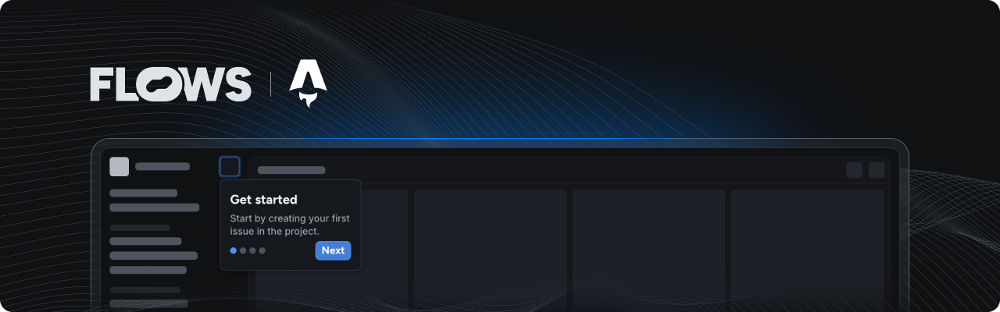

# Flows Astro example

An example project showcasing how to use Flows with Astro to build native product growth experiences.

This example extends the Astro starter project with the [`@superboard/flows-js`](https://www.npmjs.com/package/@superboard/flows-js) and [`@superboard/flows-js-components`](https://www.npmjs.com/package/@superboard/flows-js-components) packages to demonstrate how to integrate Flows into your application.

## Features

### Flows component

In [`flows.astro`](./src/components/flows.astro) you can find Flows being initialized in `<script>` in the browser. In its render we've added `<flows-floating-blocks>` custom element to render floating components. The Flows component is rendered in the root layout found in [`Layout.astro`](./src/layouts/Layout.astro).

### Pre-built components

The `@superboard/flows-js-components` package includes ready-to-use components to build in-app experiences. Refer to [`flows.astro`](./src/components/flows.astro) to learn how to import and use these components.

### Custom components

Extend Flows by creating your own components for workflows and tours. Because the components need to be valid Web Components, Astro components cannot be used directly:

- For simple custom components, use Vanilla JavaScript or the lightweight [Lit library](../lit/README.md) to build compatible Web Components.
- **Recommended**: If you're using a client-side framework in your Astro project like React, Solid, Svelte, or Vue, follow one of the [other example projects](../README.md) which show how to integrate framework components with Flows.

Note that to use these custom components you need to define them in your Flows project with the same properties and exit nodes. For detailed instructions on building custom components, see the [custom components documentation](https://flows.sh/docs/components/custom).

### Flows slots

The `<flows-slot>` element lets you render Flows UI elements dynamically within your application. You can add placeholder UI for empty states. See [`index.astro`](./src/pages/index.astro) for an example.

## Documentation

Learn more about Flows and how to use its features in the [official Flows documentation](https://flows.sh/docs).
