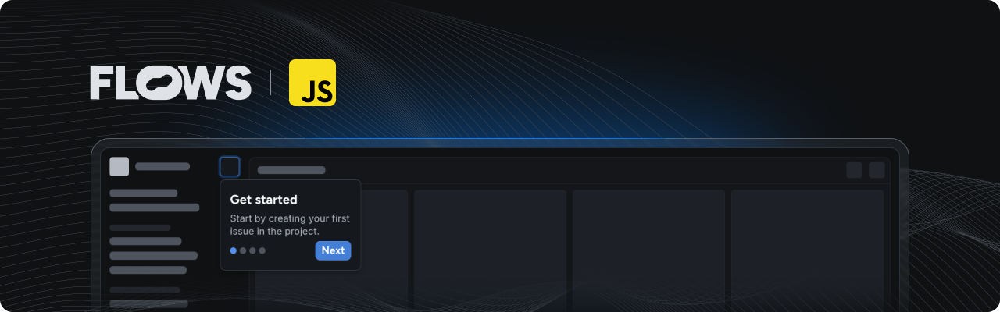

# Flows JavaScript CDN example

An example project showcasing how to use Flows with JavaScript loaded from CDN to build product adoption experiences.



This example is basic HTML page extended with the [`@superboard/flows-js`](https://www.npmjs.com/package/@superboard/flows-js) and [`@superboard/flows-js-components`](https://www.npmjs.com/package/@superboard/flows-js-components) packages loaded from a CDN to demonstrate how to integrate Flows into your app without using NPM.

## Features

### Setup

The Flows packages are linked from CDN in [`index.html`](./index.html) and subsequently initialized in [`flows.js`](./flows.js). At the top of `flows.js` we are destructuring `flows_js` and `flows_js_components` exactly like we would import from `@superboard/flows-js` and `@superboard/flows-js-component` while using NPM. For the components to show up `<flows-floating-blocks>` element is added in `index.html`.

### Pre-built components

The `@superboard/flows-js-components` package includes ready-to-use components to build in-app experiences. Refer to [`flows.js`](./flows.js) to learn how to import and use these components.

### Custom components

Extend Flows by creating your own components for workflows and tours:

- **Workflow block:** The [`banner.js`](./banner.js) file demonstrates a custom `Banner` component with `title`, `body`, and a `close` prop connected to an exit node.
- **Tour block:** The [`tour-banner.js`](./tour-banner.js) file shows how to build a `TourBanner` component. It accepts `title` and `body` props, as well as `continue`, `previous` and `cancel` for navigation between tour steps.

Note that to use these custom components you need to define them in your Flows project with the same properties and exit nodes as described above. For detailed instructions on building custom components, see the [custom components documentation](https://flows.sh/docs/components/custom).

### Flows slots

The `<flows-slot>` component lets you render Flows UI elements dynamically within your application. You can add placeholder UI for empty states. See [`index.html`](./index.html) for an example.

### Development

Try it by running following script in this directory:

```bash
npx serve
```

## Documentation

Learn more about Flows and how to use its features in the [official Flows documentation](https://flows.sh/docs).
