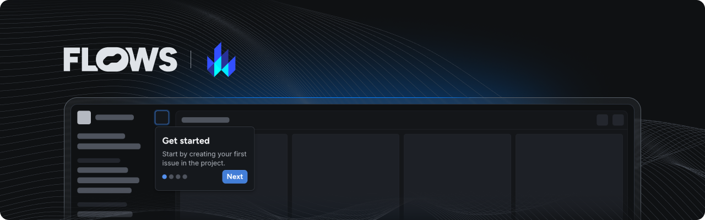

# Flows Lit example

An example project showcasing how to use Flows with Lit to build native product growth experiences.

This example extends the Vite Lit TypeScript starter project with the [`@superboard/flows-js`](https://www.npmjs.com/package/@superboard/flows-js) and [`@superboard/flows-js-components`](https://www.npmjs.com/package/@superboard/flows-js-components) packages to demonstrate how to integrate Flows into your application.

## Features

### Flows plugin

In the [`my-element.ts`](./src/my-element.ts) you can find Flows plugin being initialized during `connectedCallback` hook. In the [index.html](./index.html) - `<flows-floating-blocks>` is added to render floating components.

### Pre-built components

The `@superboard/flows-js-components` package includes ready-to-use components to build in-app experiences. Refer to [`my-element.ts`](./src/my-element.ts) to learn how to import and use these components.

### Custom components

Extend Flows by creating your own components for workflows and tours:

- **Workflow block:** The [`banner.ts`](./src/banner.ts) file demonstrates a custom `Banner` component with `title`, `body`, and a `close` prop connected to an exit node.
- **Tour block:** The [`tour-banner.ts`](./src/tour-banner.ts) file shows how to build a `TourBanner` component. It accepts `title` and `body` props, as well as `continue`, `previous` and `cancel` for navigation between tour steps.

Note that to use these custom components you need to define them in your Flows project with the same properties and exit nodes as described above. For detailed instructions on building custom components, see the [custom components documentation](https://flows.sh/docs/components/custom).

### Flows slots

The `<flows-slot>` element lets you render Flows UI elements dynamically within your application. You can add placeholder UI for empty states. See [my-element.ts](./src/my-element.ts) for an example.

## Documentation

Learn more about Flows and how to use its features in the [official Flows documentation](https://flows.sh/docs).
