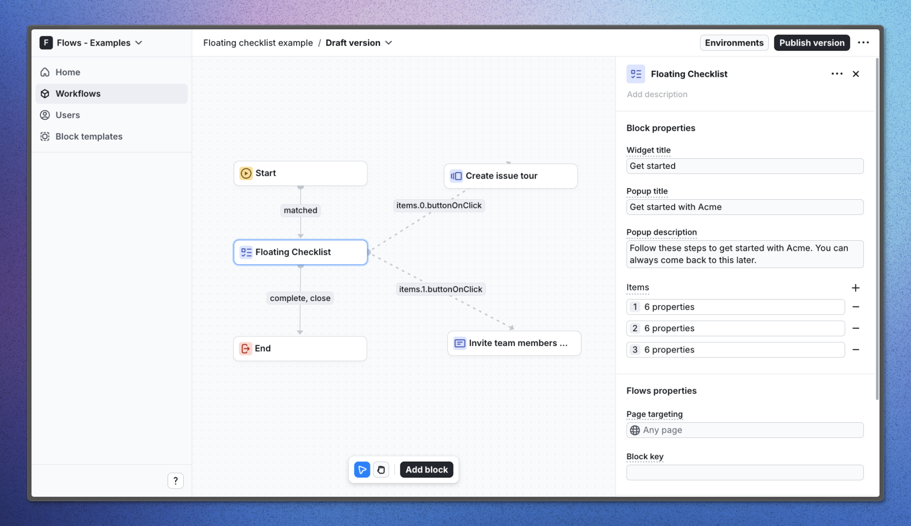

# Floating checklist – Flows example

This example showcases a custom floating checklist component that is displayed in the bottom-right corner of the screen. The checklist provides users with suggested setup actions to help them get started with the application.

## Demo

[View the live demo](https://flows.sh/examples/floating-checklist)

## Features

When a user signs up, the floating checklist appears in the bottom-right corner. Tasks are marked as completed once the user fulfills the required conditions.

Below is a screenshot of how the workflow is set up:

## Getting started

1. Sign up for Flows if you haven’t already. You can [create a free account here](/flows/signup).
2. Clone the repository from GitHub and install the required dependencies in the project directory.
3. Add your project ID in the [`providers.tsx`](./src/app/providers.tsx) file.
4. Recreate the workflow using the **Floating Checklist** in your project and publish it.
5. Run the development server with `pnpm dev`.

## Learn more

To learn more about Flows take a look at the following resources:

- [Flows documentation](https://flows.sh/docs)
- [Join our community](https://flows.sh/join-slack)
