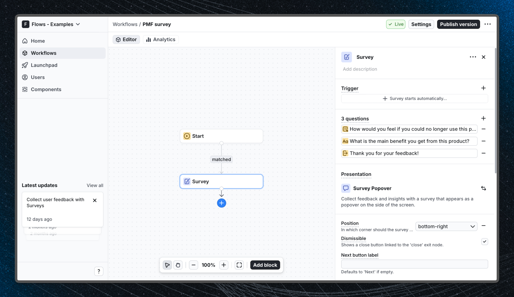

# Product-Market Fit (PMF) survey - Flows example

This example shows how to measure product-market fit in a React app using the built-in Survey Popover component from `@flows/react-components`. The survey triggers automatically after a delay and asks users how they would feel if they could no longer use the product, giving you a clear signal of whether you have achieved product-market fit.

## Demo

[View the live demo](https://flows.sh/examples/pmf-survey)

## Features

When a user enters the workflow, the survey popover appears in the bottom-right corner of the screen. The survey walks users through three steps:

1. **PMF question**: a single-choice question asking "How would you feel if you could no longer use this product?" with options: "Very disappointed", "Somewhat disappointed", and "Not disappointed".
2. **Follow-up question**: an open-ended freeform text field asking what the main benefit of the product is for them. Marked as optional so users can skip it.
3. **End screen**: a thank-you message acknowledging the response before the popover closes automatically.

Below is a screenshot of how the workflow is set up:

## Getting started

1. Sign up for Flows if you haven't already. You can [create a free account here](/flows/signup).
2. Clone the repository from GitHub and install the required dependencies in the project directory.
3. Add your project ID in the [`providers.tsx`](./src/app/providers.tsx) file.
4. Recreate the PMF survey workflow using the **Survey** block in your project and publish it.
5. Run the development server with `pnpm dev`.

## Learn more

To learn more about Flows take a look at the following resources:

- [Flows documentation](https://flows.sh/docs)
- [Join our community](https://flows.sh/join-slack)
