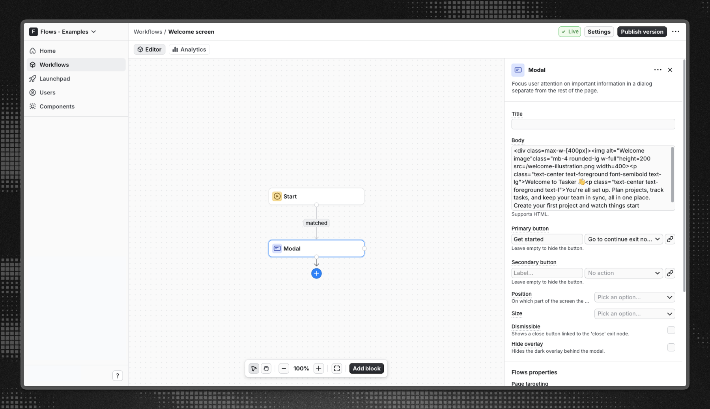

# Welcome Screen - Flows example

This example showcases a welcome screen powered by the built-in Modal component from `@flows/react-components`.

A welcome screen is the first thing a new user sees when they open your app. Use it to greet the user by name, explain the value they are about to get, and point them at their first action so they reach that first win faster.

## Demo

[View the live demo](https://flows.sh/examples/welcome-screen)

## Features

When a user opens the application for the first time, they are greeted by a welcome modal that sits on top of the project management dashboard. The modal includes a friendly greeting, a short value statement, and a primary "Get started" call to action that closes the screen and drops the user into the app. Because the modal only targets first-time users, returning users go straight to the dashboard.

Below is a screenshot of how the workflow is set up:

## Getting started

1. Sign up for Flows if you haven't already. You can [create a free account here](/flows/signup).
2. Clone the repository from GitHub and install the required dependencies in the project directory.
3. Add your project ID in the [`providers.tsx`](./src/app/providers.tsx) file.
4. Recreate the welcome screen workflow using the **Modal** block, targeting first-time users, and publish it.
5. Run the development server with `pnpm dev`.

## Learn more

To learn more about Flows take a look at the following resources:

- [Flows documentation](https://flows.sh/docs)
- [Join our community](https://flows.sh/join-slack)
